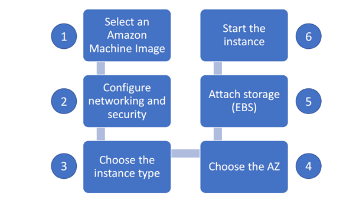
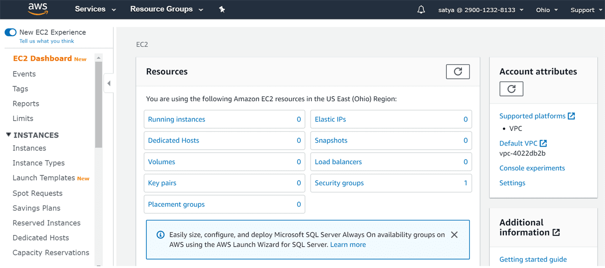
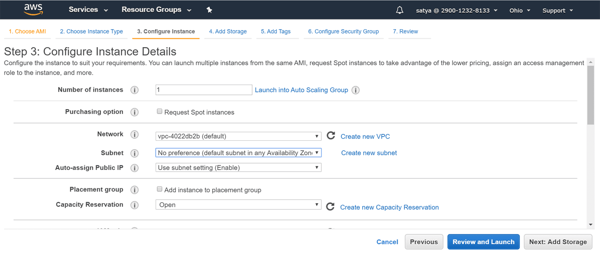
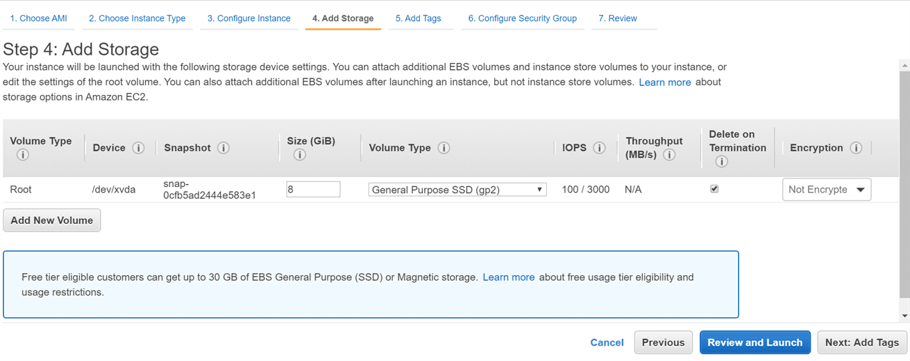
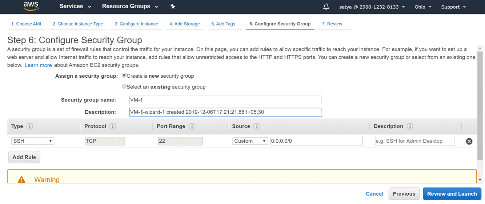
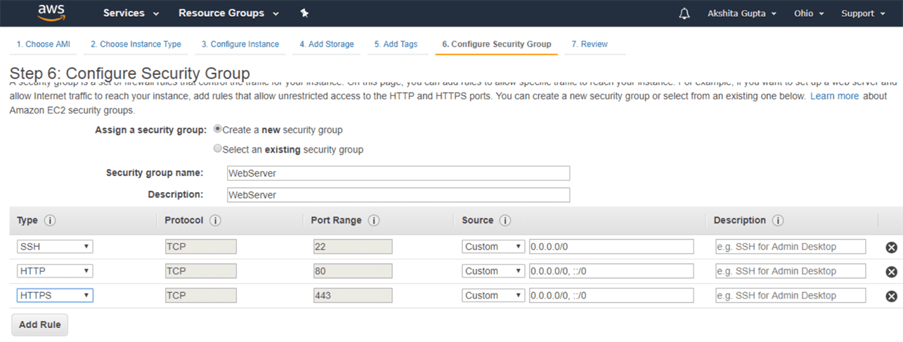
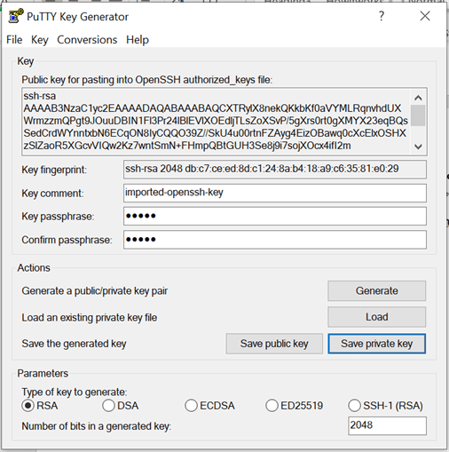
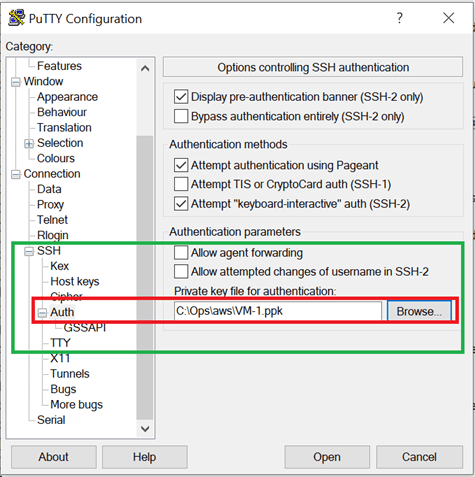
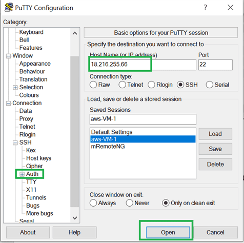
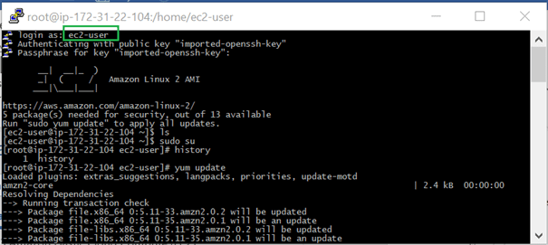

Lab: Launching an EC2 Linux instance
====================================

**Lab: Launching an EC2 Linux instance**

1.Go to EC2 by Services > Compute >EC2

2.To create new Instance – Click on **-Launch Instance -**

Choose Amazon Machine Image(AMI) - [Tick] Free Tier One

2.Choose Instance Type : (General Purpose)

3.Configure Instance : Network / Security /IAM Roles

4.Add Storage : Memory Size, EBS or Not

5.Add Tags: Just for using Purpose

6.Security Groups : Leave it as it is or create new one with VM Name

To access VM via SSH , HTTP, HTTPS from any source , configure with new Security
Group

7. Review Instance Launch

8.Boot from General Purpose Warning > Select "Magnetic"

9.Generate a new Key Pair / use Existing one & Download Key pair

\- used for SSH login via Putty/ any tool

10.Launch Instance& Make Sure its State is **Running**

Lab : Connect to Linux EC2 Instance via PuTTY
=============================================

1.Get IPv4 Public IP from Instance Description

Public DNS(IPv4): **ec2-18-216-255-66.us-east-2.compute.amazonaws.com**

IPv4 Public IP : **18.216.255.66**

2.Open Downloaded .pem file

-   If we are using Linux system, we can directly use .pem file for connection.

-   If we are using Windows System, we don’t have SSH directly.

we use PuttY for SSH connections. but Putty doesn't support .pem file it only
supports .ppk file. for that we need to convert .pem file to .ppk file

**3.Covert .pem to .ppk using Putty**

-   Launch PuttyGen

-   Load .pem file

-   Save Private Key: VM-1.ppk

4.Open Putty

-   Enter Ip : 18.216.255.66

-   Connection Type : SSH

-   Left Menu > SSH >+AUTH : Browse saved VM-1.ppk file

5.Remember : Default user for EC2 Instance is : "**ec2-user**"

