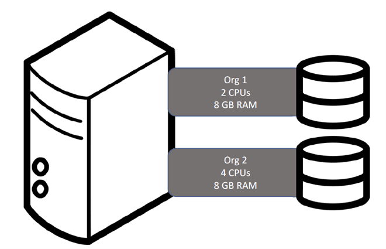
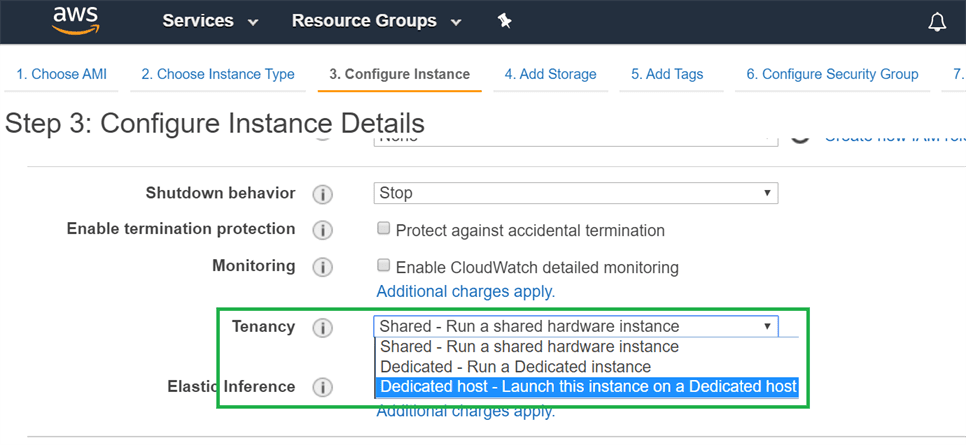
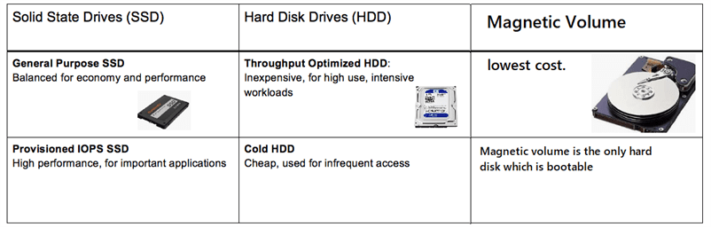

Tenancy
=======

#### Shared Tenancy

-   Multiple instances on a physical machine

-   Multiple organizations/applications share the time on the machine.

-   Multiple customers share the time and space on the physical machine

-   Default behavior of an instance

**Pros**

-   Reduced costs

-   Simpler deployment

**Cons**

-   Lower performance

-   Less control

#### Dedicated Hosts

One Dedicated Physical Server – run multiple VM’s

-   Run the virtual machines on one dedicated Physical Server

-   Used by one customer

-   Must be explicitly configured

-   Not available in free tier

**Pros**

-   More accurate licensing management

-   More detailed reporting

-   Compliance management

-   Determine host placement during instance restarts

**Cons**

>   Costs more

**BYOL – Bring Your Own License Option is available (ex. Windows License)**

#### Dedicated Instance

-   Runs on a physical machine

    -   Only instance running on that machine

    -   On restart, may be moved

-   Used by one customer

-   Must be explicitly configured

-   Not available in free tier

**Pros**

-   Runs on hardware dedicated to the customer

-   Provides performance advantage of a dedicated host

**Cons**

-   Less accurate licensing management

Doesn’t allow placement determination

Elastic Block Store (EBS) and EC2
---------------------------------

When you run an EC2 instance that provides you temporary storage, if you delete
an EC2 instance then the data stored in the EC2 instance will also be deleted.
To make a data persistent, Amazon provides an EBS Volume. If you launch an EC2
instance and want to make some data persistent, then you need to attach an
instance with the EBS Volume so that your data would be available even on
deleting an EC2 instance

-   EC2 is a **virtual server** in a cloud while EBS is a **virtual disk** in a
    cloud.

-   Amazon EBS allows you to create storage volumes and attach them to the EC2
    instances.

-   Once the storage volume is created, you can create a file system on the top
    of these volumes, and then you can run a database, store the files,
    applications.

-   EBS volume does not exist on one disk, it spreads across the Availability
    Zone. EBS volume is a disk which is attached to an EC2 instance.

-   EBS volume attached to the EC2 instance where windows or Linux is installed
    known as **Root device of volume**

EC2 instances boot from EBS volumes and not EFS or S3, so an EBS volume must be
used. Magnetic volumes are slower but less expensive than SSD volumes.

### EBS Volume Types

EBS provides three types of volume that differ in performance characteristics
and price.

-   SSD-backed volumes - high cost , high performance

-   HDD-backed volumes - low cost , avg performance

-   Magnetic Volume - lowest cost, low performance

