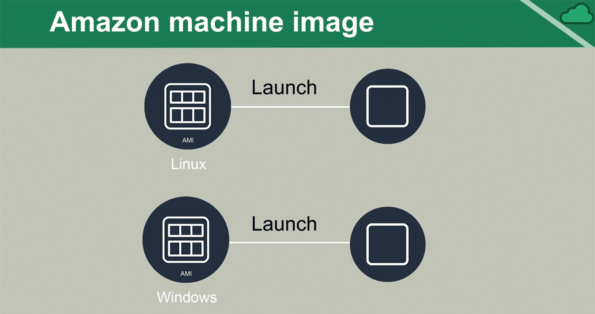

AMI
===

-   Blueprint with server configuration details

-   Similar to localized imaging solutions

-   The term “instance” indicates the use of the AMI

-   All instances are created from an AMI

-   Sources

    -   Amazon (free)

    -   AWS Marketplace (free/\$)

**Who can launch an instance of an AMI?**

-   Public: Anyone

-   Explicit: Specified

-   Implicit: Owner(def.)

### AMI Creation

-   Many AMI’s come with AWS

-   AMIs can be created from the existing AMIs

-   AMIs can be created from scratch

-   AMIs can be pulled from other public sources

-   They may be purchased from the AWS Marketplace

### Lab – Create new AMI from Existing Instance 

-   Sign in to the AWS Management Console.

-   Move to the EC2 service.

-   We have one running instance – “Linux VM”

    

-   To create AMI with existing instance, we need to create snapshot. For doing
    that we need to stop instance and go to **EBS \> Volumes.** It will show the
    all available & attached EBS for VMS

    

-   We are creating Linux AMI, so need create snapshot for Linux. For that –
    **Select Linux EBS\> Actions** \> **Create Snapshot.**

    

-   To check all available snapshots, go to **EBS \> Snapshots**

-   To create AMI Image from snapshot ,

**EBS** \> **Snapshot : Select a Snapshot \>Actions** \> **create image**.

-   After creating AMI Image , you can see created AMI Images under **Images \>
    AMI’S**

    

-   You Can do following actions on created AMI’s

    

-   **Launch** – create a new VM using selected Image

-   **Register New AMI** – Register this as new AMI and make it public.

-   We can also create new instance by using our AMI’s – My AMI’s tab of Launch
    instance Wizard.

    
