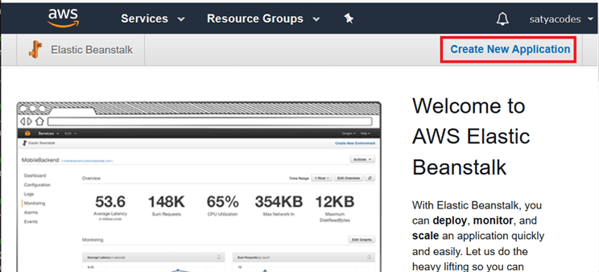
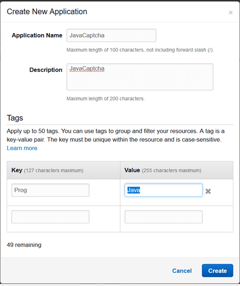
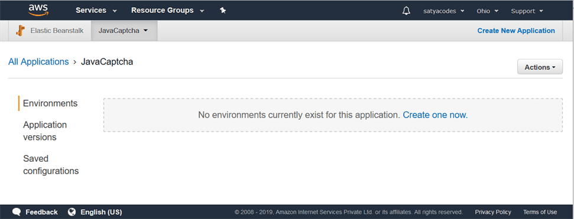
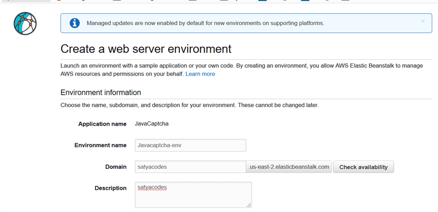
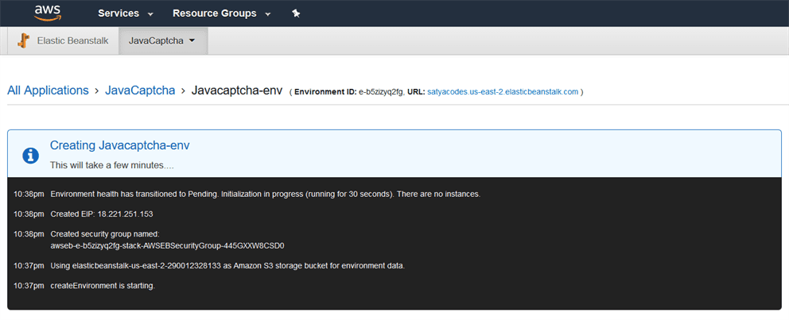
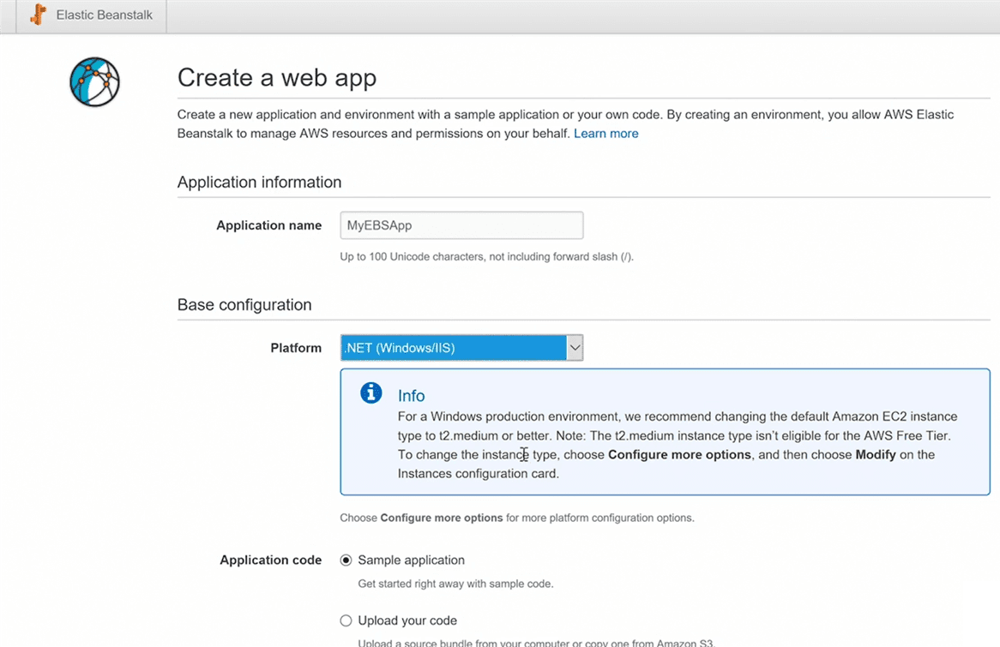

Elastic Beanstalk
=================

**AWS** **Elastic Beanstalk!** Comes under  PaaS model, which is Platform as a
Service.

So far we recreated EC2 instances & if you want to to run or deploy Java based
applications, first we need to install JDK and Apache Tomcat to deploy the
application.

All these are doing in Manual way but now using Elastic beanstalk we don't need
to install software or Configure platform related things like Java, Apache
Tomcat, you can just concentrate on implementing the application logic elastic
beanstalk take care about the platform things like like Java installation and
Apache Tomcat configuration.

You can simply upload your code and Elastic Beanstalk automatically handles the
deployment, from capacity provisioning, load balancing, auto-scaling to
application health monitoring. At the same time, you retain full control over
the AWS resources powering your application and can access the underlying
resources at any time

### Lab – Deploy an Application on Elastic Beanstalk

Step 1: On Elastic Beanstalk console click on **Create New Application** option.

Step 2: Actions tab and select Create Environment option. Beanstalk provides you
with an option where you can create multiple Environments for your application.

Step 3: Choose among two different Environment Tier options. Choose **Web Server
Environment** - if you want your application to handle HTTP requests or choose
**Worker Environment** to handle background tasks.

Step 4: Another dialog, you need to provide a domain name and description for
your application.

Step 5: **Choose a platform** of your choice for your application, like –
java,.net, php etc. for me its Java.

Step 6 : **Application Code** – choose a sample application provided by
Beanstalk, or upload a file which has code for your application.

Step 7 : Click **Create Enviroment**, it will take some time to create
environment.

Step 8: On the top right corner, you will find the URL of your application
version. <http://satyacodes.us-east-2.elasticbeanstalk.com/>

