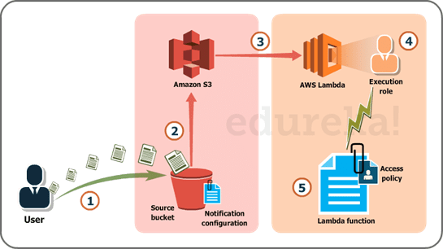
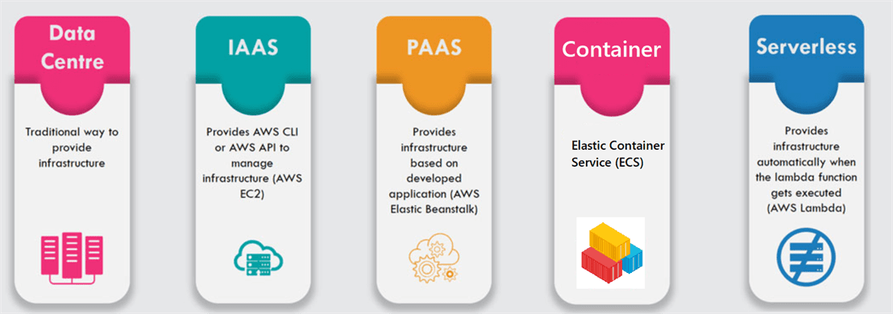
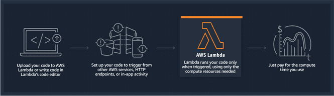
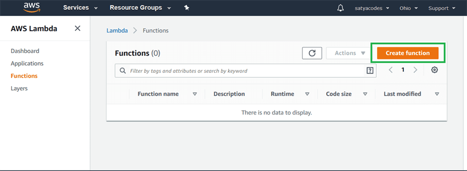
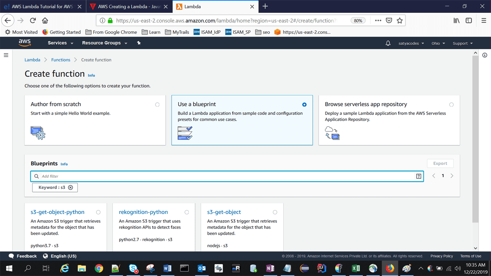
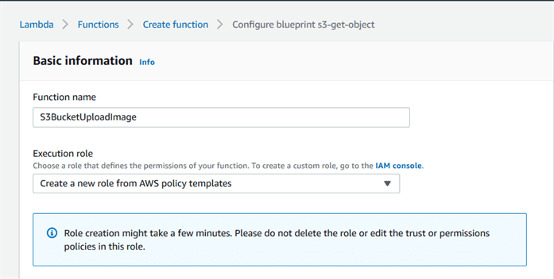
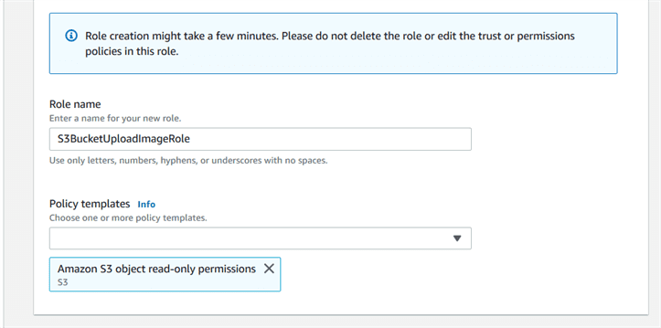
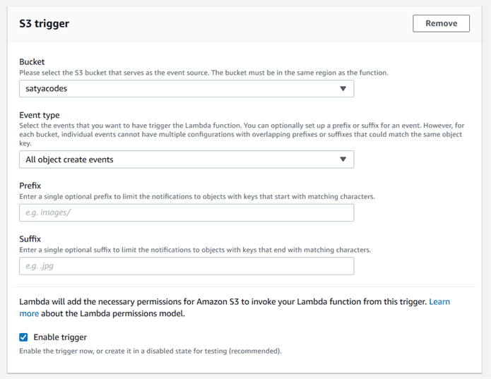
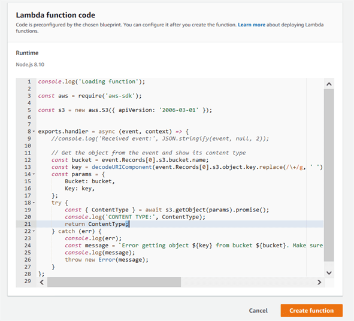
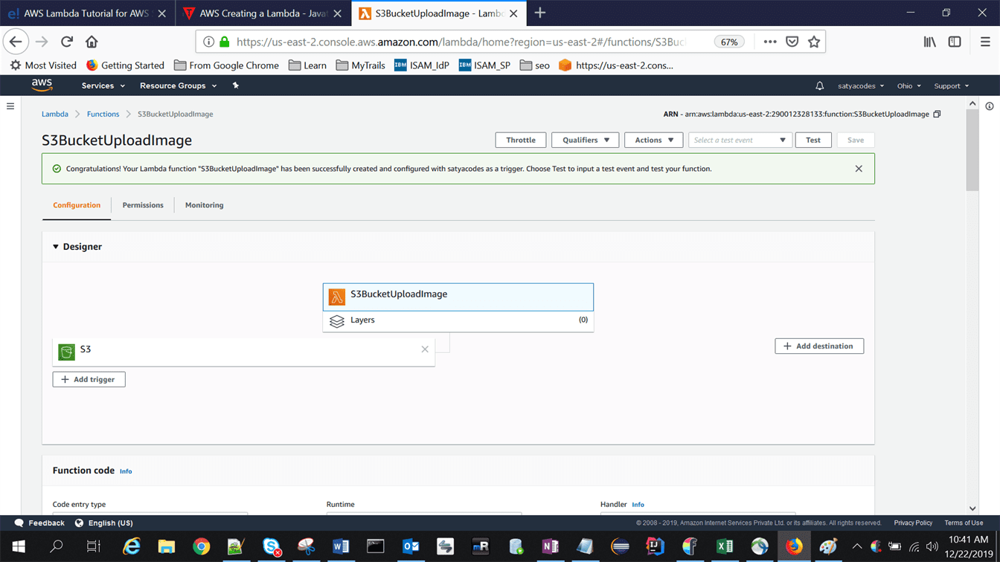

Lambda
======

Run code without thinking about servers. Pay only for the compute time you
consume

Amazon explains, AWS Lambda (λ) as a ‘serverless’ compute service, meaning the
developers, don’t have to worry about which AWS resources to launch, or how will
they manage them, they just put the code on lambda and it runs, it’s that
simple! It helps you to focus on core-competency i.e. App Building or the code.

The code that you want Lambda to run is known as a **Lambda function**. Now, as
we know a function runs only when it is called, right? Here, **Event Source** is
the entity which triggers a Lambda Function, and then the task is executed.

#### Sample scenario

For example , we will be uploading images in the form of objects to an S3
bucket. This uploading an image to the S3 bucket, will become an event source or
the **‘trigger’.**

1.  User uploads an image (object) to a source bucket in S3 which has
    notification attached to it, for Lambda.

2.  The notification is read by S3 and it decides where to send that
    notification.

3.  S3 sends the notification to Lambda, this notification acts as an invoke
    call of the lambda function.

4.  Execution role in Lambda can be defined by using IAM (Identity and Access
    Management) to give access permission for the AWS resources, for this
    example here it would be S3.

5.  Finally, it invokes the desired lambda function which works on the object
    which has been uploaded to the S3 bucket.

### Cloud Evolution – with AWS Services 

### How it works

-   Customer builds the code

-   Customer launches the code as Lambda function

-   AWS selects server

-   Customer calls Lambda function as needed from applications

Languages Supported

-   Node.js

-   Java

-   C\#

-   Go

-   Python

Lab 
====

Step1: AWS Services > compute > select AWS Lambda.

Step2: On the AWS Lambda Console, click on -**Create a Lambda function**".

Step3: On the next page, you have to select a blueprint. We are selecting S3

Step4: Provide required info

Now, since we created the function for S3 bucket, the moment you add a file to
your S3 bucket, you should get a log for the same in CloudWatch, which is a
monitoring service from AWS.

References 
-----------

1.<https://www.youtube.com/watch?v=FXvlq89Ph_4>

2.<https://www.youtube.com/watch?v=QNIPh4DhLx0>

<https://www.edureka.co/blog/ec2-aws-tutorial-elastic-compute-cloud/>

<https://www.qwiklabs.com/focuses/8554?parent=catalog>

<https://docs.aws.amazon.com/ec2/index.html?nc2=h_ql_doc_ec2>

<https://www.linkedin.com/learning/aws-certified-solutions-architect-associate-4-compute-services/elastic-compute-cloud-ec2-overview?u=2057244>

<https://aws.amazon.com/getting-started/use-cases/?e=gs&p=gsrc&awsf.getting-started-content-type=content-type%23hands-on&awsf.getting-started-category=category%23compute>
