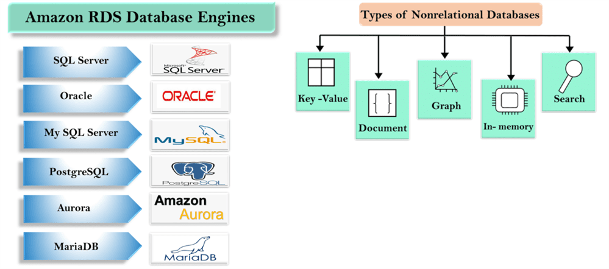

4. Databases
============

-   **Amazon Relational Database Service:** It supports six commonly used
    database engines.

-   **Amazon Aurora:** It is a MySQL-Compatible relational database with five
    times performance.

-   **Amazon DynamoDB:** It is a fast and flexible NoSQL database service.

-   **Amazon Redshift:** It is a petabyte-scale data warehouse service.

-   **Amazon Elasticache:** It is an in-memory cache service with support for
    Memcached and Redis.

-   **AWS Database Migration Service:** It is a service that provides easy and
    inexpensive to migrate your databases to AWS cloud.

### AWS Database types

### Types of DBs

#### Flat file databases

-   Have one line per record

-   Doesn’t contain multiple tables

-   Ex: xls

#### Relational databases

-   Store portions of the data in designated tables

-   Tables are related based on unique identifier

#### NoSQL

-   Not based on SQL or relational design theory

-   Design supports fast transactions

-   DynamoDB is a NoSQL service

-   Create

-   Query

-   Read/write/modify

#### Data Warehouses

-   Large, central repository for data

-   Data aggregated from one or more sources

-   Used for Online Analytical Processing (OLAP), bigdata

-   Ex. AWS Redshift

Redshift is a data warehouse database solution. It is optimized for OLAP and is
managed by AWS through the RDS service.

### Types DB hosting in AWS

#### EC2 Instance-Based Database Hosting

1.Launch an instance

2.Install the database service

3.Open appropriate ports in security groups

4.Connect to the database

#### AWS Service-Based

With AWS Service-Based databases in the RDS service, you do not need to be
concerned with operating system installation and configuration, but you will
still need to create the databases, manage security, and perform backup
procedures

1.Create the database

2.Connect to the database

### High Availability Solutions

#### Clustering

-   Multiple servers (instances)

-   One database with replication

-   Increases availability

-   Automatic failover

-   Increased cost

#### Standby Instances

-   Multiple servers (instances)

-   One database with replication

-   Increases recoverability

-   No automatic failover

-   Reduced costs

#### Multiple AZ Deployment

-   Multiple instances

-   Multiple AZs

-   One region

-   Replicated storage

-   Increased availability

-   Increased performance

-   Cost

### Database Security

**RDS databases support Storage encryption**

If someone steals a hard drive for example, they cannot get the data off of that
hard drive, because it's encrypted on the hard drive.

Administration access based on IAM.

RDS databases do support encryption; however, it must be enabled during database
creation. The only other option is to backup the database and then recover it
with encryption. However, database recovery is really the creation of a new
database and that is why encryption can be enabled during recovery.
