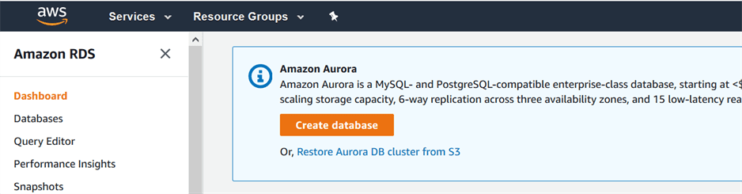
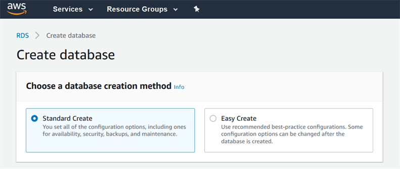
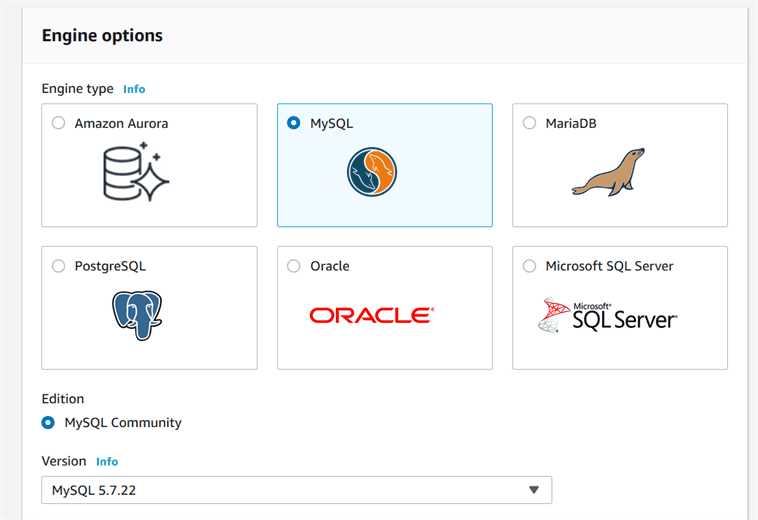
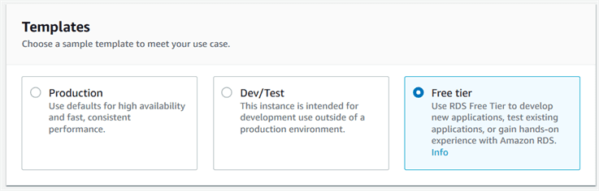
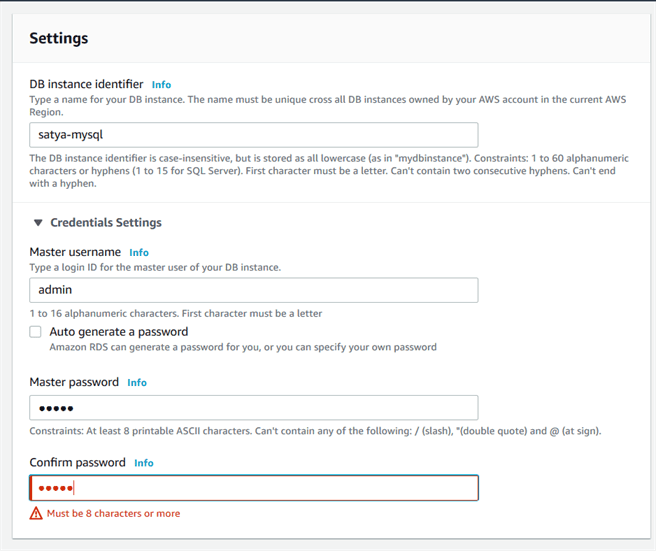
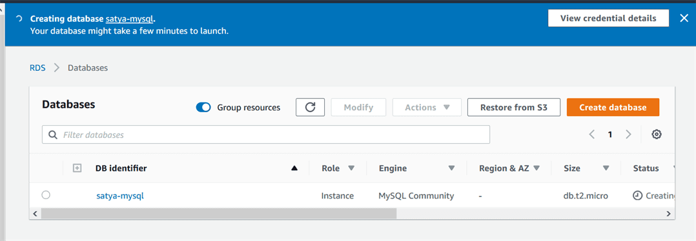
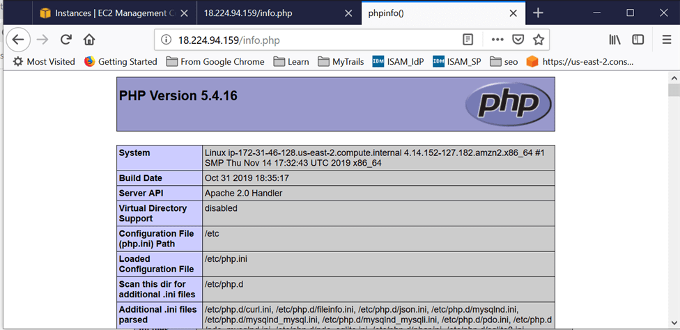
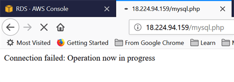
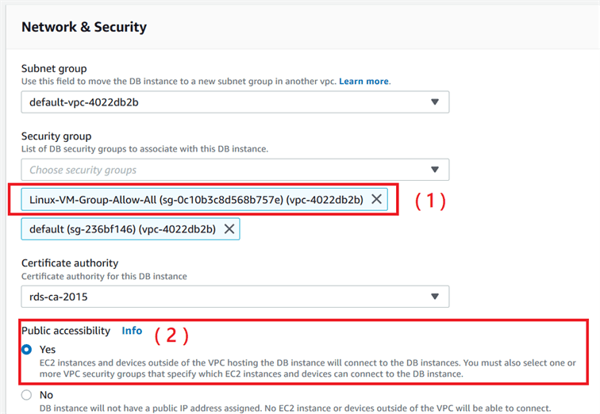

RDS – AuroraDB
==============

Amazon Aurora is a MySQL- and PostgreSQL-compatible enterprise-class database .
**Aurora is 5x faster than RDS MySQL**.

### Lab

#### Create MySQL DB

Click on the RDS service under Database > Create Database button.



Choose Database : MySQL database. & Choose "Free Usage Tier", and then click on
the Next.











The above screen shows that your DB instance has been created.

### Lab - Create EC2 Instance & Install PHP.

Install the PHP and server by running the command **yum install httpd php
php-mysql -y.**
```python
sudo su
yum install httpd php php-mysql -y
```


Run the command yum **update -y** to update the EC2 instance.
```python
yum update -y
```


Run the command **service httpd start** to start the server.
```python
service httpd start 
start httpd.service
```
<br>

Put the php information to the info.php file.  
**/var/www/html/info.php**
```python
<?php

// Show all information, defaults to INFO_ALL
phpinfo();

?>
```
<br>

Restart httpd server  
```python
sudo systemctl start httpd
sudo systemctl stop httpd
sudo systemctl restart httpd
sudo systemctl status httpd
```

<br>

Access <PublicIP>/info.php – <http://18.224.94.159/info.php>




<br>

## Lab – Connect an EC2 instance to an RDS instance.

EC2 Instance
```python
Public DNS (IPv4)
ec2-18-224-94-159.us-east-2.compute.amazonaws.com
	
IPv4 Public IP
18.224.94.159	
	
Security groups
Linux-VM-Group-Allow-All. view inbound rules. view outbound rules
```

<br>

MySQL details
```python
satya-mysql.cwvopwhdayaq.us-east-2.rds.amazonaws.com:3306

Security
VPC security groups
default (sg-236bf146)( active )

Public accessibility
No
```
<br>

Create a mysql.php file.
```python
<?php
$servername = "satya-mysql.cwvopwhdayaq.us-east-2.rds.amazonaws.com";
$username = "admin";
$password = "12345678";

// Create connection
$conn = new mysqli($servername, $username, $password);

// Check connection
if ($conn->connect_error) {
    die("Connection failed: " . $conn->connect_error);
}
echo "Connected successfully";
?>
```

<br>


<http://18.224.94.159/mysql.php>



The above screen shows that an EC2 instance is not connected to an RDS instance
because of the following reasons:

-   Both RDS instance and EC2 instance contains different security groups.

-   Update the hostname with the end point of RDS instance.



Now EC2 instance has been connected to your RDS instance.
