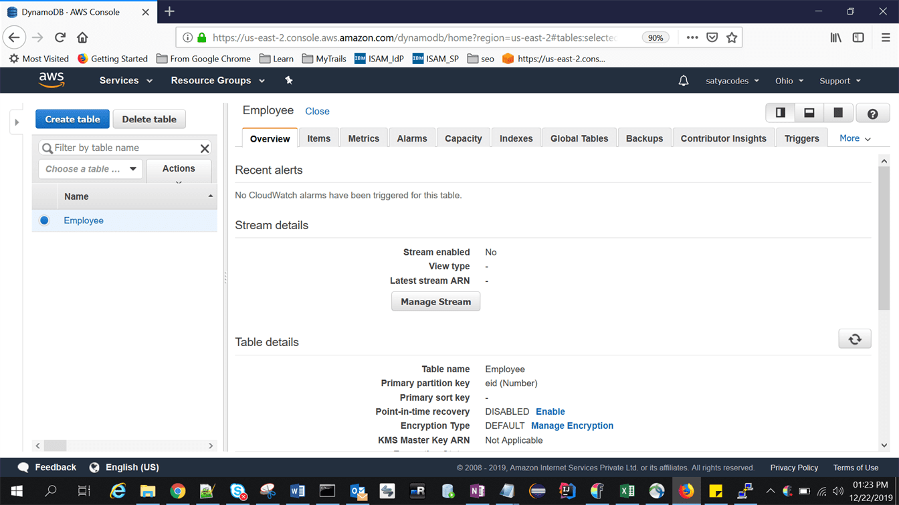
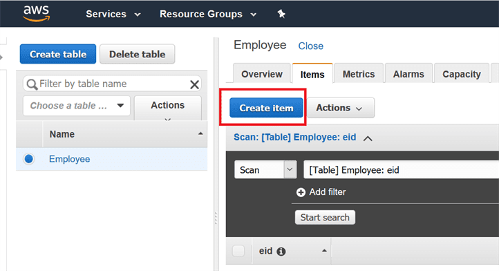
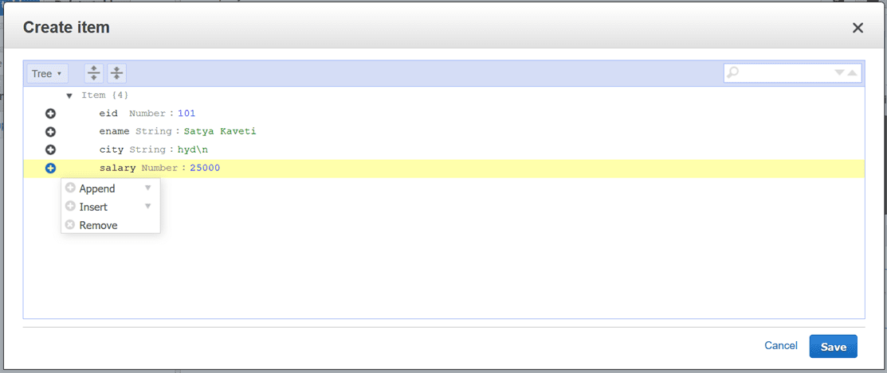
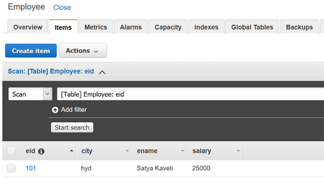

DynamoDB
========

Amazon DynamoDB is a fast and flexible NoSQL database service for all
applications that need consistent, single-digit millisecond latency at any
scale. Its flexible data model and reliable performance make it a great fit for
mobile, web, gaming, ad-tech, IoT, and many other applications

### Lab – Creating , Inserting And Querying A Table In DynamoDB

Step 1: Navigate to the DynamoDB section in AWS or click here. Select “Create
Table“.

Step 2: Fill “Employee” details and click on “Create“.

Step 3: You can view your table being created. Click on “Overview” to understand
your table, click on “Items” to edit, insert and query on the table.

Now that you have created a table, let’s go ahead and insert a few items and
understand how NoSQL works.

Step 1: Navigate to “Items” and click on “Create item“.

Step 2: It will open a JSON file where you can add different items. Click on the
“+” symbol and select “Append” and select what type of data you want to enter.

Step : This is how your table will look like once you have inserted the data.

