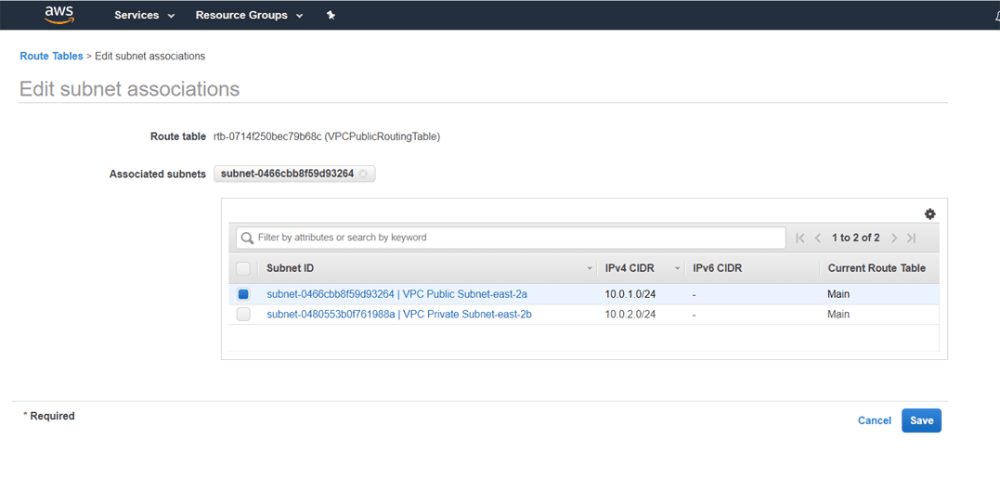

Lab – Creating your own VPC
===========================

#### Creating VPC

AWS services> **Networking and Content Delivery** >Your VPC’s – **Create
VPC** to create new VPC

For VPC we have IPv4, IPv6, DHCP, Route Table, ACL network details. Lets compare
all the properties of two VPS’s (default, SatyaVPC)

Subnets – **Default** , **SatyaVPC**

Routing Tables – **Default** , **SatyaVPC**

Internet gateway – **Default** , **SatyaVPC**

Network ACL – **Default** , **SatyaVPC**

Security Groups – **Default** , **SatyaVPC**

Till now, we observe that VPC creates three services, i.e., Route tables,
Network ACL and Security Groups. It is shown in the below figure:

#### Create Subnets

 in VPC, we should have one public subnet and one private subnet.

Create Subnets

AWS Services > VPC > Subnets

Create Public Subnet - VPC Public Subnet-east-2a

Create Private Subnet - VPC Private Subnet-east-2b

We have created two subnets – but both are in private.

To make a subnet public, click on the **Actions** drop down menu and then click
on the **Modify auto assign IP settings** > Check the **Auto Assign IPv4 box**,
and then save

Till now, our VPC looks:

#### create Internet gateway

An internet gateway is a virtual router that connects a VPC to the internet.

AWS Services > VPC > Internet Gateway > Create Internet Gateway

By Default internet gateway is detached from the VPC. To attach the internet
gateway to VPC, Click on the Actions drop-down menu and then click on
the **Attach to VPC**

#### Route Table

A route table specifies how packets are forwarded between the subnets within
your VPC, the internet, and your VPN connection

Go to Route Tables , Select VPC created Routing Table > Subnets associations

*-You do not have any subnet associations. The following subnets have not been
explicitly associated with any route tables and are therefore associated with
the main route table"* – message

To overcome this problem, we create another route table which would be public,
and the main table would be private.

Route Tables > Create route table

Seleet new table > Routes > Edit routes

Add Target – internet Gateway for 0.0.0.0/0 for all requests

Click on the **subnet associations** of a public route table and then click on
the **Edit subnet associations**. In Edit subnet associations, check
10.0.1.0-us-east-1a subnet box and this includes the subnet in a public route
table. An Unchecked subnet is associated with the main route table

Now we have the last step left, and the last step is to create two EC2
instances. One EC2 instance is created in private subnet and another EC2
instance is created in public subnet.
