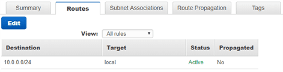

**Lab** : Creating a Virtual Private Cloud
==========================================

We are now going to create below architecture in AWS

1.Go to Services > Search > VPC

2.Click on VPC > Create VPC > fill details & Create

3. VPC is created Successfully.

*Now VPC is just created, but for instances of the VPC has no access with
Internet by default. We need to configure Routing table for the Internet
access.*

4.**To Configure VPC,** Go to VPC > Left: Your VPC’s > Select : Pizza VPC >
Summary: Routetable

By Clicking Route Table link, it will open new tab, and select Route Table Id >
Routes Tab

5.**Next, Create Subnet**, VPN >Left: Subnet > Create Subnet

6.**Next, create Route Table**, VPN >Left: Route Table > Create Route Table

7.To access Internet, we must create Internet gateway : **Internet
gateways** > Create internet gateway

8.To add Internet gateway to VPC, go to subnets > Pizza-Public-Subnet>Routing
table > Edit > add another route & save details

8.So now we need to create another subnet in different region for replica
purpose.

-   Go to **VPCs** > Edit CIDRs > **Add IPv4 CIDR > 100.64.0.0/24 > save**

-   Go to VPC > **Subnets** > Create subnet > Fill Details > Save

    
