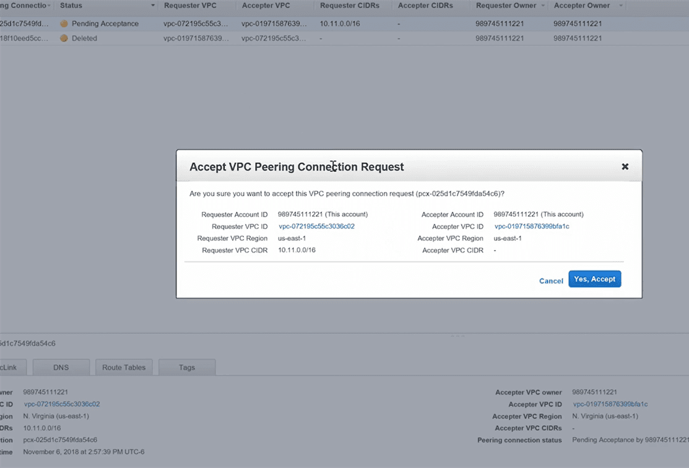
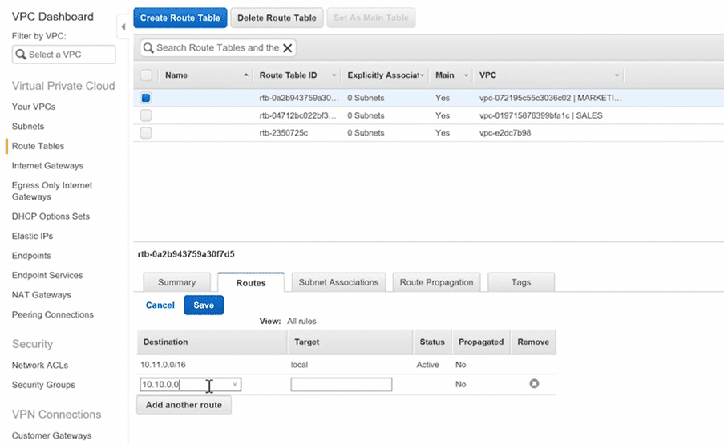

Lab – VPC peering
=================

-   you have a virtual private cloud for **sales** and a virtual private cloud
    for **marketing** 

-   now the sales VPC need to access resources in the marketing VPC and vice
    versa. 

-   Well in order for we must open a channel for communications between
    them because normally VPCs can't talk directly with other VPCs as a
    default. 

-   So we've got to have some method to link them together so that they can
    connect. This is what we call VPC peering

I have database server in a completely different VPC but now I want that the
same database server is to be used by a new application which is deployed on
other VPC.

Step 1: Select the VPC’s to be peered

go to vpc option in your aws account, there you will find “peering connection”
option on left side. in that click on “create vpc peering connection” button,
you’ll get this window

Step 2: Review the peering connection information

Step 3 : Accept the VPC peering request

Step 4 : Edit the route tables of both VPC’s (IMP)

you’ll have to add network range with CIDR of the other VPC into both vpc’s
route table by selecting the appropriate vpc peering id in target field.

Step 5 : Once done check the security group to make sure you have SSH port open
for instances in both VPC’s.Try to perform SSH to the instance in other peered
VPC, It should work!

\$ssh -i "xyz.pem" ec2-user\@10.0.0.2

Note : If it doesn’t work, please check your route table entries.

**Not Transitive**

VPC peering is not transitive. This simply means that peering does not pass
through. For example, if VPC1 is peered with VPC2 and VPC2 is peered with VPC3,
this does not mean that VPC1 is peered with VPC3. All peers must be directly
configured.

### Lab - Creating VPC Peers

-   Owner role of one VPC sends a request to the other VPC

-   Owner of the other VPC accepts the request

-   Each VPC needs a route to the other VPC in their route tables

-   Security group rules may require updates

