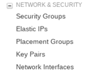
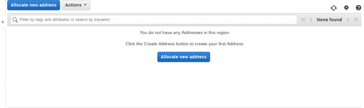
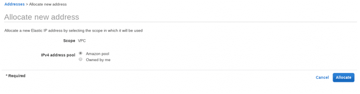
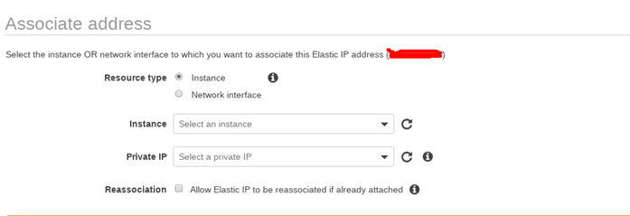
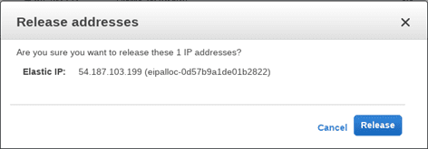

Elastic IP Addresses (EIPs)
===========================

**Private IPv4 addresses**  
Private IPv4 addresses are used to communicate between instances within the same
VPC. You cannot connect to another VPC and so the Internet. **A private IPv4 is
not reachable over the internet.**

**Public IPv4 Address**  
Using the public IP address of the instance, you can communicate to the
internet. **A public IPv4 address is an address which is reachable from the
internet.**

When we launch an instance in a default VPC, AWS allocate a **new public IPv4**
address and DNS associated with the public IP address; for example,
ec2-112-34-123-22.compute-2.amazonaws.com can be the DNS for your public IP
address which resolves the public IPv4 address.

**Elastic IP Address**  
AWS Elastic IP is a public IPv4 address that you can allocate to your instance.
You can associate an elastic IP address to your instance, it will able to access
the internet and it will be associated until you will remove it manually.

*AWS allocate a public IPv4 address for each instance by default then what is
the need for an additional IPv4 address?*

-   When your instance is stopped or terminated, the public IP address gets
    released. **AWS assigns a new public IP address each time when it is
    restarted**.

-   Public IP address is released when you assign an Elastic IP address. When
    you disassociate the Elastic IP address, AWS assigns a new public IPv4
    address from its pool.

-   **AWS Elastic IP addresses are associated with your AWS account and it
    doesn’t change**.

**Few more on Elastic IP**  
-   Public IP addresses from the VPC region

-   Permanently allocated to your account until released

-   Account is charged until release

-   EIPs can be moved between instances in the same region only.

-   Network interfaces consume EIPs, you create the Elastic IP, and then you
    associate it with an Elastic Network Interface, and that network interface
    then is the point at which that public IP address can be used.

Lab - Allocate an Elastic IP Address
------------------------------------

-   Sign in to the AWS management console <https://aws.amazon.com/console/>

-   Open the Amazon EC2 console at <https://console.aws.amazon.com/ec2/>

-   In left navigation, go to “NETWORK & SECURITY” and “Elastic IPs”.

Elastic Ips Option\> **Allocate new Address** – See the below screenshot for
your reference. Elastic IP address are region specific.

Allocate New Address Panel\>For IPv4 address pool, choose Amazon pool

Allocate New Address\>You can choose “Owned by me” if you have an IP address in
your own pool. We are going to choose the “Amazon Pool” as we do not have our
own IPv4 pool.

Choose Allocate and close the confirmation screen – AWS will take few seconds to
allocate the public IPv4 address from its pool as Elastic IP.

**Associating AWS Static IP with EC2 instance**

Now, you can associate the Elastic IP address to your running instance. AWS will
release the public IPv4 address which is currently associated with EC2 instance
and associate the Elastic IP address.

Please follow below steps:

1.  Sign in to the AWS management console <https://aws.amazon.com/console/>

2.  Open the Amazon EC2 console at <https://console.aws.amazon.com/ec2/>

3.  In left navigation, go to “NETWORK & SECURITY” and “Elastic IPs”.

4.  Select an Elastic IP address and choose Actions, Associate address

5.  You will see the below dialog:

6. Associate Elastic Ip

Choose the instance from the running instances. AWS will automatically select
the private IP address for your instance.

If your Elastic IP address is associated with any other instance then select to
reassociate check box. Now click associate address.

AWS will take a few seconds/minutes to associate the Elastic IP address to your
running instance. You would be able to see the Elastic IP address association in
EC2 properties.

**Disassociating from EC2 instance**

You can disassociate an Elastic IP address which is currently assigned to an EC2
instance. You can do it by assigning to any other EC2 instance, in this case,
you just need to follow the steps above.

If you just want to disassociate not reassociation then follow the below steps:

1.  Sign in to the AWS management console <https://aws.amazon.com/console/>

2.  Open the Amazon EC2 console at <https://console.aws.amazon.com/ec2/>

3.  In left navigation, go to “NETWORK & SECURITY” and “Elastic IPs”.

4.  Select an Elastic IP address and choose Actions, Diassociate address

5.  You will see a dialog, click on the “Disasscociate address” button

AWS will take few seconds to disassociate the Elastic address from your running
EC2 instance.

**Release Elastic IP Address**

If you no longer need the Elastic IP address then you can release it from your
account. Please make sure that you have disassociated the Elastic IP address
from your EC2 instance.

Please follow the below steps:

1.  Sign in to the AWS management console <https://aws.amazon.com/console/>

2.  Open the Amazon EC2 console at <https://console.aws.amazon.com/ec2/>

3.  In left navigation, go to “NETWORK & SECURITY” and “Elastic IPs”.

4.  Select the Elastic IP address, choose Actions, and then select Release
    addresses. Choose Release when prompted.

>   Release Elastic Ip Address

1.  Release Elastic Ip Address

AWS will take a few seconds and your Elastic IP address will be released.

**AWS does not support Elastic IP address with IPv6. The limit of Elastic IPv4
address per account is limited to 5 per region.**

Elastic Network Interfaces (ENIs)
---------------------------------

-   Virtual network interface attached to an instance

-   Only available within a VPC

-   Associated with a subnet

**Allows dual‐homing**

an internet router is a dual-homed device. It would be a device that has one
connection on the internet and one connection on your private network. A
firewall would be a dual-homed device.

One connection on the network that's untrusted, one connection on the network
that's trusted, and then it's doing its fire-walling between those two networks
because it's dual-homed.

**One public address and multiple private addresses**

you are dealing with this for instances that run in a Virtual Private Cloud and
it's associated with a subnet. So you have a subnet; you have an ENI, that is
associated with that subnet; they all exist in a VPC; and, of course, the ENI's
connected to an instance.

<https://support.kemptechnologies.com/hc/en-us/articles/115004176846-How-to-add-an-additional-Network-Interface-to-a-LoadMaster-in-Amazon-Web-Services-AWS->
