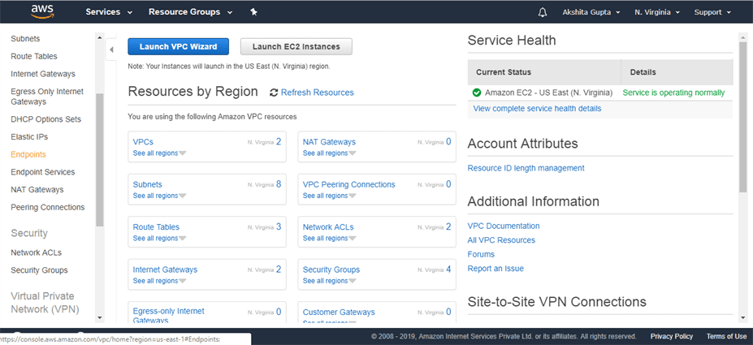
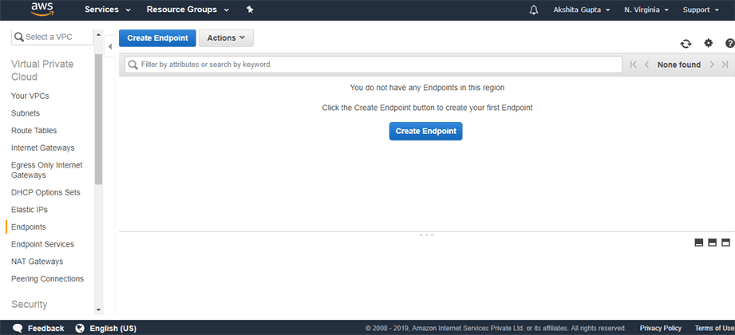
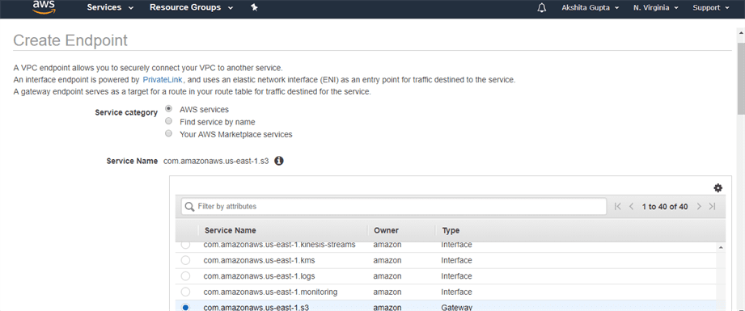
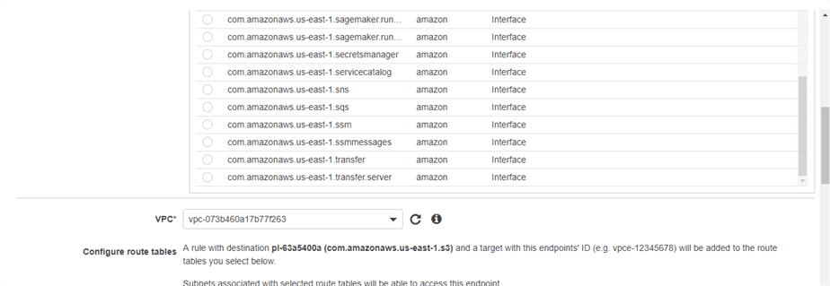
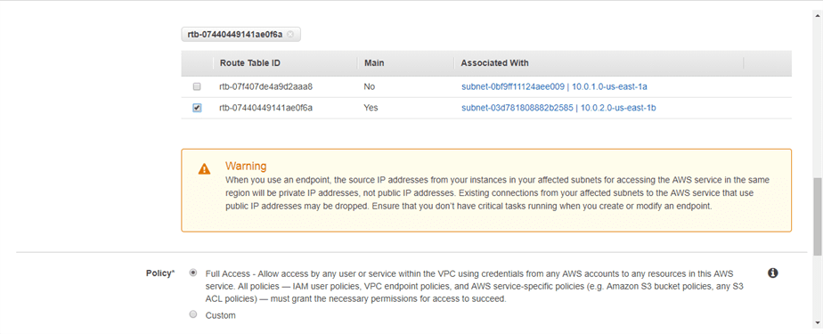
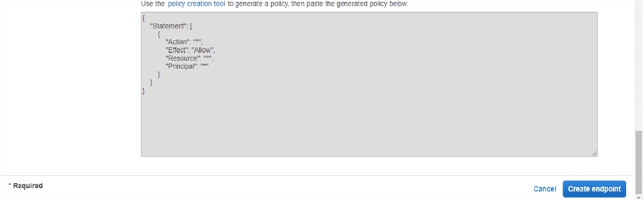
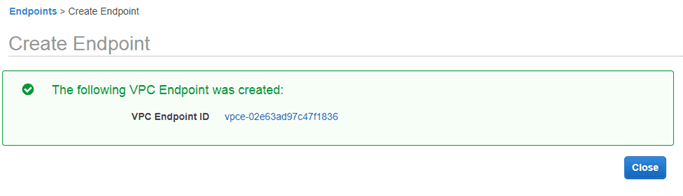

VPC Endpoints
=============

VPC endpoint enables a user to connect with AWS services that are outside the
VPC through a private link. VPC endpoints use AWS Private Links in the backend
with which users will be able to connect to AWS services without using public
IP’s.

My EC2 instance have two subnets- public, private. If private subnet wants to
store the file in S3 sevice which is outside of VPC. so here S3 is an Endpoint
Service.

There are two types of VPC endpoints,

**Interface Endpoints:**

Interface Endpoints are Elastic Network Interfaces (ENI) with private IP
addresses. ENI will act as the entry point for the traffic that is destined to a
particular service. Services such as Amazon CloudWatch Logs, Amazon SNS, etc.
are supported

**Gateway Endpoints:**

Gateway endpoints is a gateway targeted for a specific route in the routeing
table. They can be used to route traffic to a destined AWS service. As of now,
Amazon S3 and DynamoDB are the only services that are supported by gateway
endpoints.

#### Network Access Control Lists (NACLs)

A *network access control list (ACL)* is an optional layer of security for your
VPC that acts as a firewall for controlling traffic in and out of one or more
subnets. You might set up network ACLs with rules similar to your security
groups in order to add an additional layer of security to your VPC.

-   Applied on subnets

-   Stateless processing

-   Supports both allow and deny rules

-   Rule number defines precedence

-   Lowest numbered rules first

-   First match applies

#### Network Address Translation (NAT)

To access the Internet, one public IP address is needed, but we can use a
private IP address to access Internet, that’s the concept of NAT.

 To achieve this, the translation of private IP address to a public IP address
is required. **Network Address Translation (NAT)** is a process in which one or
more local IP address is translated into one or more Global IP address and vice
versa in order to provide Internet access to the local hosts.

### Lab

We have already created a custom VPC whose name is **SatyaCodesVPC.**Click on
the VPC Endpoint appearing on the left side of the console.

Click on the **Create Endpoint.**

Fill the following details to create a VPC Endpoint.

**Where,**

-   **Service category:** I select the **AWS services** that I will use through
    the VPC Endpoint.

-   **Service name:** Select the service that you want to use. Suppose I choose
    AWS S3 service.

-   **VPC:** Select the VPC that you have created. I have created SatyaCodesVPC,
    so choose the **SatyaCodesVPC** from the VPC drop-down menu.

-   **Configure route tables:** Choose the main route table that has been
    created in a SatyaCodesVPC.

The below screen shows that the VPC Endpoint has been created.

>   VPC Endpoint

