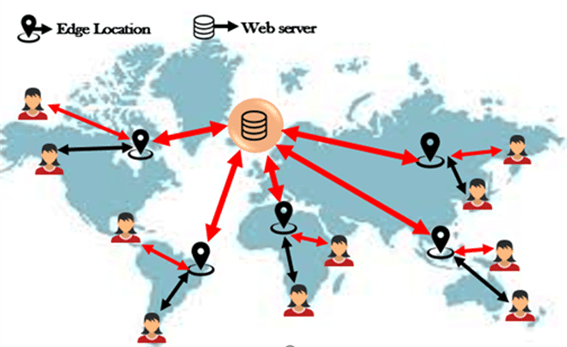
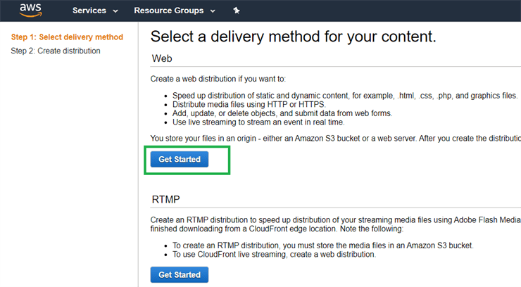
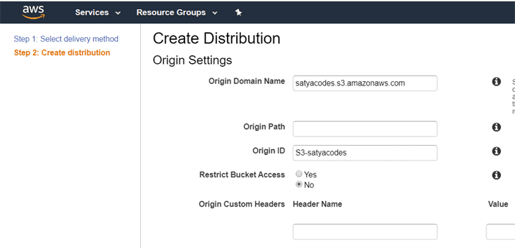
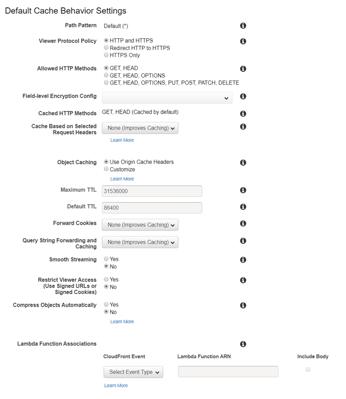
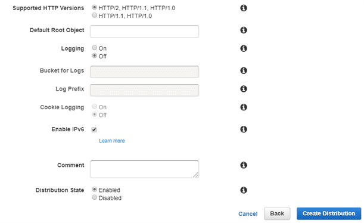

CloudFront
==========

CDN – content delivery network

Amazon CloudFront is a web service that speeds up distribution of your static
and dynamic web content, such as .html, .css, .js, and image files, to your
users. CloudFront delivers your content through a worldwide network of data
centers called edge locations. When a user requests content that you're serving
with CloudFront, the user is routed to the edge location that provides the
lowest latency (time delay), so that content is delivered with the best possible
performance.

-   If the content is already in the edge location with the lowest latency,
    CloudFront delivers it immediately.

-   If the content is not in that edge location, CloudFront retrieves it from an
    origin that you've defined—such as an Amazon S3 bucket, a MediaPackage
    channel, or an HTTP server (for example, a web server) that you have
    identified as the source for the definitive version of your content

### CloudFront components

**Origin:** It defines the origin of all the files that CDN will distribute.
Origin can be either an S3 bucket, an EC2 instance or an Elastic Load Balancer.

**Edge Location:** Edge location is the location where the content will be
cached. It is a separate to an AWS Region or AWS availability zone. Edge
locations spread all around the world and currently, there are 50 edge
locations.

**Distribution:**  consists of a collection of edge locations. The distribution
can be of two types:

-   **Web Distribution:** It is typically used for websites, html, .css, .php,
    via HTTP or HTTPS

-   **RTMP:** It is used for media files like videos, streaming etc

-   When the first user requests to get the content, and the request goes to the
    nearest edge location.

-   The nearest edge will be read first to determine whether it contains the
    cached data or not.

-   If an edge does not contain the cached data, the edge location pulls the
    data from the S3 bucket. Suppose the S3 bucket is in Ireland. But this
    process is not quicker for the first user.

-   However, when the second user accesses the same file, this file is already
    cached to the edge location, so it pulls the data from its edge location. It
    speeds up the delivery of the data.

### Lab – CloudFront Cache example for HTML website

Create a bucket and upload content in a bucket. Now we can able to access the
website using

<https://satyacodes.s3.us-east-2.amazonaws.com/index.html>

Create a CloudFront Distribution > Open the CloudFront Console > **Create
Distribution**

Select the delivery method for your content, for websites it is **Web
Distribution**,

**Origin Settings**

-   **Origin Domain Name:** It defines from where the origin is coming from.

    

    

    

After the Distribution has been created, we get the domain name of the
CloudFront Distribution and we also know the object name that we have placed in
the S3 bucket.

Now we can access our website, though CloudFront CDN – **http://domain
name<file-name>**

<http://d1l6zugzuy21jt.cloudfront.net/index.html>
