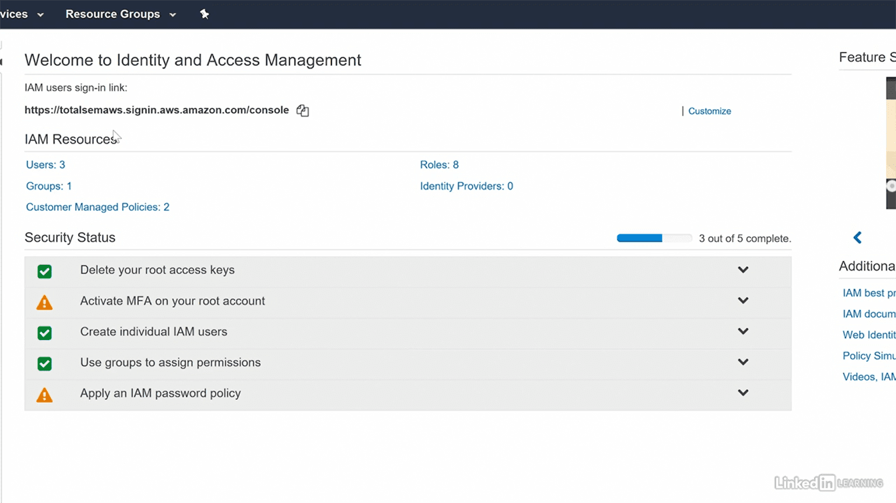
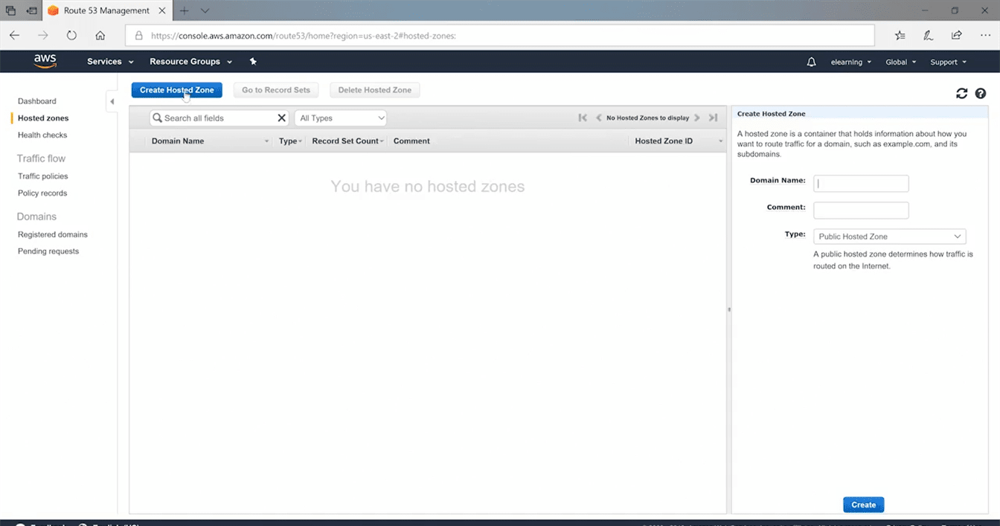
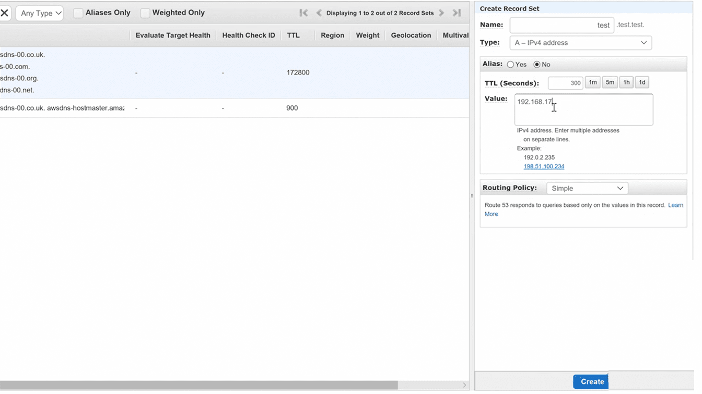

Route 53 – Domain Hosting Service
=================================

We can use Amazon Route 53 to register new domains, transfer existing domains,
route traffic for your domains to your AWS and external resources, and monitor
the health of your resources

To make more easier – route53

EC2

### Lab – Host a website with Route 53

Referencs
---------

Tersms

<https://start.jcolemorrison.com/aws-vpc-core-concepts-analogy-guide/>
