Auto Scaling
============

 With a physical server infrastructure, if you want to scale up it means adding
more physical servers, scale down means reducing physical servers.

-   Monitors applications

-   Adjusts capacity

-   Manages costs

### Auto Scaling Functionality

-   It monitors your applications and then adjusts capacity according to your
    needs

-   Auto Scaling is Free to use, Results of use may cost: adding more services
    means adding more cost

### Scalable AWS Resources

-   EC2 Auto Scaling groups

-   DB clusters

-   DynamoDB indexes, tables

-   Elastic Container Service (ECS) services

### Auto Scaling groups

Auto Scaling groups can be defined as a collection of instances with similar
characteristics.

The auto scaling group is going to have the EC2 instances in it that can be
scaled out or scaled in as you need them to be scaled.

-   Scaling out ‐ adding instances

-   Scaling in ‐ removing instances

### Lab

EC2 \>Autoscaling \>Autoscaling Group

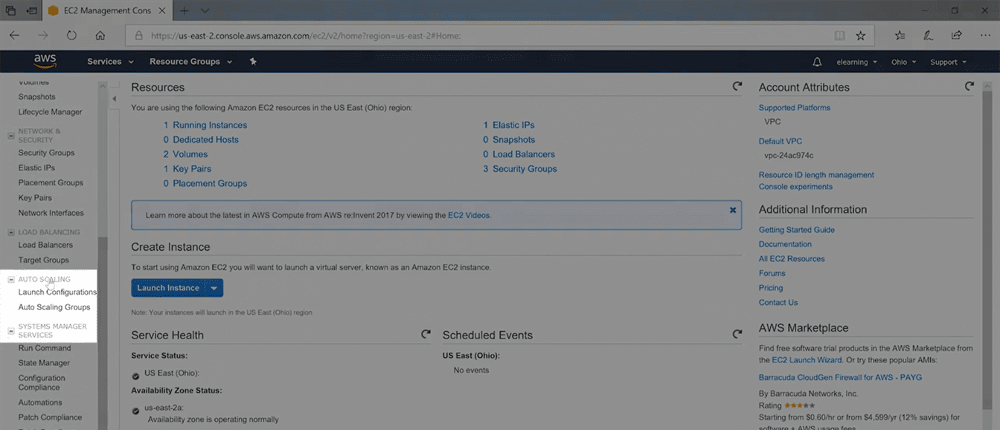

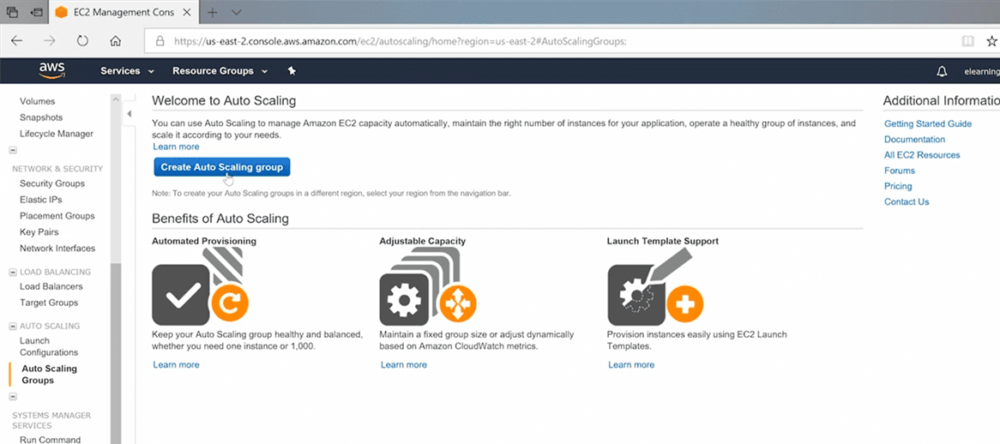

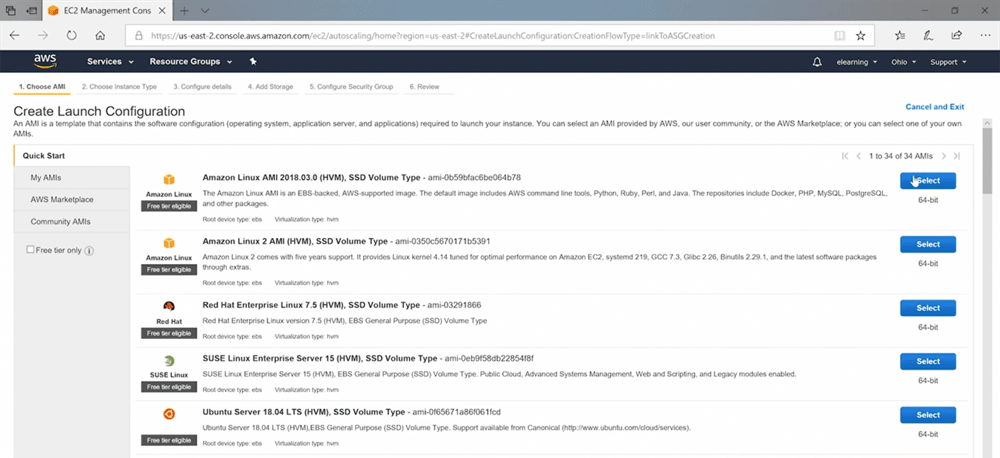

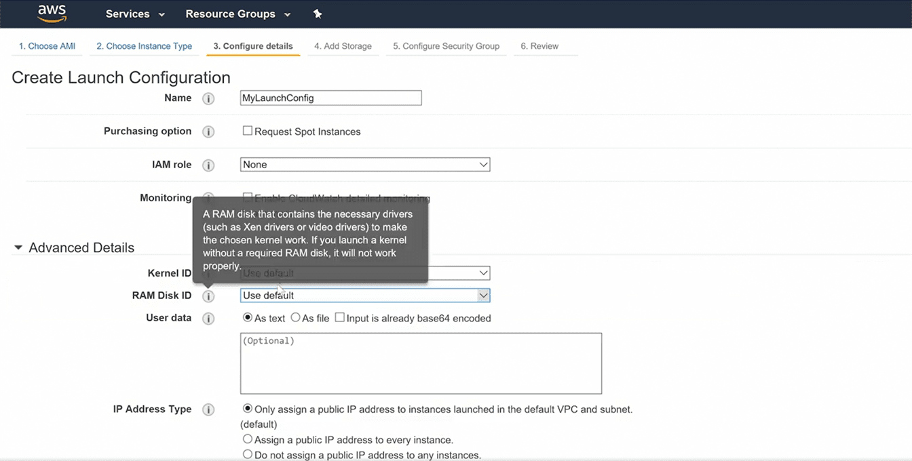

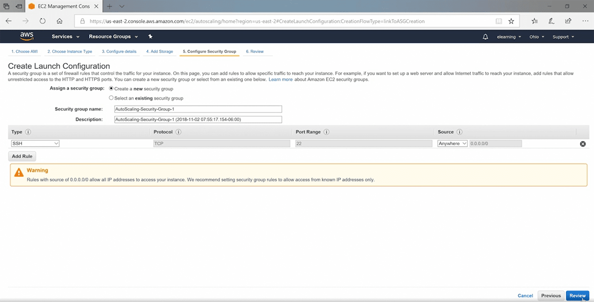

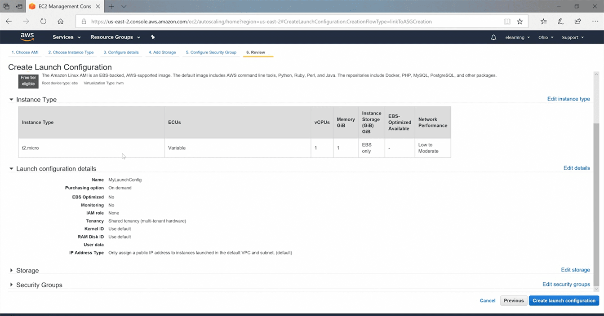

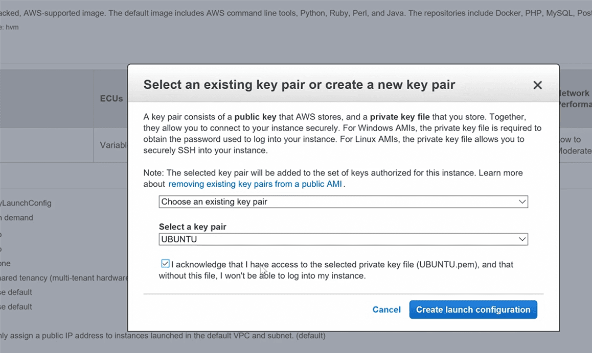

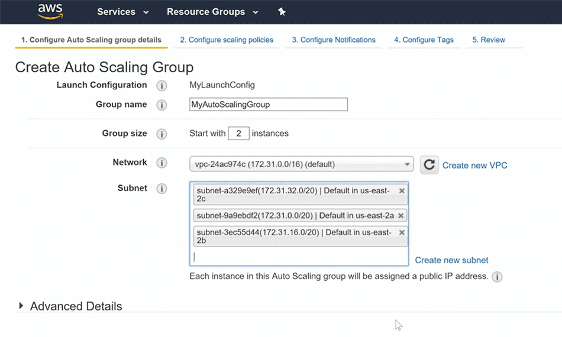

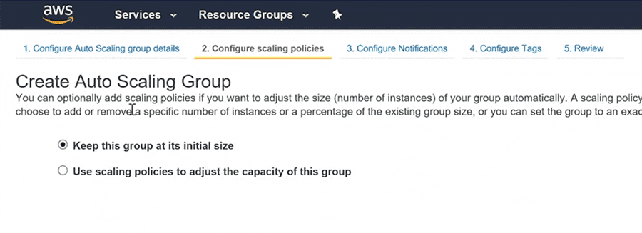

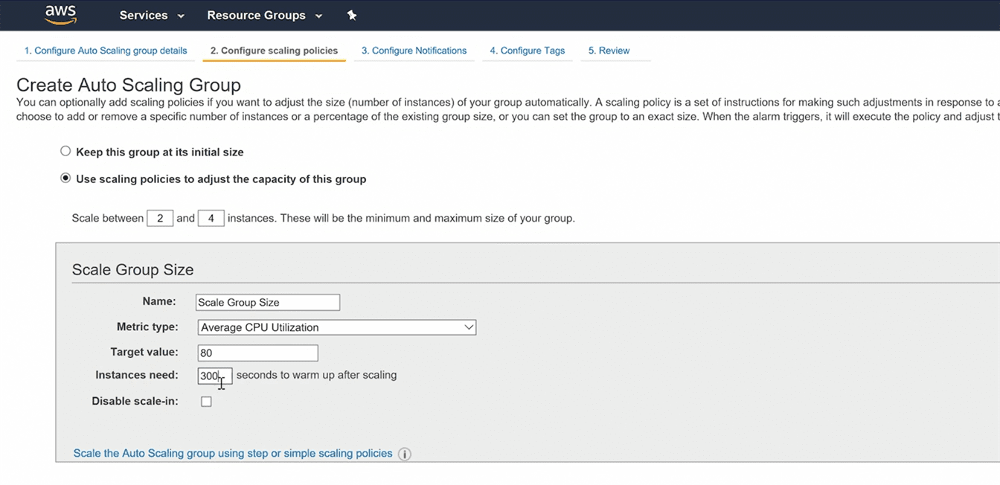

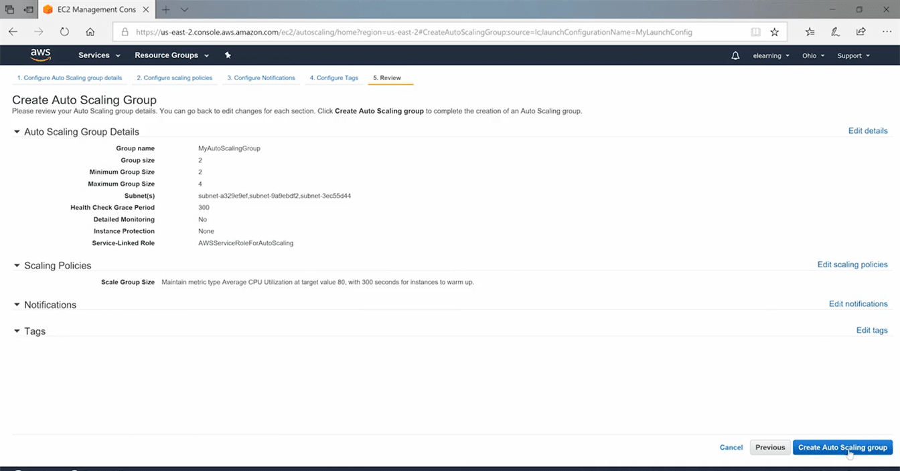

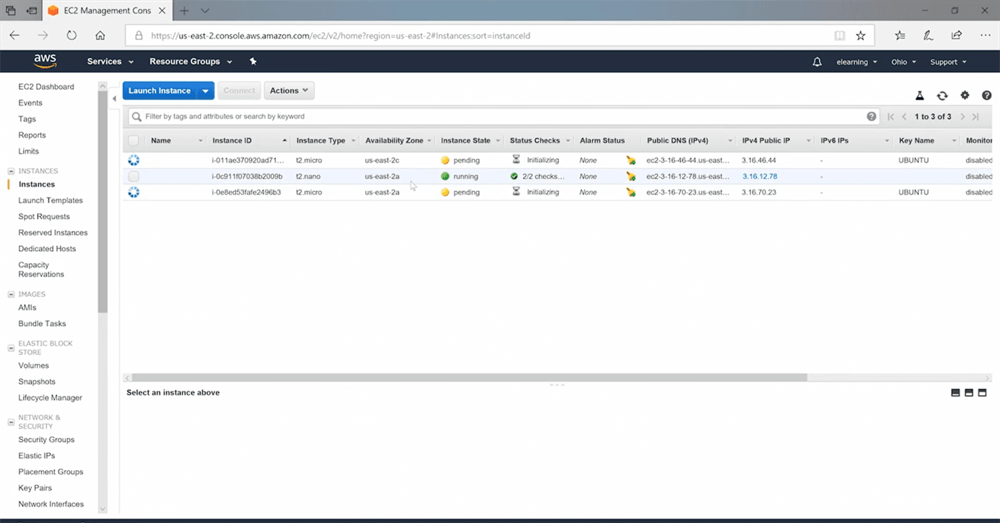
