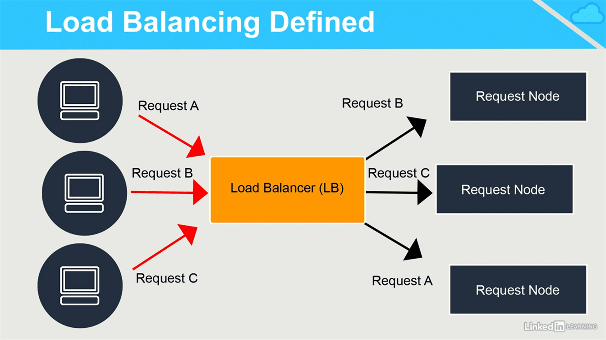
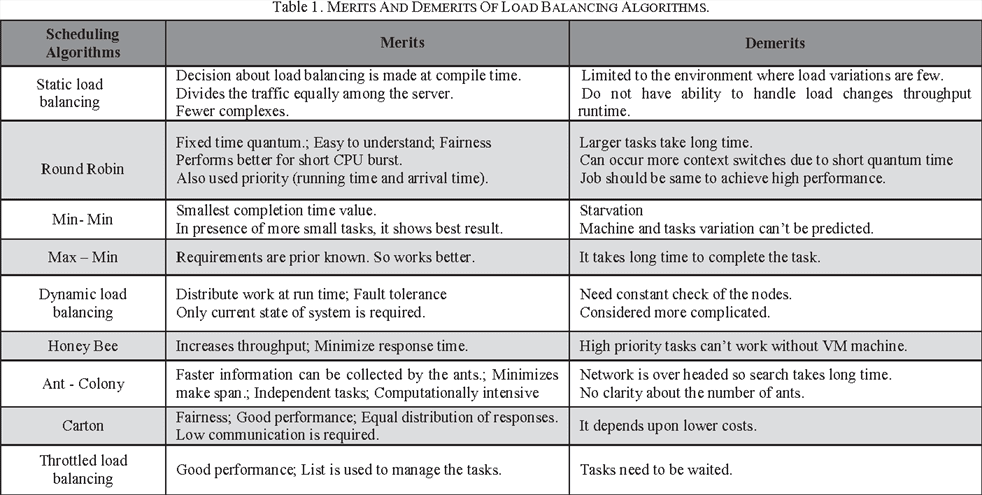
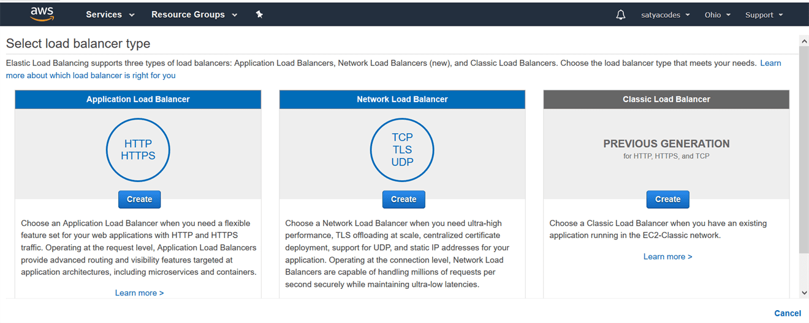
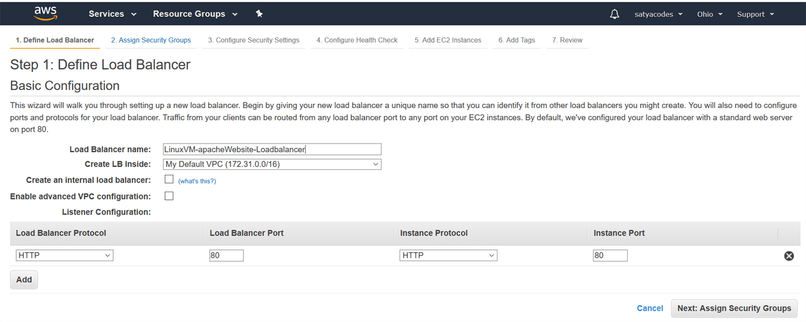
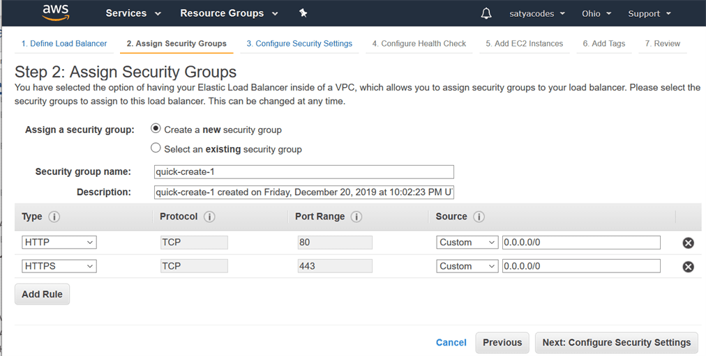
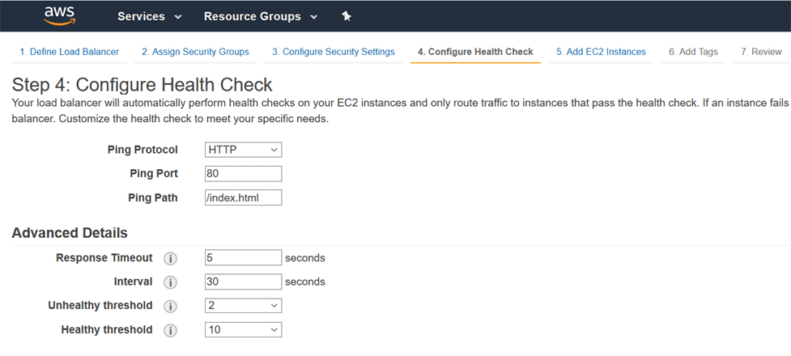
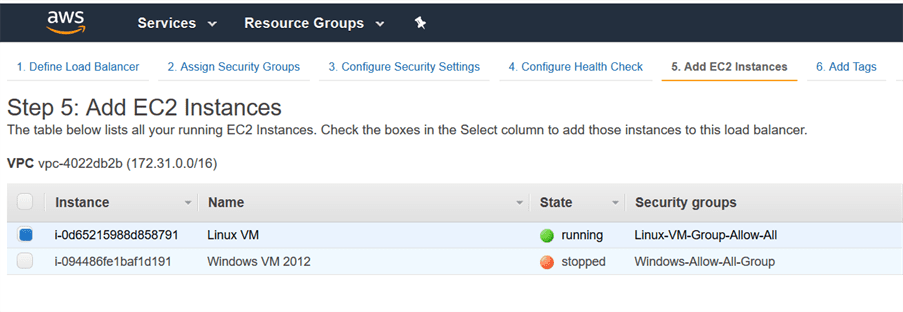
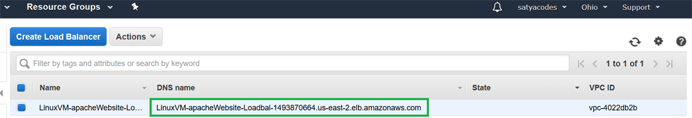
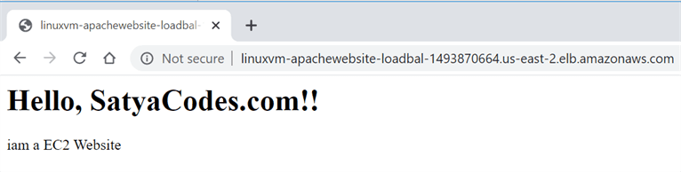

Elastic Load Balancing (ELB)
============================

Elastic Load Balancing automatically distributes incoming application traffic
across multiple targets, such as Amazon EC2 instances, containers, IP addresses

### Load Balancer Basics

**Sender initiated Load Balancer**

If you're using the type of DNS load balancing , The DNS server responds to a
client request by saying here are all the possible IP addresses you can use for
that host name you're trying to resolve. . Then the client can decide which one
of those IP addresses it to actually wants to use. 

**Receiver initiated Load Balancing**

With receiver initiated, it means that the request always goes to one
location, and that receiver, what we call the load balancer, selects the best
target.

### ELB Types 

Elastic Load Balancing offers three types of load balancers that all feature the
high availability, automatic scaling, and robust security necessary to make your
applications fault tolerant.

-   Application load balancer - HTTP/HTTPS , Web Applications

-   Network load balancer - TCP load balancing

-   Classic load balancer - only for legacy use and not for new deployments

**ELB Supported Services**

-   EC2

-   ECS

-   Auto Scaling

-   CloudWatch

-   Route 53

### Lab – Creating a Load Balancer

We already have a website , which is created “**Lab – host website on EC2 server
with Apache Server”**. The website Url is : <http://18.224.94.159/about.html>.

In this Example we add load balancer to this Website instance.

EC2 Dashboard > left : Load Balancing > Load Balancer > Create load balancer

We Choose – **Classic Load Balancer**

**Create an internal load balancer:** As we want to serve external web traffic,
so we need an external load balancer, not an internal load balancer. Uncheck
this field.

**Security Group** – HTTP, HTTPS request accept from any where

Ping Path – Home page path

Add EC2 Instance for load balancing

Review the load balancer, and then click on the **Create**

If we access the created website using above DNS Name :
<http://linuxvm-apachewebsite-loadbal-1493870664.us-east-2.elb.amazonaws.com/>,
It will balance the load, if you get many requests.

