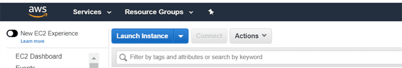
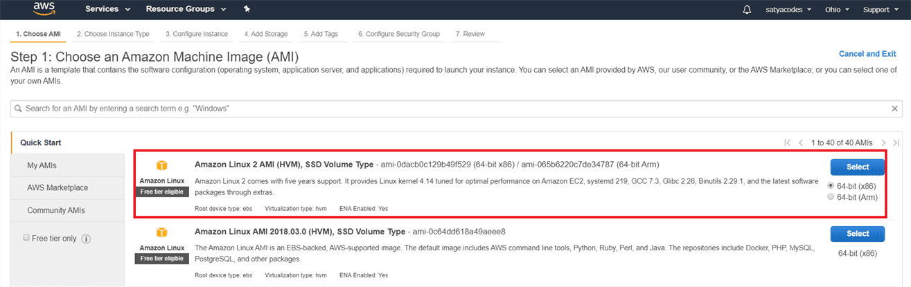
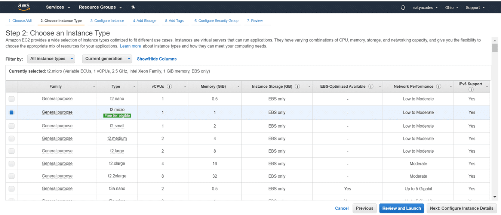
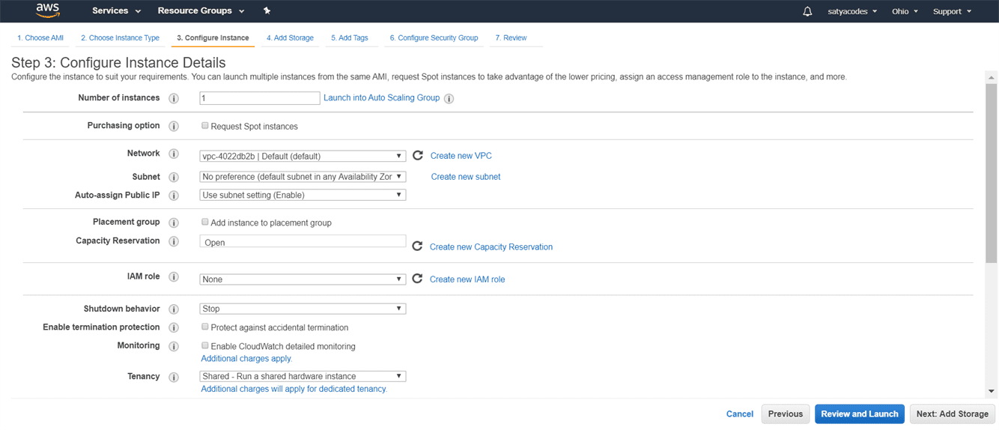
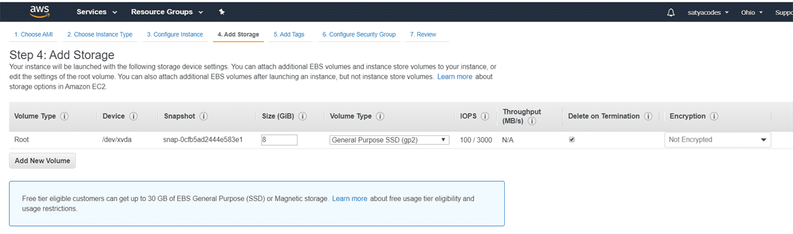
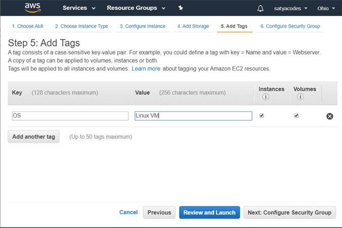
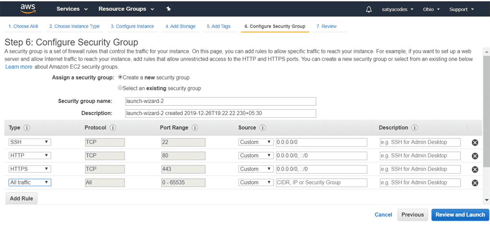
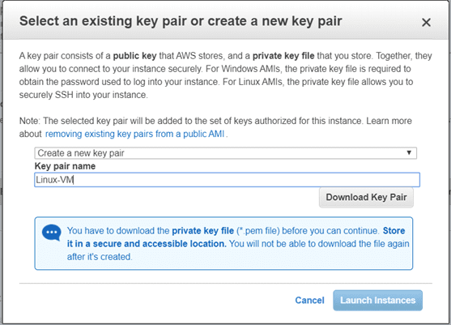
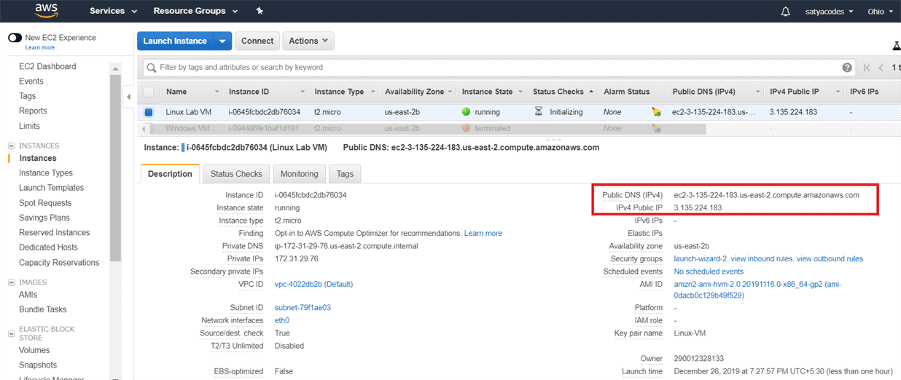
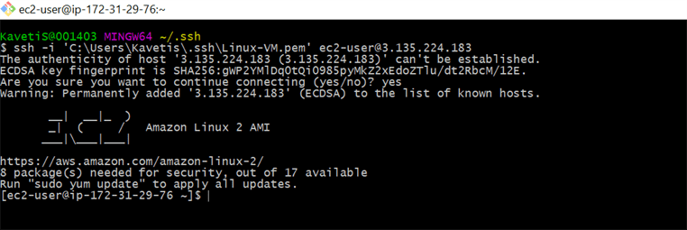

### Launch a Linux Virtual Machine with Amazon EC2

AWS Services > Amazon EC2 to open the service console.

Select Launch Instance to create and configure your virtual machine

choose an **Amazon Machine Image (AMI)** > **Amazon Linux AMI** and click
Select

Choose an Instance type : various combinations of CPU, memory, storage, and
networking capacity.default option of **t2.micro**

Configure Instance

Add Storage

Add Tags

Configure Security Groups & SSH connection details - Click Review and Launch

On the next screen you will be asked to choose an existing key pair or create a
new key pair. A key pair is used to securely access your Linux instance using
SSH

\- Select Create a new key pair and give it the name LinuxVM. Next click the
Download Key Pair button.

saving your key pair in your user directory in a sub-directory called .ssh (ex.
C:\\user\\{yourusername}\\.ssh\\Linux-VM.pem).

Click View Instances- Copy the Public IP address of your AWS instance, so you
can use it when we connect to the instance using SSH

#### Login to VM

**Login Using Git**

-   Download & Install Git

-   Open Git Bash > Run

>   ssh -i {full path of your .pem file} ec2-user@{instance IP address}

>   ssh -i 'C:\\Users\\Kavetis\\.ssh\\Linux-VM.pem' ec2-user@3.135.224.183

**Login Using Putty**

1.Open Downloaded .pem file

-   If we are using Linux system, we can directly use .pem file for connection.

-   If we are using Windows System, we don’t have SSH directly.

we use PuttY for SSH connections. but Putty doesn't support .pem file it only
supports .ppk file. for that we need to convert .pem file to .ppk file

2.Covert .pem to .ppk using Putty

-   Launch PuttyGen

-   Load .pem file

-   Save Private Key: Linux-VM.ppk

3.Open Putty

-   Enter Ip : 18.216.255.66

-   Connection Type : SSH

-   Left Menu > SSH >+AUTH : Browse saved Linux-VM.ppk file

Remember : Default user for EC2 Instance is : "ec2-user"
