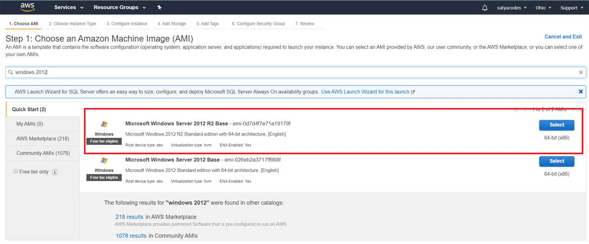
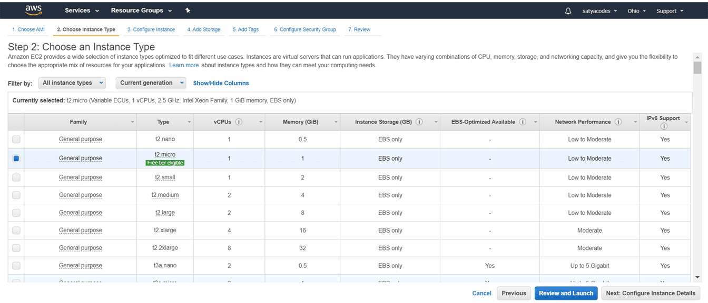
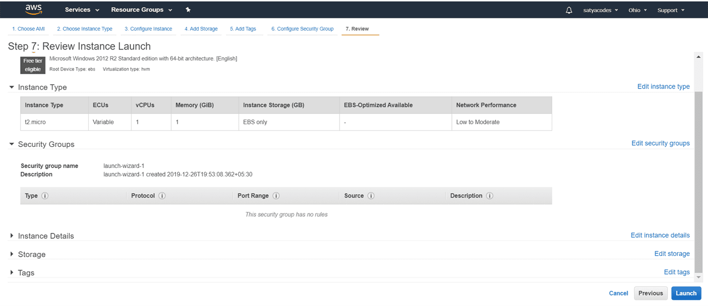
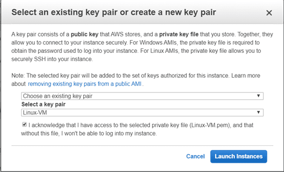
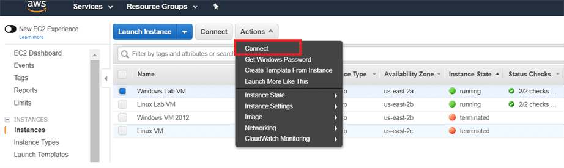
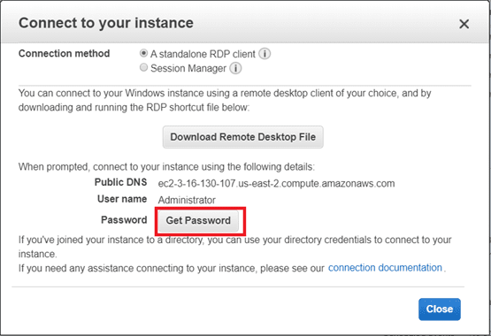
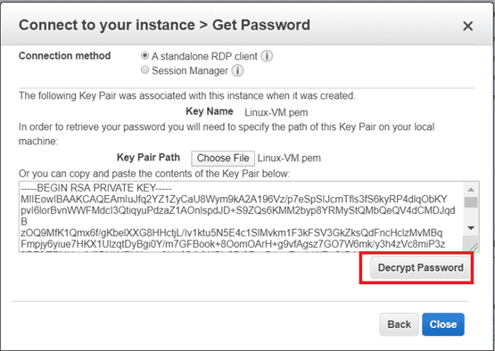
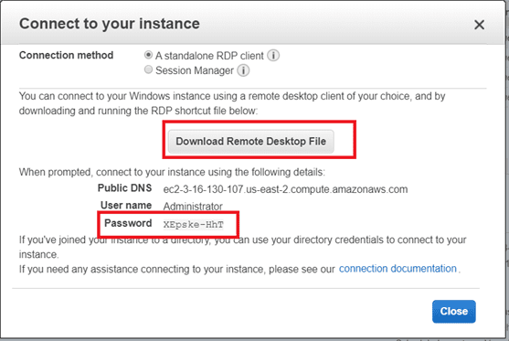
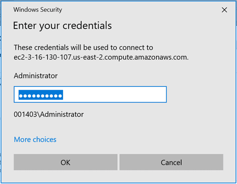

### Launch a Windows Virtual Machine

Amazon EC2 \> Click Launch Instance

Amazon Machine Image (AMI) \> Microsoft Windows Server 2012 R2

instance type - select the default option of **t2.micro**

Then click Review and Launch

Create a Key Pair and Launch Your Instance – We already created Key Pair, we use
the same

Select the Windows Server instance you just created and click Connect.

In order to connect to your Windows Instance via RDP, you will need a user name
and password:

The User name defaults to Administrator & To receive your password, click Get
Password

to retrieve the password, you will need to locate the Key Pair you created in
before & Click Decrypt Password. Copy/save that Password

Click Download Remote Desktop File and open the file to connect via RDP

