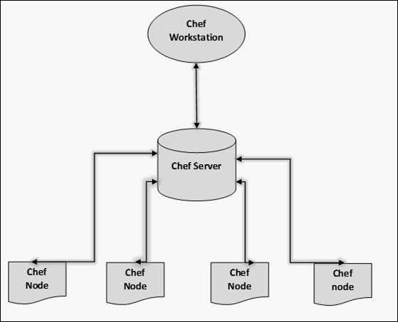
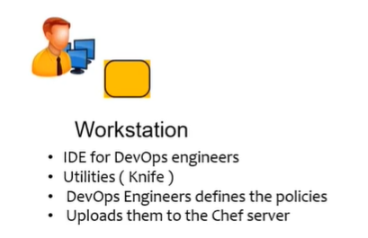
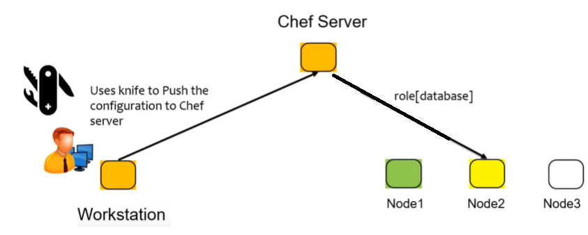
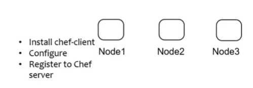
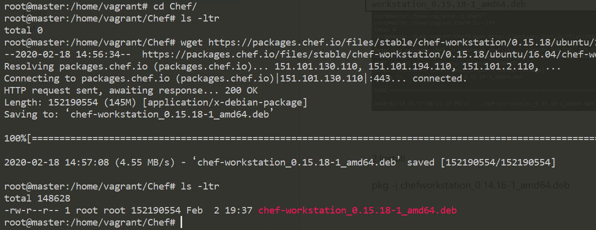
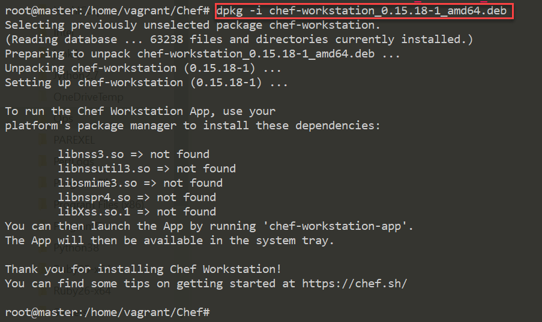
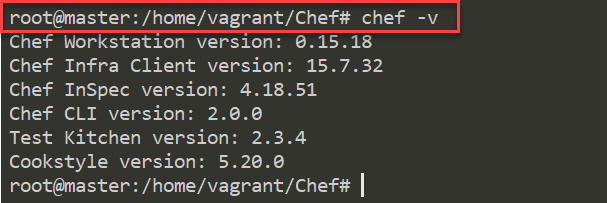

Chef – Introduction 
====================

**Key Point** : if anything works manually, it will work with Automation. If any
error , first check manual way is working or not.

**Chef** is one of the most popular configuration management tools. It uses Ruby
and handles configuration by packing details into what it calls recipes.

Architecture 
-------------



we have the following components.

#### Chef Workstation

This is the location where all the configurations are developed. Chef
workstation is installed on **the local machine**.



#### Chef Server

This works as a centralized working unit of Chef setup, where all the
configuration files are uploaded post development. There are different kinds of
Chef server, some are hosted Chef server whereas some are built-in premise.



#### Chef Nodes

They are the actual machines which are going to be managed by the Chef server.
Chef client is the key component of all the nodes, which helps in setting up the
communication between the Chef server and Chef node.



Installation
------------

### Install the Chef Development kit(ChefDK) – Workstation

The ChefDK contains everything you need to start working with Chef on a
workstation. It provides all the tools that a developer needs to create and
modify cookbooks and upload them to a Chef server.

-   It includes the **Chef client,** an embedded version of Ruby, RubyGems,
    OpenSSL, and command-line utilities such as **Knife**, **Ohai**, and Chef
    Zero.

-   It also includes community tools, such as Test Kitchen, Foodcritic,
    Berkshelf, Chef Vault, Rubocop, and ChefSpec

**Chef client**  
The Chef client is the tool that is deployed to all nodes. If we want to run
Cookbook on Nodes, Chef client must be installed on it.it is a communicator
between Nodes and workstation/Chef Server.

**Ohai Chef tool**  
Ohai is the tool that gathers information about a node. Information such as
platform details, operating system data, and processor information etc.,

**Recipes and cookbooks**

-   Recipes are the building blocks used to define the desired states. Recipes
    are files of ruby code that define the commands to be run on nodes. They are
    like blueprints used to "build" a node. Recipes are collections of Chef
    resources.

-   **Cookbooks are collections of related recipes**, templates, files, and
    custom resources. They provide organization and versioning for recipes. Each
    unique version of a cookbook represents unique sets of functionalities, such
    as bug fixes or added features.

**Chef run lists**  
A "run list" is, as the name would suggest, a list of, and the sequence for, the
recipes, cookbooks, and policies to be applied to a node

**Chef roles**  
Roles are functional groupings of recipes and cookbooks used to describe the
full blueprint needed for a node to become everything it is intended to be.
Roles are reusable configurations, and they can be applied to multiple nodes to
make functionally identical servers, such as a farm of web servers.

**Chef resources**  
Chef resources define what we want to happen to a node. Chef resources have some
types: **Package, Template, Service**, and so on.

-   **Package**: This contains software or applications, such as apache, ntp,
    and cron, and the action to be performed on that software or application,
    such as "install".

-   **Template**: These are files with placeholders for attributes that are
    transformed into configuration files for package installation and execution.

-   **Service**: This is the installed executable of the package and the actions
    that the executable can perform, such as start, stop, or restart. Service
    also defines whether the software or application is launched at node
    startup.

**Chef supermarket**  
The supermarket is a site that provides shared cookbooks. There is a public
supermarket that contains community-created and -maintained cookbooks. This site
is hosted by Chef and is available
at [https://supermarket.chef.io](https://supermarket.chef.io/)

## Install the Chef Development kit (Chef DK) on Chef workstation

Go to  [Chef Workstation downloads
page](https://downloads.chef.io/chef-workstation) and Select URL of appropriate
package for your distribution.
```powershell
wget
https://packages.chef.io/files/stable/chef-workstation/0.15.18/ubuntu/16.04/chef-workstation_0.15.18-1_amd64.deb
```



2.Install
```powershell
dpkg -i chefworkstation_0.14.16-1_amd64.deb
```




3.verify the installation, run:
```powershell
chef -v
```

