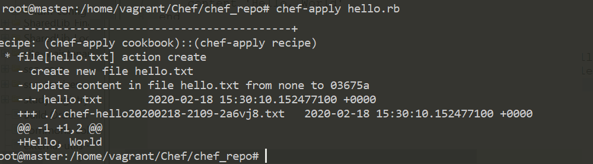
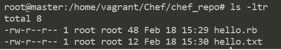
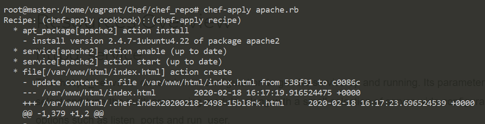
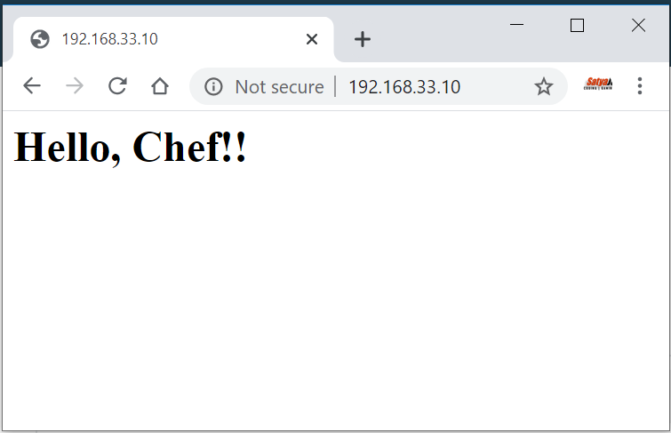

Chef – Recipe
=============

Chef written in Ruby. Now we are going to create a recipe **“hello.rb”**, here.
**rb** is Ruby extension. Collection of Recipes are called Cookbook.

**chef-apply**

-   **chef-apply** tool is installed with the ChefDK. This is used to execute a
    single recipe on your local machine. There is no Chef server involved.
    Everything is local.

-   **chef-apply** is not a tool for the deployment of production nodes. It’s
    just a quick and easy way to use Chef to configure your local system.

Syntax

sudo chef-apply -e "package '\<pkg-name\>"

sudo chef-apply \<recipe\>

Chef Recipe– Hello World Recipe on Localhost
--------------------------------------------

1.Create **chef_repo** folder, go into it

mkdir chef_repo

cd chef_repo

2.create \`**hello.rb**\` file inside chef_repo

file 'hello.txt' do

content 'Hello, World'

end

**3.Apply recipe to Current System.**

The above Code means, create a **resource(file)** with name \`hello.txt\` with
content as “**hello world”.** By executing chef-apply **hello.rd,** Chef will
create a new file in our current infrastructure system

chef-apply hello.rb

4.Now check, we can observe file is created with \`hello.txt\`

5.Similarly, if you want to delete file, change **hello.rb** with below lines

file 'hello.txt' do

action:delete

end

Chef Recipe– Install Apache on Localhost
----------------------------------------

In above example, we just created a file as a resource in host(local) machine.
Now go to more advance install Software as a pkg in host machine

-   Apache2 pkg should install in host machine

-   Apache2 Should enable & Auto Start

-   Create index.html, & make it as apache Homepage

**1.Create \`apache.rd\` to perform above 3 steps on host system**

package 'apache2'

\# Here package apache2 has default action is install, so we didn't mention that
action here. Space between action & [] must be there

service 'apache2' do

action [:enable, :start]

end

\# Create a File with content to display Hello, Chef

file '/var/www/html/index.html' do

content '\<h1\>Hello, Chef!!\</h1\>'

end

**2. Run \`apache.rb\` recipe using \`chef-apply\`**

chef-apply apache.rb

3.Check Apache status

service apache2 status

\* apache2 is running

4.Check index.html by opening localhost/IP in browser

5.we can check using curl as well

curl localhost

\<h1\>Hello, Chef!!\</h1\>
