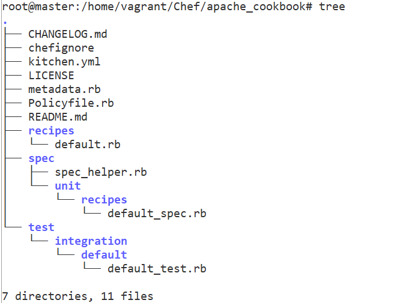
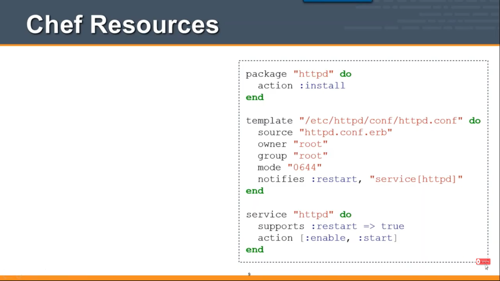
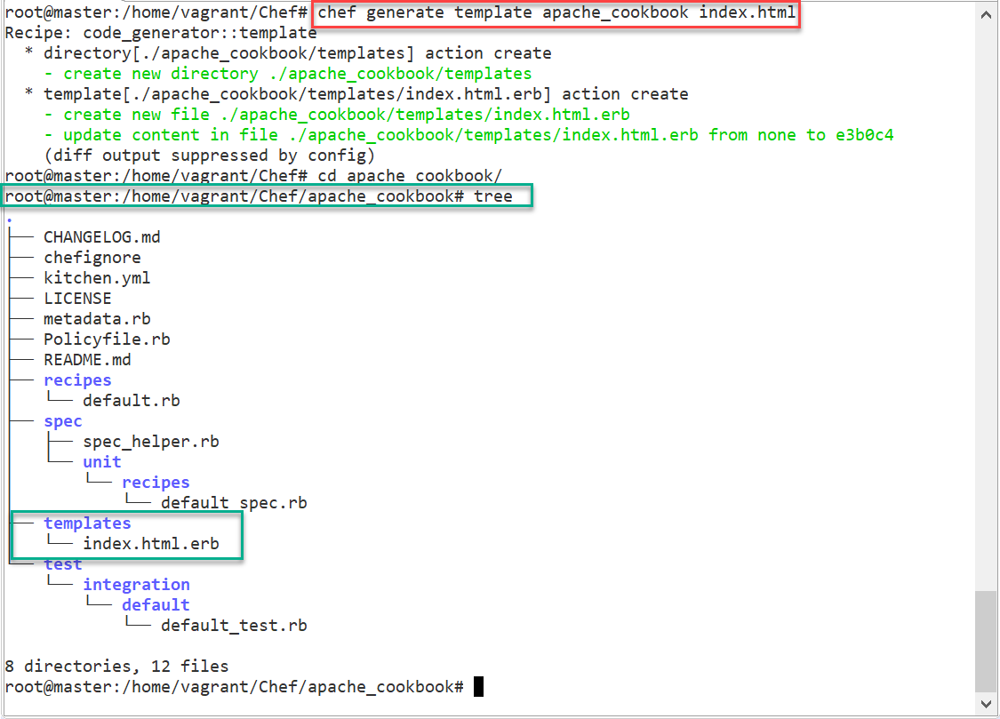
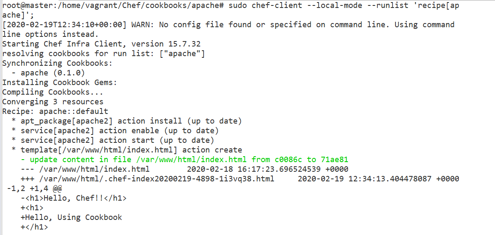
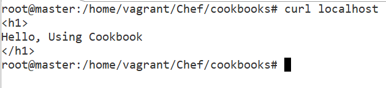

Chef – CookBook
===============

Cookbooks are created on the workstation and then uploaded to a **Chef server.** 

From there, **recipes** and **policies** described within the cookbook can be assigned to nodes as part of the node’s **-run-list”**.

A **run-list** is a sequential list of
recipes and roles that are run on a node by `chef-client`.

Creating a Cookbook
-------------------

There are two ways to dynamically create a cookbook.

```powershell
# Using chef command
chef generate cookbook <Cookbook Name>


# Using knife utility
knife cookbook create <Cookbook Name>
```


Chef Cookbook – Creating Sample Cookbook
----------------------------------------

We can generate a Cookbook Using Chef Tool
```powershell
chef generate cookbook <Cookbook_Name>
```


Here I am creating Cookbook for Apache Installation, so I’m proving cookbook
name as \`**apache_cookbook** \`
```powershell
chef generate cookbook apache_cookbook
```
  
   
   
In This cookbook we perform below tasks

-   Apache2 pkg should install in host machine

-   Apache2 Should enable & Auto Start

-   Create index.html, & make it as apache Homepage


### **Cookbook Directory Structure**  
Cookbooks are organized in a directory structure that is completely
self-contained. There are many different directories and files that are used for
different purposes.

Go to **apache_cookbook** directory & observe the File structure.




### **Recipes**

-   A recipe is the main workhorse of the cookbook. A cookbook can contain more
    than one recipe, or depend on outside recipes

-   Recipes are used to declare the state of **different resources**.

-   For instance, a resource could say -`the package x should be installed`”.
    Another resource may say -`the x service should be running`”.

Resources can be of many different types. Some common ones are:

-   **package**: Used to manage packages on a node

-   **service**: Used to manage services on a node

-   **user**: Manage users on the node

-   **group**: Manage groups

-   **template**: Manage files with embedded ruby templates

-   **cookbook_file**: Transfer files from the files subdirectory in the
    cookbook to a location on the node

-   **file**: Manage contents of a file on node

-   **directory**: Manage directories on node

-   **execute**: Execute a command on the node

-   **cron**: Edit an existing cron file on the node

You can learn about the [different resource
types](http://docs.opscode.com/resource.html) here.




#### Resource Syntax
A resource is a Ruby block with four components: 
- `type`
- `name`
- one (or more) `properties` (with values)
- one (or more) `actions`. 

The syntax for a resource is like this:
```
type 'name' do
   attribute 'value'
   action :type_of_action
end
```


### **Templates**

Template files end with the `.erb` extension, meaning that they contain embedded
Ruby.

These are mainly `used to substitute attribute values into the file` to create the
final file version that will be placed on the node.

For example, if we have an attribute that defines the default port for a
service, the template file can call to insert the attribute at the point in the
file where the port is declared. Using this technique, you can easily create
configuration files, while keeping the actual variables that you wish to change
elsewhere.

**We need to create index.html to place apache2 server using Templates. But In
above we don’t have Templates folder**.

**1.Create Templates Folder**  
Create a Template called index.html in **apache_cookbook(***Inside Cookbook
folder/ outside apache***)**

```powershell
chef generate template apache_cookbook index.html
```



**2. Write -hello world” inside index.html.erb**
```powershell
# vi templates/index.html.erb
<h1>
        Hello, Chef - Using Cookbook
</h1>
```


**3.Edit Recipe file : default.rb**  
Open recipe file **recipes/default.rb** & write steps to perform Install & Start
Apache2 server and place index.html
```powershell
# vi recipes/default.rb
package 'apache2'

service 'apache2' do
	action [:enable, :start]
end

template '/var/www/html/index.html' do
	source 'index.html.erb'
end
```


**4.Apply complete CookBook on Local System**
```powershell
sudo chef-client --local-mode --runlist ‘recipe[apache_cookbook]’;
```


**Waring: should end with ;**



**Check Apache2 Status**
```powershell
service apache2 status
* apache2 is running
```


**Now open apache URL, Using CURL**


**Via Browser**

