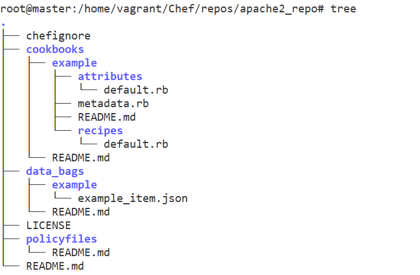
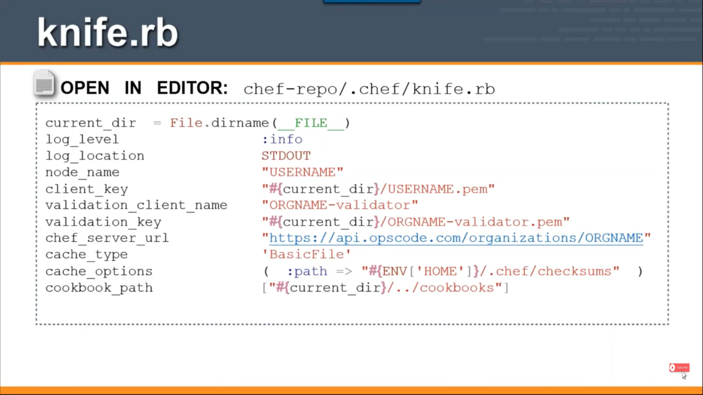

Chef – Repo
===========

Every Chef workstation has at least one Chef repository. The Chef repo is where
all working copies of the cookbooks, recipes, templates, and so on live. Chef
Repo contains

-   **Cookbooks (** including `recipes, attributes, custom resources, libraries,
    and templates`)

-   **Data bags**

-   **Policyfiles**

The chef-repo directory should be synchronized with a version control system,
such as git. All of the data in the chef-repo should be treated like source
code.

You’ll use the **chef** and **knife** commands to upload data to the Chef Infra
Server from the chef-repo directory. Once uploaded, Chef Infra Client uses that
data to manage the nodes registered with the Chef Infra Server and to ensure
that it applies the right cookbooks, policyfiles, and settings to the right
nodes in the right order.

### Directory Structure 

| **Directory**    | **Description**                                                                                                            |
|------------------|----------------------------------------------------------------------------------------------------------------------------|
| **.chef/**       | A hidden directory that is used to store validation key files and optionally a config.rb file.                             |
| **cookbooks/**   | Contains cookbooks that have been downloaded from the [Chef Supermarket](https://supermarket.chef.io/) or created locally. |
| **data_bags/**   | Stores data bags (and data bag items) in JSON (.json) format.                                                              |
| **policyfiles/** | Stores Policyfiles in Ruby (.rb) format.                                                                                   |


## Create the chef-repo

Use the `chef generate repo` command to create your chef-repo directory
along with the base folder structure.
```powershell
chef generate repo <REPO_NAME>
```


Create Sample Repo named - **apache2_repo**
```powershell
chef generate repo apache2_repo
Generating Chef Infra repo apache2_repo
- Ensuring correct Chef Infra repo file content
Your new Chef Infra repo is ready! Type `cd apache2_repo` to enter it.
```

Your new Chef Infra repo is ready! Type \`cd apache2_repo\` to enter it.



**.chef folder**

Really, the only files you need from the starter kit are the .chef folder files:

-   The organization's validator private key file

-   Your user private key file

-   A knife.rb file




## Chef supermarket

The supermarket is a site that provides shared cookbooks. There is a public
supermarket that contains community-created and -maintained cookbooks. This site
is hosted by Chef and is available at <https://supermarket.chef.io>

There are two versions of Supermarket available today.

**Public Supermarket**  
This is available at the Chef Supermarket site. This is an open source project,
you can find and contribute to the repo on GitHub.

**Private Supermarket**  
There is also a version of Supermarket that can be run privately in your own
infrastructure.

You will need Knife to interact with the Supermarket

## Chef Knife

**Knife** is a command-line tool that supplies the interface between your
**chef-repo and your Chef server**.

-   It allows developers to upload their work on the workstation to the Chef
    server, from where it can be distributed to the nodes during their Chef
    client runs.

-   Knife also allows you to obtain cookbooks from the supermarket, and it
    provides a mechanism to bootstrap nodes.

You can find more about Knife on Next Tutorial.
