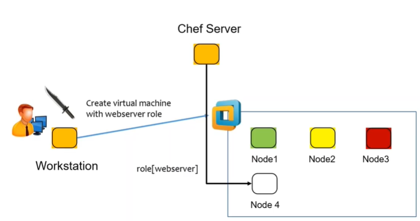
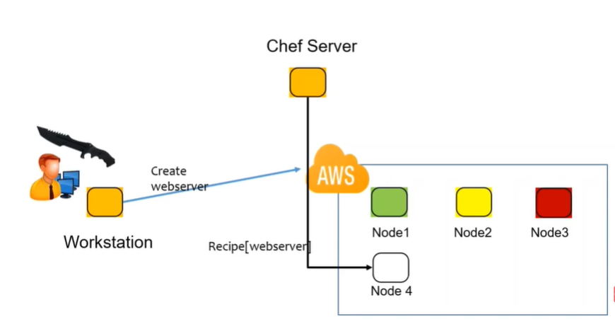

Chef – Knife 
=============

knife is a command-line tool that provides an interface between a local
chef-repo and the Chef Infra Server. knife helps users to manage:

-   Nodes

-   Cookbooks and recipes

-   Roles, Environments, and Data Bags

-   Resources within various cloud environments

-   The installation of Chef Infra Client onto nodes

-   Searching of indexed data on the Chef Infra Server

Knife Subcommands
-----------------

knife includes a collection of built in subcommands that work together to
provide all of the functionality required to take specific actions against any
object in an organization, including cookbooks, nodes, roles, data bags,
environments, and users.

All knife subcommands have the following syntax:
```powershell
knife subcommand [ARGUMENT] (options)
```


#### Knife Bootstrap

You use the knife bootstrap subcommand to install the chef-client on Chef Nodes.
The bootstrap process also registers the Nodes with the Chef server to
facilitate communication between the two.

you would use a command like knife
```powershell
knife bootstrap 192.168.10.44
```


This instructs knife to install the chef-client on the system with the IP
address 192.168.10.44, register that system with the Chef server, and create a
node representing the system on the Chef server.

#### Knife Node
The knife node subcommand is used to query and set the various configuration
values for a node.


#### Knife Diff
Knife diff is used to compare the files in your current Workstation repo with
what is stored on the Chef server.


#### Knife Exec
Exec is a knife subcommand that lets you run Ruby scripts against the Chef
server in the context of a fully configured chef-client,
```powershell
knife exec -E 'nodes.transform("chef_environment:_default") { |n| n.chef_environment("development") }'
```


#### Knife SSH
The knife ssh subcommand lets you run ssh commands on all or a subset of the
nodes known to your Chef Server.
```powershell
knife ssh "chef_environment:production" "uptime" -p 2222 -x earl -PMyPW99
```


#### Knife Search
knife search lets you do queries against all of the data stored in the Chef
server.


#### Knife Windows plugin
We use the knife Windows plugin when we are working with nodes running the
Windows operating system
```powershell
# Installing the Knife Windows plugin on Master
chef gem install knife-windows


# Bootstrapping a Windows node
knife bootstrap windows winrm node03 -p 55985 -x Administrator -P MyPW99 -r 'recipe[winbase]'
```


#### Knife EC2 plugin

This plugin is used to integrate knife with Amazon cloud instances that allow
you to create and manage instances from the command line.

Installing the Knife EC2 plugin
```powershell
chef gem install knife-ec2
```


The knife EC2 plugin requires some specific data related to your Amazon account.
to add the Amazon data to your knife.rb file, it should be added in this format:
```powershell
knife[:aws_access_key_id] = "Your AWS Access Key ID"

knife[:aws_secret_access_key] = "Your AWS Secret Access Key"
```


If you already have some EC2 instances running.You can issue a command like
this:
```powershell
knife ec2 server list -r us-west-2
```


**Creating an EC2 instance**  
Using the Knife EC2 command to create a new EC2 instance is somewhat
complicated. A "simple" version of the command might look something like this:
```powershell
knife ec2 server create --node-name ec2-node08 \
--groups=launch-wizard-1 \
--region=us-west-2 \
--availability-zone=us-west-2a \
--image=ami-5189a661 \
--server-connect-attribute=public_ip_address \
--flavor=t2.micro \
--ssh-user=ubuntu \
--ssh-key=my_chef_service \
--identity-file=/Users/earlwaud/.aws/my_chef_service.pem \
--run-list=recipe['base']
```


**Bootstrapping an existing EC2 instance**  
To bootstrap an existing EC2 instance, you will issue a command much like the
one used to bootstrap any other server. It might look something like this:
```powershell
knife bootstrap 54.213.235.40 \
--node-name my_old_ec2_node \
--ssh-user ubuntu \
--identity-file /Users/earlwaud/.aws/my_chef_service.pem \
--sudo
```


**Deleting EC2 instances**
```powershell
delete --node-name <node-name> --purge
```

## Knife cookbook commands

**List** - To see a list of all community cookbooks available from Supermarket.
```powershell
knife cookbook site list
```


**Search** - To search particular cookbook
```powershell
knife cookbook site search mysql
```


**Show** - To view more information about a particular cookbook
```powershell
knife cookbook site show mysql
```


**Download** - To download a cookbook as a tar.gz archive and place it in the
current working directory
```powershell
knife cookbook site download mysql
```


### Uploading to the Supermarket

There are a few things you’ll need in place before you can upload your cookbook
to the Supermarket.
```powershell
edit .chef/knife.rb.
node_name "satyacodes" 
# Replace with the login name you use to login to the Supermarket.


client_key "#{ENV['HOME']}/.chef/client.pem" 
# Define the path to wherever your client.pem file lives.  This is the key you generated when you signed up for a Chef account.

cookbook_path [ '/Users/nshamrell/Projects/my_chef_repo/cookbooks' ] 
# Directory where the cookbook you're uploading resides.
```

**Share** - to upload the cookbook to the Supermarket
```powershell
knife cookbook site share "my_apache2_cookbook" "Web Servers"
```
“Web Servers" - is category my cookbook


**Unshare** - to Remove your cookbook from the Supermarket.
```powershell
knife cookbook site unshare my_apache2_cookbook
```


Knife plug-ins to Create New Nodes/ Servers
-------------------------------------------

Knife Plug-in : Create server with VMWare plugin



Knife Plug-in : Create server with AWS EC2 plugin


