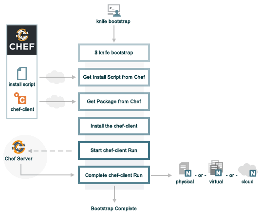

Chef – Server
=============

So far we did changes on local system only. Now we are going to execute our
cookbooks in Hosted Nodes through **Chef server**

Chef Server – Setup Online Chef server
--------------------------------------

Signup By going <https://manage.chef.io/signup>


Verify Email & Setup Password


It will ask for Organization, Create one.


**Download Starter Kit**
Go to Administration \> Organization \>satyacodes \> Actions \> Starter Kit \>
Download Starter Kit


**Download Kit.zip in Local System**

-   Copy to Vagrant **shared folder**

-   \`**vagrant reload**\` to refresh Shared Folder content

-   copy that to chef folder : **mv /shareFolder/chef-starter/
    /home/vagrant/Chef/cookbooks**/

-   Check the Folder Structure: **tree -a**


<br>


Chef Server – Bootstrap Chef Nodes 
-----------------------------------

The **knife bootstrap** command is a common way to install the chef-client on a
node.

Once the workstation machine is configured, it can be used to install the
chef-client on one (or more) nodes across the organization using a knife
bootstrap operation.

-   The knife bootstrap command is used to SSH into the target machine

-   It will install the chef-client executable (if necessary), generate keys,

-   register the node with the Chef server. 

The following diagram shows the stages of the bootstrap operation, and the list
below the diagram describes each of those stages in greater detail.




| **Stages**                                      | **Description**                                                                                                                                                                                                                                                                                                                                                                                                                                                                                                                                                                                                |
|-------------------------------------------------|----------------------------------------------------------------------------------------------------------------------------------------------------------------------------------------------------------------------------------------------------------------------------------------------------------------------------------------------------------------------------------------------------------------------------------------------------------------------------------------------------------------------------------------------------------------------------------------------------------------|
| **\$ knife bootstrap**                          | Enter the knife bootstrap subcommand from a workstation. Include the hostname, IP address, or FQDN of the target node as part of this command. Knife will establish an SSH or WinRM connection with the target node using port 22 and assemble a shell script using the chef-full.erb file, which is the default bootstrap template.                                                                                                                                                                                                                                                                           |
| **Get the install script from Chef**            | The shell script that is derived from the chef-full.erb bootstrap template will make a request to the Chef website to get the most recent version of a second shell script (install.sh). On Microsoft Windows machines: The batch file that is derived from the windows-chef-client-msi.erb bootstrap template will make a request to the Chef website to get the .msi installer.                                                                                                                                                                                                                              |
| **Get the Chef Infra Client package from Chef** | The second shell script (or batch file) then gathers system-specific information and determines the correct package for Chef Infra Client, and then downloads the appropriate package from omnitruck-direct.chef.io.                                                                                                                                                                                                                                                                                                                                                                                           |
| **Install Chef Infra Client**                   | Chef Infra Client is installed on the target node.                                                                                                                                                                                                                                                                                                                                                                                                                                                                                                                                                             |
| **Start a Chef Infra Client run**               | On UNIX- and Linux-based machines: The second shell script executes the chef-client binary with a set of initial settings stored within first-boot.json on the node. first-boot.json is generated from the workstation as part of the initial knife bootstrap subcommand. On Microsoft Windows machines: The batch file that is derived from the windows-chef-client-msi.erb bootstrap template executes the chef-client binary with a set of initial settings stored within first-boot.json on the node. first-boot.json is generated from the workstation as part of the initial knife bootstrap subcommand. |
| **Complete a Chef Infra Client run**            | a Chef Infra Client run proceeds, using HTTPS (port 443), and registers the node with the Chef Infra Server. The first Chef Infra Client run, by default, contains an empty run-list. A [run-list can be specified](https://docs.chef.io/knife_bootstrap.html) as part of the initial bootstrap operation using the --run-list option as part of the knife bootstrap subcommand.                                                                                                                                                                                                                               |

The bootstrap operation requires the **IP address** or FQDN of the target
system **, the SSH credentials** and **Root access** to the node.

The general syntax of the command will be:  
`knife bootstrap <IP / HOSTNAME> [options]`


#### Bootstrap With password authentication
```powershell
knife bootstrap <IP / HOSTNAME> 
--ssh-user <USERNAME> 
--ssh-password <PASSWORD> 
--sudo --use-sudo-password 
--node-name <NODE-NAME>  
--run-list 'recipe[<cookbook-name>]';
```


#### Bootstrap With With key authentication
```powershell
knife bootstrap <IP / HOSTNAME> 
-x <USERNAME> 
-i <PATH_TO_KEY_FILE> 
--sudo --node-name <NODE-NAME>  
--environment <ENVIRONMENT> 
--run-list 'recipe[MY_COOKBOOK1]’
```


#### Enable a password authentication in EC2 Instace
Set a password for user. The example below uses ec2-user as the user
```powershell
sudo passwd ec2-user
Changing password for user ec2-user.
New password:
Retype new password:
```

Update the PasswordAuthentication parameter in the `/etc/ssh/sshd_config file:`
```powershell
PasswordAuthentication yes
```

Restart the SSH service.
For Amazon Linux, RHEL 5, and SUSE Linux, use this command:
```powershell
sudo service sshd restart
```


For Ubuntu, use this command:
```powershell
sudo service ssh restart
```

when you are using hosted chef, you need to pass in a private key with the
bootstrap and have the public key in your autherized_keys file....

1.  install the ChefSDK in Master

2.  Open master Terminal, Download your starter kit from hosted Chef

3.  extract the starter kit to `~/chef-repo`

4.  Go to chef-repo, generate a new keypair: `ssh-keygen`

5.  add the public key to your authorized_keys file: **\$ cat id_rsa.pub \>\>
    authorized_keys**

6.  run the knife bootstrap with the following:
```powershell
sudo knife bootstrap {{server-ip}} --ssh-user {{your-server-user}} -i ~/.ssh/id_rsa --sudo --node-name web1
```

<br>


Using Chef Server - Install Apache2 on Two Nodes machines 
----------------------------------------------------------

#### 1.Download Apahe2 Cookbook from Supermarket

we are going to use **learn_chef_apache2** cookbook from Supermarket in this
example.To Download **learn_chef_apache2** , use below command
```powershell
knife cookbook site download learn_chef_apache2

[New]
knife supermarket download learn_chef_apache2

```


**Extract tar file to cookbooks folder**
```powershell
tar -zxxvf knife/learn_chef_apache2-0.3.0.tar.gz -C cookbooks/
```


we can see following files were extracted


Check **learn_chef_apache2/recipes/default.rb** it contains same code we
configured before
```powershell
apt_update 'Update the apt cache daily' do
  frequency 86_400
  action :periodic
end

package 'apache2'

service 'apache2' do
  supports :status => true
  action [:enable, :start]
end

template '/var/www/html/index.html' do
  source 'index.html.erb'
end
```


#### 2. Upload CookBook to Chef Server

We are downloaded this from Supermarket. If we want Upload this CookBook to Chef
Server

**First, copy this repository to Chef-Repo/cookbooks**
go to `/chef/chef-starter/chef-repo`(Extracted Starter Kit) folder & copy **learn_chef_apache2** here
```powershell
mv cookbooks/learn_chef_apache2/ cookbooks/chef-starter/chef-repo/cookbooks/
```


**To Upload/commit changes** to Chef Server, Run below command inside
**/chef-starter/chef-repo**
```powershell
knife cookbook upload learn_chef_apache2
```


If we not copy this to /cookbooks folder it will throw below error
`ERROR: Cannot find a cookbook named learn_chef_apache2; did you forget to add metadata to a cookbook?`  
Make sure you copy cookbook to chef-repo/cookbooks folder


**Check Changes in Chef Server**
-   Login to Chef Server : <https://manage.chef.io/login>

-   Go to **Dashboard \> Top Menu \> Policy Tab** : observe cookbook uploaded.


#### 3.Chef Nodes Details 
We have Two Vagrant Nodes
```powershell
---------------------------------------------------------
# Node: 1
--------------------------------------------------------
Vagrant.configure("2") do |config|
  config.vm.box = "ubuntu/trusty64"  
  config.vm.network "private_network", ip: "192.168.33.11"
  config.vm.hostname = "web1.satyacodes.vm"
  config.vm.network "forwarded_port", guest: 80, host: 5555,
   auto_correct: true
end

---------------------------------------------------------
# Node: 2
--------------------------------------------------------
Vagrant.configure("2") do |config|
  config.vm.box = "ubuntu/trusty64"  
  config.vm.network "private_network", ip: "192.168.33.12"
  config.vm.hostname = "web2.satyacodes.vm"
  config.vm.network "forwarded_port", guest: 80, host: 6666,
   auto_correct: true
end
```


#### 4.Boostrap & Run Apache Cookbook on Nodes

Go to Chef workstation & Navigate to Chef Repo(`chef/chef-starter/chef-repo`),
execute below commands to bootstrap & Install Apache2 on both the nodes.

Remove Apache2 if already installed using :  
`sudo apt remove apache2`.

```powershell
#Boostrap Node1
knife bootstrap 192.168.33.11 --ssh-user vagrant --ssh-password vagrant --sudo --use-sudo-password --node-name Node1 --run-list 'recipe[learn_chef_apache2]';
```


```powershell
#Boostrap Node2
knife bootstrap 192.168.33.12 --ssh-user vagrant --ssh-password vagrant --sudo --use-sudo-password --node-name Node2 --run-list 'recipe[learn_chef_apache2]';
```


#### 5.Check Chef Server – Nodes Registered 

Now we can check, knife automatically register Ubuntu **Node1 & Node 2** , with
[Chef Server](https://manage.chef.io/)


#### 6.Check index.html in both Nodes
```powershell
#Check apache status
service apach2 status

#Check Running apache2 Port
sudo lsof -i
```


Open Browser, Hit Nodes IP , check the index page


#### 7.More on Chef Nodes

To get no.of Nodes in Chef server
```powershell
To get no.of Nodes in Chef server
chef-repo> knife node list
Node1
Node2
```

Get Node Info
```
chef-repo> knife node show Node1
Node Name:   cnode1
Environment: _default
FQDN:        vagrant-ubuntu-trusty-64
IP:          10.0.2.15
Run List:    recipe[learn_chef_apache2]
Roles:       
Recipes:     learn_chef_apache2
Platform:    ubuntu 14.04
Tags:
```

Separate Bootstrapping
----------------------
Just Bootstrap  
`Knife bootstrap 192.168.1.10 -x root -P vagrant`

To set Cookbook to a Node 
```powershell
knife node run_list add node1 -recipe[apache]”
node1:
 	run_list: recipe[apache]
```


Run ,manually on node machine -  node will pick updated one  
`sudo chef-clinet`


<u> **1.Boostrap Nodes – Without executing recipes** </u>

```powershell
knife bootstrap 192.168.33.11 --ssh-user vagrant --ssh-password vagrant --sudo --use-sudo-password --node-name Node1

knife bootstrap 192.168.33.12 --ssh-user vagrant --ssh-password vagrant --sudo --use-sudo-password --node-name Node2
```


**2.Check Chef Server** – for Reregistered Nodes


3.Set Cookbook to **– Node1** if we update the Chef server with his assigned
Cookbooks
```powershell
knife node run_list add Node1 'recipe[learn_chef_apache2]';
```


**4.Run chef-client**  
If we run chef-client on Node1, it will Contact Chef-Server , it will ask for
what are the **run_list** assigned him, & it will run those tasks.
```powershell
sudo chef-client
```


5.Test apache Server.


#### ERROR: Your private key could not be loaded from /etc/chef/client.pem
You must run this command inside root folder of extracted chef started Kit

```powershell
knife bootstrap 3.135.192.58 --ssh-user ubuntu --ssh-password ubuntu --sudo --use-sudo-password --node-name Node1;
```

