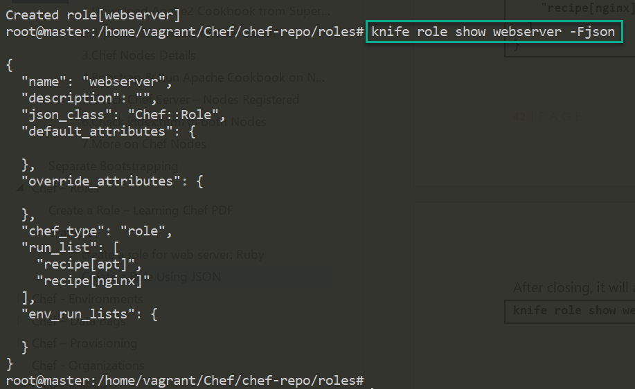
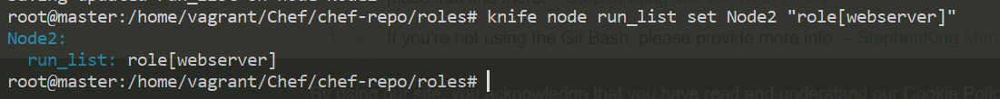
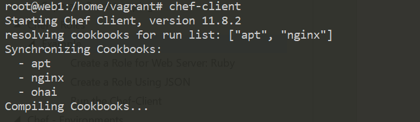

Chef – Roles
============

So far, we've been just adding recipes directly to a single node. But that's not
how your infrastructure works.

**Roles are there in Chef to group nodes with similar configuration**. Typical
cases are to have roles for web servers, database servers, and so on.

Roles make it easy to configure many nodes identically without repeating
yourself each time

In your organization, if your infrastructure grows to be multiple, redundant
servers that all perform the same basic tasks. For instance, these might be web
servers that a load balancer passes requests to. They would all have the same
basic configuration and could be said to each satisfy the same -role”.

You can set custom run lists for all the nodes in your roles and override
attribute values from within your roles.

Creating Roles
--------------

For creating any role we need to follow below steps

1.  Create a role

2.  Upload the role on the Chef server

3.  Update Run list

4.  Assign the role to the nodes

5.  Run the Chef client

**we can create Role in two ways**

1.  **Using Knife [JSON]-** Create Role in Chef Server directly  
2.  **Using Ruby** - In local repo under chef-repo folder

## 1.Using Knife [JSON]- Create Role in Chef Server directly

**1.Create a role**
```powershell
knife role create <ROLE_NAME>
```


**2.Update Run list**
```json
{
   "name":"client1",
   "description":"",
   "json_class":"Chef::Role",
   "default_attributes":{

   },
   "override_attributes":{

   },
   "chef_type":"role",
   "run_list":[
      "recipe[nginx]",
      "recipe[phpapp::web]"
   ],
   "env_run_lists":{

   }
}
```

**3.Upload the role on the Chef server**  
By closing Knife will auto save with Chef Server. To check
```powershell
knife role show <ROLE_NAME> -d -Fjson
```


**4.Assign the role to the nodes**
```powershell
knife node run_list set Node2 "role[<ROLE_NAME>]"
```


**5.Run the Chef client**
```powershell
sudo chef-client
```


## 2.Using Ruby - In local repo under chef-repo folder

**1.Create a role**  
Create a `role` folder inside `chef-repo` & create webserver.rb file with runlists.
```powershell
name "web_server"
description "Role for web servers"
run_list("role[base]", "recipe{web_server]")
```


**2.Upload the role on the Chef server**
```powershell
knife role from file chef-repo/roles/webserver.rb
```


**3.Update Runlist**
```powershell
Already Did at Step #1
```


**4.Assign the role to the nodes**  
`knife node edit <node_name>`


**5.Run the Chef client**  
`sudo chef-client`

<br>


Create Role for Webserver 
--------------------------

we are creating a Role; it consists of following recipes. we download these from
Supermarket.
```powershell
knife supermarket download apt
knife supermarket download nginx
knife supermarket download ohai

#Exatract It
tar -zxxvf  -C cookbooks/

#upload Cookbooks
knife cookbook upload apt/nginx/ohai
```
Each role file can be written either in Ruby, or in JSON.


**Create a *roles* directory in *chef-repo*:**  
`$ mkdir roles`

We’re going to create a *.json* file representing the role data. A basic role
has a

-   name:

-   description: and

-   run_list:

-   a long list of recipes


#### Create a Role for Web Server: Ruby
```powershell
vi web_server.rb
```


Start with Name of the Roles & Description: what this role for
```powershell
name "web_server"
description "A role to configure our front-line web servers"
```


Next, we can specify the runlist, contain cookbooks (recipe["<Cookbook-Name>"]), recipes (cookbook::recipe), and other roles. Remember, a run_list is always executed sequentially, so put the dependency items before the other items.
```
name "web_server"
description "A role to configure our front-line web servers"
run_list "recipe[apt]", "recipe[nginx]"
```


To Upload Role to Chef Server manually, using below command
```powershell
knife role from file web_servers.rb
```


#### Create a Role Using JSON

To create a webserver role:  
`knife role create webserver`

It should look something like this:
```json
{
  "name": "test",
  "description": "",
  "json_class": "Chef::Role",
  "default_attributes": {
  },
  "override_attributes": {
  },
  "chef_type": "role",
  "run_list": [

  ],
  "env_run_lists": {
  }
}
```

When we save a JSON file created using the knife command, the role is created on
the Chef server. But for Ruby.rb, we need to Upload Role to Chef Server manually

**Change json file it as per Our Role**
```json
{
  "name": "webserver",
  "description": "A role to configure our front-line web servers",
  "json_class": "Chef::Role",
  "default_attributes": {
    "nginx": {
      "log_location": "/var/log/nginx.log"
    }
  },
  "override_attributes": {
    "nginx": {
      "gzip": "on"
    }
  },
  "chef_type": "role",
  "run_list": [
    "recipe[apt]",
    "recipe[nginx]"
  ]
}
```


After closing, it will automatically Saved in Chef Server. If we want to get our
JSON file from the server.
```powershell
knife role show webserver -Fjson
```



**Add Role to a Node**  
Now we need to add our role to a node. For that first find list of nodes
available
```powershell
knife node list

Node1
Node2
```


And then we would give a command like:
```powershell
knife node edit <node_name>
knife node edit Node1
```


This will show the node’s definition file, which will allow us to add a role to
its run_list:
```powershell
{
  "name": "Node1",
  "chef_environment": "_default",
  "normal": {
    "tags": [

    ]
  },
  "run_list": [
    "recipe[nginx]"
  ]
}
```

Now, we need to replace our recipe with our role in this file:
```powershell
{
  "name": "Node1",
  "chef_environment": "_default",
  "normal": {
    "tags": [

    ]
  },
  "policy_name": null,
  "policy_group": null,
  "run_list": [
  "role[webserver]"
]

}
```
On close, it will automatically update Node1 run list with newly assigned role.

We can also do this in single command
```powershell
knife node run_list set Node2 "role[webserver]"
```



#### Run the Chef-Client
Login to Node1, run **chef-client** to

