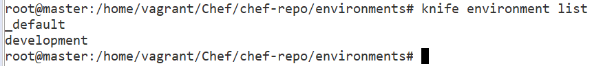
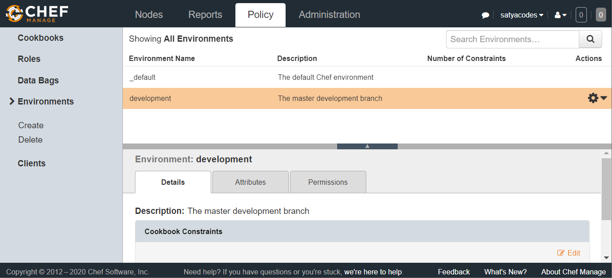

Chef - Environments
===================

Having separate environments for development, testing, and production are good
ways to be able to develop and test cookbook updates and other configuration
changes in isolation.Chef enables grouping nodes into separate environments to
support an ordered development flow.

Every Chef Server starts out with a single environment, the **\_default**
environment

The Chef server always has an environment called **\_default**, which cannot be
edited or deleted. All the nodes go in there if you don't specify any other
environment.

For Example, if you want one configuration for Development, one for Testing, &
one for Production - we will do this by Environments.

Creating New Environment 
-------------------------

#### 1. Create new Environment

To Create new Environment, we need to create environments directory inside
-**chef-repo**”.This is where we should put our environment files.
```powershell
cd ~/chef-repo/environments
```


To create any environment, we need to place that environment specific
configuration inside Environments folder. Here I’m creating \`**development**\`
environment
```powershell
vi development.rb
```


In this file you can specify **cookbooks and their version constraints**, and
recipes that are deployed.so it contains

-   name

-   description

-   cookbook_versions

-   override_attributes

```powershell
#development.rb
name "development"
description "The master development branch"
cookbook_versions({
    "nginx" => "<= 1.1.0",
    "apt" => "= 0.0.1"
})
override_attributes ({
    "nginx" => {
        "listen" => [ "80", "443" ]
    },
    "mysql" => {
        "root_pass" => "root"
    }
})
```

We could also use the JSON format. The knife tool can generate the template of
an environment file by typing. Provide default editor **export EDITOR=vi**
```powershell
knife environment create development
```


This will open our editor with a preloaded environment file with the name filled
in.
```powershell
# Def. Generated File
{
  "name": "development",
  "description": "",
  "cookbook_versions": {

  },
  "json_class": "Chef::Environment",
  "chef_type": "environment",
  "default_attributes": {

  },
  "override_attributes": {

  }
}
```


We need to edit with our details 
```
{
  "name": "development",
  "description": "The master development branch",
  "cookbook_versions": {
    "nginx": "<= 1.1.0",
    "apt": "= 0.0.1"
  },
  "json_class": "Cheff:Environment",
  "chef_type": "environment",
  "default_attributes": {
  },
  "override_attributes": {
    "nginx": {
      "listen": [
        "80",
        "443"
      ]
    },
    "mysql": {
      "root_pass": "root"
    }
  }
}
```


#### 2.Upload Environment Files to/from the Server

We could upload our **Ruby file** to the Chef server by typing this:
```powershell
knife environment from file ~/chef-repo/environments/development.rb
```


For our **JSON file,** we can get the environment file off of the server by
typing something like:
```powershell
knife environment show development -Fjson > ~/chef-repo/environments/development.json
```


Now check all the environments Configured in Chef Server
```powershell
knife environment list
```



You can also check in Chef Server



#### 3.Setting Environments in Nodes
Each node can be in exactly one environment. we need to edit its node
environment information by using node edit \<node\>.
```powershell
knife node edit <Node1>
```


This will open up a JSON formatted file with the current node parameters:
```powershell
{
{
  "name": "Node1",
  "chef_environment": "_default",
  "normal": {
    "tags": [
    ]
  },
  "policy_name": null,
  "policy_group": null,
  "run_list": [
  "role[webserver]"
]
}
```
As you can see, the chef_environment is set to \_default originally. We can
simply modify that value to put the node into a new environment.
```powershell
"chef_environment": "development"
```


#### 4.Run chef-client
run **chef-client** on the node, it will pick up the new attributes and version
constraints and modify itself to align with the new policy
