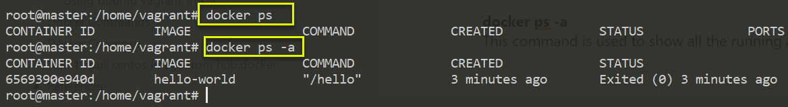

Docker – Introduction
=====================

Introduction
------------

### What is Virtualization?

Virtualization is the technique of importing a Guest operating system on top of
a Host operating system. This eliminated the need for extra hardware resource.

The **advantages** of Virtual Machines or Virtualization are:

-   Multiple operating systems can run on the same machine

-   Maintenance and Recovery were easy in case of failure conditions

-   Total cost of ownership was also less due to the reduced need for
    infrastructure

In above pic, you can see there is a host operating system on which there are 3
guest operating systems running which is nothing but the virtual machines.

Guest OS running on top of the host OS, which will have its own kernel and set
of libraries and dependencies. This takes up a large chunk of system resources,
i.e. hard disk, processor and especially RAM.

**Disadvantages of Virtualization:**

-   Running multiple Virtual Machines leads to unstable performance

-   Hypervisors are not as efficient as the host operating system

-   Boot up process is long and takes time

### What is Containerization?

Containerization is also a type of Virtualization. Containerization is however
more efficient because there is no guest OS here and utilizes a host’s operating
system, share relevant libraries & resources as and when needed unlike virtual
machines

All the containers share, host operating system and holds only the application
related binaries & libraries. They are lightweight and faster than Virtual
Machines.

**Advantages of Containerization over Virtualization:**

-   Containers on the same OS kernel are lighter and smaller

-   Better resource utilization compared to VMs

-   Boot-up process is short and takes few seconds

In the diagram , you can see that there is a host operating system which is
shared by all the containers. Containers only contain application specific
libraries which are separate for each container and they are faster and do not
waste any resources.

### Virtualization vs Containerization

Virtualization and Containerization both let you run multiple operating systems
inside a host machine.

Virtualization deals with creating many operating systems in a single host
machine. Containerization on the other hand will create multiple containers for
every type of application as required

As we can see from the image, the major difference is that there are multiple
Guest Operating Systems in Virtualization which are absent in Containerization.
The best part of Containerization is that it is very light weight as compared to
the heavy virtualization

What is Docker
--------------

Before we go ahead, let me summarize the learning till now:

-   Virtual Machines are slow and takes a lot of time to boot.

-   Containers are fast and boots quickly as it uses host operating system and
    shares the relevant libraries.

-   Containers does not waste or block host resources unlike virtual machines.

-   Containers have isolated libraries and binaries specific to the application
    they are running.

-   Containers are handled by Containerization engine.

-   Docker is one of the containerization platforms which can be used to create
    and run containers.

#### What is Docker

Docker is a containerization **platform(it’s just a platform)** that packages
your application and all its dependencies together in the form of a docker
container to ensure that your application works seamlessly in any environment

#### What is Container ?

Docker Container is a standardized unit which can be created on the fly to
deploy a particular application or environment. It could be an Ubuntu container,
CentOs container, etc. to full-fill the requirement from an operating system
point of view. Also, it could be an application-oriented container like CakePHP
container or a Tomcat-Ubuntu container etc.

Let’s understand it with an example:

A company needs to develop a Java Application. In order to do so the
**developer** will setup an environment with tomcat server installed in it. Once
the application is developed, it needs to be tested by the tester.

Now the **tester** will again set up tomcat environment from the scratch to test
the application. Once the application testing is done, it will be deployed on
the production server.

Again, the **production** needs an environment with tomcat installed on it, so
that it can host the Java application. **If you see the same tomcat environment
setup is done thrice**. There are some issues that I have listed below with this
approach:

1.  There is a loss of time and effort.

2.  There could be a version mismatch in different setups i.e. the developer &
    tester may have installed tomcat 7, however the system admin installed
    tomcat 9 on the production server. 

Now, I will show you how Docker container can be used to prevent this loss.

In this case, the developer will create a tomcat docker image ( A Docker Image
is nothing but a blueprint to deploy multiple containers of the same
configurations ) using a base image like Ubuntu, which is already existing in
Docker Hub (Docker Hub has some base docker images available for free) .

Now this image can be used by the developer, the tester and the system admin to
deploy the tomcat environment. This is how docker container solves the problem.

Let’s see a comparison between a Virtual machine and Docker Container to
understand this better.

**Size:** The following image explains how Virtual Machine and Docker Container
utilizes the resources allocated to them.

Traditioal vs Docker
--------------------

Monolithic Application Architecture

Simple to Develop, Test, Deploy & Scale

-   Simple to develop because of all the tools and IDEs support to that kind of
    application by default.

-   Easy to deploy because all components are packed into one bundle.

-   Easy to scale the whole application.

Microservice Architecture

Now a Days Applications developed in Microservices model

Benefits

-   Can scale independent microservices separately. No need to scale the whole
    the system

-   Can use the latest technologies to develop the microservices.

-   One component failure will not cause entire system downtimes.

Traditional Software Development Workflow (without Docker)

With Docker

Docker Architecture 
--------------------

Docker Architecture includes a Docker client – used to trigger Docker commands,
a Docker Host – running the Docker Daemon and a Docker Registry – storing Docker
Images. The Docker Daemon running within.Docker Host is responsible for the
images and containers.

-   To build a Docker Image, we can use the CLI (client) to issue a build
    command to the Docker Daemon (running on Docker_Host). The Docker Daemon
    will then build an image based on our inputs and save it in the Registry,
    which can be either Docker hub or a local repository

-   If we do not want to create an image, then we can just pull an image from
    the Docker hub, which would have been built by a different user

-   Finally, if we have to create a running instance of my Docker image, we can
    issue a run command from the CLI, which will create a Docker Container.

How Docker Works
----------------

Docker Engine Architecture

### Docker Engine

Docker Engine is simply the docker application that is installed on your host
machine. It works like a client-server application which uses:

-   A **server** which is a type of long-running program called a daemon process

-   A command line interface (CLI) **client**

-   REST API is used for communication between the CLI client and Docker Daemon

As per the above image, in a Linux Operating system, there is a Docker client
which can be accessed from the terminal and a Docker Host which runs the Docker
Daemon. We build our Docker images and run Docker containers by passing commands
from the CLI client to the Docker Daemon.

### Docker Image

Docker Image can be compared to a template which is used to create Docker
Containers. They are the building blocks of a Docker Container. These Docker
Images are created using the build command. These Read only templates are used
for creating containers by using the run command.

### Docker Container

Containers are the ready applications created from Docker Images or you can say
a Docker Container is a running instance of a Docker Image and they hold the
entire package needed to run the application. This happens to be the
ultimate utility of Docker.

### Docker Registry?

Docker Registry is where the Docker Images are stored. The Registry can be
either a user’s local repository or a public repository like a Docker Hub
allowing multiple users to collaborate in building an application.

Even with multiple teams within the same organization can exchange or share
containers by uploading them to the Docker Hub. Docker Hub is Docker’s very own
cloud repository similar to GitHub.

Docker Product offering
-----------------------

Docker Install Ubuntu
---------------------

###### Manual Install

1.First, update your existing list of packages:

sudo apt update

2.Next, install a few prerequisite packages which let apt use packages over
HTTPS:

sudo apt install apt-transport-https ca-certificates curl
software-properties-common

3.Then add the GPG key for the official Docker repository to your system:

curl -fsSL https://download.docker.com/linux/ubuntu/gpg \| sudo apt-key add -

4.Add the Docker repository to APT sources:

sudo add-apt-repository "deb [arch=amd64]
https://download.docker.com/linux/ubuntu bionic stable"

5.Next, update the package database with the Docker packages from the newly
added repo:

sudo apt update

6.Make sure you are about to install from the Docker repo instead of the default
Ubuntu repo:

apt-cache policy docker-ce

You'll see output like this, although the version number for Docker may be
different:

docker-ce:

Installed: (none)

Candidate: 18.03.1\~ce\~3-0\~ubuntu

Version table:

18.03.1\~ce\~3-0\~ubuntu 500

500 https://download.docker.com/linux/ubuntu bionic/stable amd64 Packages

7.Notice that docker-ce is not installed, but the candidate for installation is
from the Docker repository for Ubuntu 18.04 (bionic).So, install Docker:

sudo apt install docker-ce

8.Docker should now be installed, the daemon started, and the process enabled to
start on boot. Check that it's running:

sudo systemctl status docker

● docker.service - Docker Application Container Engine

Loaded: loaded (/lib/systemd/system/docker.service; enabled; vendor preset:
enabled)

Active: active (running) since Mon 2018-10-01 21:10:48 IST; 3min 39s ago

if not start, start the service by running

sudo service docker start

satya\@satya:\~/.../docker\$ docker --version

Docker version 18.06.1-ce, build e68fc7a

###### Using Ubuntu Vagrant Trusty

Get vagrant Box & run vagrant up

Vagrant.configure("2") do \|config\|

config.vm.box = "ubuntu/trusty64"

config.vm.network "private_network", ip: "192.168.33.10"

config.vm.hostname = "master.satyacodes.vm"

config.vm.network "forwarded_port", guest: 80, host: 8080, auto_correct: true

config.vm.synced_folder "C:\\\\Ops\\\\vagrant\\\\ShareFolder", "/shareFolder"

config.ssh.username = "vagrant"

config.ssh.password = "vagrant"

end

**Install Docker on Ubuntu 14.04 LTS(latest versions not working)**

We will begin by installing with the following:

sudo apt-get install docker.io

We must then make a symbolic link between the original location of the Docker
installation, so the program knows where to look for it.

sudo ln -sf /usr/bin/docker.io /usr/local/bin/docker

sudo sed -i '\$acomplete -F \_docker docker' /etc/bash_completion.d/docker.io

Furthermore, If you would like to install the latest version on your system, we
will need to install additional dependencies in the following order to ensure
everything checks out.

sudo apt-get install apt-transport-https

sudo apt-key adv --keyserver hkp://keyserver.ubuntu.com:80 --recv-keys
36A1D7869245C8950F966E92D8576A8BA88D21E9

sudo sh -c "echo deb <https://get.docker.io/ubuntu> docker main\\ \>
/etc/apt/sources.list.d/docker.list"

sudo apt-get update

sudo apt-get install lxc-docker

sudo apt-get install apparmor

Finally, you can verify that the latest version of docker is installed with the
following:

sudo docker version

Check that the docker daemon has been started

service docker status

service docker start

add vagrant user to Docker

sudo usermod -a -G docker "vagrant"

Docker Commands
---------------

#### Basic 

**docker version**

Show the Docker version information

root\@master:/home/vagrant\# docker version

Client:

Version: 1.9.1

API version: 1.21

Go version: go1.4.3

Git commit: a34a1d5

Built: Fri Nov 20 17:56:04 UTC 2015

OS/Arch: linux/amd64

Server:

Version: 1.9.1

API version: 1.21

Go version: go1.4.3

Git commit: a34a1d5

Built: Fri Nov 20 17:56:04 UTC 2015

OS/Arch: linux/amd64

**docker -v**

Gives only docker version

root\@master:/home/vagrant\# docker -v

Docker version 1.9.1, build a34a1d5

**docker --version**

This command is used to get the currently installed version of docker

root\@master:/home/vagrant\# docker --version

Docker version 1.9.1, build a34a1d5

**docker info**

Displays more information about Docker Systems

root\@master:/home/vagrant\# docker info

Containers: 1

Images: 2

Server Version: 1.9.1

Storage Driver: aufs

Root Dir: /var/lib/docker/aufs

Backing Filesystem: extfs

Dirs: 4

Dirperm1 Supported: false

Execution Driver: native-0.2

Logging Driver: json-file

Kernel Version: 3.13.0-170-generic

Operating System: Ubuntu 14.04.6 LTS

CPUs: 1

Total Memory: 489.8 MiB

Name: master

ID: 4YPE:SJP3:JID3:IITF:F7V2:GMVH:UICM:Z5PI:GNAW:HMCV:W5IO:BFQK

WARNING: No swap limit support

**docker --help**

Shows details about particular command

Syntax

docker \<command\> --help

root\@master:/home/vagrant\# docker images --help

Usage: docker images [OPTIONS] [REPOSITORY[:TAG]]

List images

\-a, --all=false Show all images (default hides intermediate images)

\--digests=false Show digests

\-f, --filter=[] Filter output based on conditions provided

\--help=false Print usage

\--no-trunc=false Don't truncate output

\-q, --quiet=false Only show numeric IDs

**docker login**

used to login with docker hub(<http://hub.docker.com/>) account.it will used to
pull/push our own docker images to server.

#### Images 

**docker images**

List all the docker images pulled on the system with image details

\>docker images

REPOSITORY TAG IMAGE ID CREATED

httpd latest ee39f68eb241 2 days ago

hello-world latest fce289e99eb9 6 months ago

sequenceiq/hadoop-docker 2.7.0 789fa0a3b911 4 years ago

**docker pull**

This command is used to pull images from the docker repository(hub.docker.com)

Syntax:

docker pull \<image name\>

root\@master:/home/vagrant\# docker pull hello-world

Using default tag: latest

latest: Pulling from library/hello-world

30413dbcae18: Pull complete

cc813f1ee102: Pull complete

Digest: sha256:fb158b7ad66f4d58aa66c4455858230cd2eab4cdf29b13e5c3628a6bfc2e9f05

Status: Downloaded newer image for hello-world:latest

root\@master:/home/vagrant\# docker images

REPOSITORY TAG IMAGE ID CREATED VIRTUAL SIZE

hello-world latest cc813f1ee102 14 months ago 1.84 kB

**docker rmi**

removes images by their ID. To remove the image, you first need to get the Image
ID By running simple command **docker images -a**

root\@master:/home/vagrant\# docker rmi -f cc813f1ee102

Deleted: cc813f1ee10243587aaa3ebd547ab6c7c284f509c8e8faa386d7b83ec935333a

Deleted: 30413dbcae18076edb8281917efa0a410e0dc0dba421aba37e767d2193827658

#### Containers 

**docker ps**

This command is used to list the running containers

**docker ps -a**

This command is used to show all the running and exited containers

**docker run**

If it will check image is available in local system or not. If not, it will
download & run the image. If available, it will just Run the docker image.

In technical, this command is used to create a container from an image

root\@master:/home/vagrant\# docker run ubuntu

Unable to find image 'ubuntu:latest' locally

latest: Pulling from library/ubuntu

888ccf454ca2: Extracting [================\> ] 8.552 MB/26.69 MB

cc8ccfcd670f: Download complete

8569bb44e89d: Download complete

29734d14b16f: Download complete

68c4771c8a42: Download complete

**docker run -it**

In above it just downloaded Ubuntu image. To interact with it we should use
it(interactive -tty)

root\@master:/home/vagrant\# docker run -it ubuntu

root\@8c70757a72c0:/\# hostname

8c70757a72c0

**docker start/stop**

root\@master:/home/vagrant\# docker stop 8c70757a72c0

8c70757a72c0

root\@master:/home/vagrant\# docker start 8c70757a72c0

8c70757a72c0

#### System 

**docker stats**

Gives container usage statistics

docker stats 8c70757a72c0

CONTAINER CPU % MEM USAGE / LIMIT MEM %

8c70757a72c0 0.00% 442.4 kB / 513.6 MB 0.09%

**docker system df**

To check Disc usage of Docker

**docker system prune**

It will remove all unused data.(all stopped containers & its data)

**.Restart Docker**

Restart the docker container with container id mentioned in the command.

\$ docker restart 09ca6feb6efc

**8.docker exec**

This command is used to access the running container.

Usage: docker exec -it \<container id\> bash

**9.docker stop**

This command stops a running container

Usage: docker stop \<container id\>

**10.docker kill**

This command kills the container by stopping its execution immediately.

The difference between ‘docker kill’ and ‘docker stop’ is that ‘docker stop’
gives the container time to shutdown gracefully, in situations when it is taking
too much time for getting the container to stop, one can opt to kill it

Usage: docker kill \<container id\>
