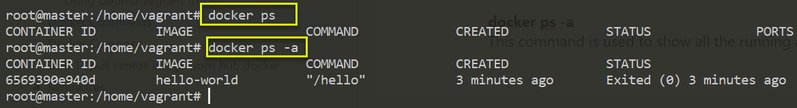

---
title: Docker- Commands
permalink: /docker/commands
key: docker-commands
categories:
- Docker
tags:
- Docker
---


Docker Commands
---------------

## Basic 

**docker version**  
Show the Docker version information
```powershell
root@master:/home/vagrant# docker version
Client:
 Version:      1.9.1
 API version:  1.21
 Go version:   go1.4.3
 Git commit:   a34a1d5
 Built:        Fri Nov 20 17:56:04 UTC 2015
 OS/Arch:      linux/amd64

Server:
 Version:      1.9.1
 API version:  1.21
 Go version:   go1.4.3
 Git commit:   a34a1d5
 Built:        Fri Nov 20 17:56:04 UTC 2015
 OS/Arch:      linux/amd64
```


**docker -v**  
Gives only docker version
```powershell
root@master:/home/vagrant# docker -v
Docker version 1.9.1, build a34a1d5
```


**docker --version**  
This command is used to get the currently installed version of docker
```powershell
root@master:/home/vagrant# docker --version
Docker version 1.9.1, build a34a1d5
```


**docker info**  
Displays more information about Docker Systems
```powershell
root@master:/home/vagrant# docker info
Containers: 1
Images: 2
Server Version: 1.9.1
Storage Driver: aufs
 Root Dir: /var/lib/docker/aufs
 Backing Filesystem: extfs
 Dirs: 4
 Dirperm1 Supported: false
Execution Driver: native-0.2
Logging Driver: json-file
Kernel Version: 3.13.0-170-generic
Operating System: Ubuntu 14.04.6 LTS
CPUs: 1
Total Memory: 489.8 MiB
Name: master
ID: 4YPE:SJP3:JID3:IITF:F7V2:GMVH:UICM:Z5PI:GNAW:HMCV:W5IO:BFQK
WARNING: No swap limit support
```


**docker --help**  
Shows details about particular command

Syntax
```powershell
docker <command> --help
```

```powershell
root@master:/home/vagrant# docker images --help

Usage:  docker images [OPTIONS] [REPOSITORY[:TAG]]

List images
  -a, --all=false      Show all images (default hides intermediate images)
  --digests=false      Show digests
  -f, --filter=[]      Filter output based on conditions provided
  --help=false         Print usage
  --no-trunc=false     Don't truncate output
  -q, --quiet=false    Only show numeric IDs
```


**docker login**  
used to login with docker hub(<http://hub.docker.com/>) account.it will used to
pull/push our own docker images to server.


## Images 

**docker images**  
List all the docker images pulled on the system with image details
```powershell
>docker images
REPOSITORY                 TAG                 IMAGE ID            CREATED             
httpd                      latest              ee39f68eb241        2 days ago          
hello-world                latest              fce289e99eb9        6 months ago        
sequenceiq/hadoop-docker   2.7.0               789fa0a3b911        4 years ago

```


**docker pull**  
This command is used to pull images from the docker repository(hub.docker.com)
```powershell
# Syntax: 
docker pull <image name>

root@master:/home/vagrant# docker pull hello-world
Using default tag: latest
latest: Pulling from library/hello-world
30413dbcae18: Pull complete
cc813f1ee102: Pull complete
Digest: sha256:fb158b7ad66f4d58aa66c4455858230cd2eab4cdf29b13e5c3628a6bfc2e9f05
Status: Downloaded newer image for hello-world:latest

root@master:/home/vagrant# docker images
REPOSITORY          TAG                 IMAGE ID            CREATED             VIRTUAL SIZE
hello-world         latest              cc813f1ee102        14 months ago       1.84 kB
```


**docker rmi**  
removes images by their ID. To remove the image, you first need to get the Image
ID By running simple command **docker images -a**
```powershell
root@master:/home/vagrant# docker rmi -f cc813f1ee102
Deleted: cc813f1ee10243587aaa3ebd547ab6c7c284f509c8e8faa386d7b83ec935333a
Deleted: 30413dbcae18076edb8281917efa0a410e0dc0dba421aba37e767d2193827658
```


## Containers 

**docker ps**    
This command is used to list the running containers


**docker ps -a**  
This command is used to show all the running and exited containers



**docker run**  
If it will check image is available in local system or not. If not, it will
download & run the image. If available, it will just Run the docker image.

In technical, this command is used to create a container from an image
```powershell
root@master:/home/vagrant# docker run ubuntu
Unable to find image 'ubuntu:latest' locally
latest: Pulling from library/ubuntu

888ccf454ca2: Extracting [================>              ] 8.552 MB/26.69 MB
cc8ccfcd670f: Download complete
8569bb44e89d: Download complete
29734d14b16f: Download complete
68c4771c8a42: Download complete
```


**docker run -it**  
In above it just downloaded Ubuntu image. To interact with it we should use
it(interactive -tty)
```powershell
root@master:/home/vagrant# docker run -it ubuntu
root@8c70757a72c0:/# hostname
8c70757a72c0
```


**docker start/stop**  
```powershell
root@master:/home/vagrant# docker stop 8c70757a72c0
8c70757a72c0

root@master:/home/vagrant# docker start 8c70757a72c0
8c70757a72c0
```


## System 

**docker stats**  
Gives container usage statistics
```powershell
#> docker stats 8c70757a72c0

CONTAINER           CPU %               MEM USAGE / LIMIT     MEM %            
8c70757a72c0        0.00%               442.4 kB / 513.6 MB   0.09%
```


**docker system df**  
To check Disc usage of Docker


**docker system prune**  
It will remove all unused data.(all stopped containers & its data)


**Restart Docker**  
Restart the docker container with container id mentioned in the command.
```powershell
#> docker restart 09ca6feb6efc
```


**docker exec**  
This command is used to access the running container.
```powershell
# Usage: 
docker exec -it <container id> bash
```


**9.docker stop**  
This command stops a running container
```powershell
# Usage: 
docker stop <container id>
```


**10.docker kill**  
This command kills the container by stopping its execution immediately.

The difference between `docker kill` and `docker stop` is that `docker stop`
gives the container time to shutdown gracefully, in situations when it is taking
too much time for getting the container to stop, one can opt to kill it
```powershell
# Usage: 
docker kill <container id>
```

