Docker Commands
---------------

## Basic 

**docker version**  
Show the Docker version information
```powershell
root@master:/home/vagrant# docker version
Client:
 Version:      1.9.1
 API version:  1.21
 Go version:   go1.4.3
 Git commit:   a34a1d5
 Built:        Fri Nov 20 17:56:04 UTC 2015
 OS/Arch:      linux/amd64

Server:
 Version:      1.9.1
 API version:  1.21
 Go version:   go1.4.3
 Git commit:   a34a1d5
 Built:        Fri Nov 20 17:56:04 UTC 2015
 OS/Arch:      linux/amd64
```


**docker -v**  
Gives only docker version
```powershell
root@master:/home/vagrant# docker -v
Docker version 1.9.1, build a34a1d5
```


**docker --version**  
This command is used to get the currently installed version of docker
```powershell
root@master:/home/vagrant# docker --version
Docker version 1.9.1, build a34a1d5
```


**docker info**  
Displays more information about Docker Systems
```powershell
root@master:/home/vagrant# docker info
Containers: 1
Images: 2
Server Version: 1.9.1
Storage Driver: aufs
 Root Dir: /var/lib/docker/aufs
 Backing Filesystem: extfs
 Dirs: 4
 Dirperm1 Supported: false
Execution Driver: native-0.2
Logging Driver: json-file
Kernel Version: 3.13.0-170-generic
Operating System: Ubuntu 14.04.6 LTS
CPUs: 1
Total Memory: 489.8 MiB
Name: master
ID: 4YPE:SJP3:JID3:IITF:F7V2:GMVH:UICM:Z5PI:GNAW:HMCV:W5IO:BFQK
WARNING: No swap limit support
```


**docker --help**  
Shows details about particular command

Syntax
```powershell
docker <command> --help
```

```powershell
root@master:/home/vagrant# docker images --help

Usage:  docker images [OPTIONS] [REPOSITORY[:TAG]]

List images
  -a, --all=false      Show all images (default hides intermediate images)
  --digests=false      Show digests
  -f, --filter=[]      Filter output based on conditions provided
  --help=false         Print usage
  --no-trunc=false     Don't truncate output
  -q, --quiet=false    Only show numeric IDs
```


**docker login**  
used to login with docker hub(<http://hub.docker.com/>) account.it will used to
pull/push our own docker images to server.


## Images 

**docker images**  
List all the docker images pulled on the system with image details
```powershell
>docker images
REPOSITORY                 TAG                 IMAGE ID            CREATED             
httpd                      latest              ee39f68eb241        2 days ago          
hello-world                latest              fce289e99eb9        6 months ago        
sequenceiq/hadoop-docker   2.7.0               789fa0a3b911        4 years ago

```


**docker pull**  
This command is used to pull images from the docker repository(hub.docker.com)
```powershell
# Syntax: 
docker pull <image name>

root@master:/home/vagrant# docker pull hello-world
Using default tag: latest
latest: Pulling from library/hello-world
30413dbcae18: Pull complete
cc813f1ee102: Pull complete
Digest: sha256:fb158b7ad66f4d58aa66c4455858230cd2eab4cdf29b13e5c3628a6bfc2e9f05
Status: Downloaded newer image for hello-world:latest

root@master:/home/vagrant# docker images
REPOSITORY          TAG                 IMAGE ID            CREATED             VIRTUAL SIZE
hello-world         latest              cc813f1ee102        14 months ago       1.84 kB
```


**docker rmi**  
removes images by their ID. To remove the image, you first need to get the Image
ID By running simple command **docker images -a**
```powershell
root@master:/home/vagrant# docker rmi -f cc813f1ee102
Deleted: cc813f1ee10243587aaa3ebd547ab6c7c284f509c8e8faa386d7b83ec935333a
Deleted: 30413dbcae18076edb8281917efa0a410e0dc0dba421aba37e767d2193827658
```


## Containers 

**docker ps**    
This command is used to list the running containers


**docker ps -a**  
This command is used to show all the running and exited containers


**docker run**  
If it will check image is available in local system or not. If not, it will
download & run the image. If available, it will just Run the docker image.

In technical, this command is used to create a container from an image
```powershell
root@master:/home/vagrant# docker run ubuntu
Unable to find image 'ubuntu:latest' locally
latest: Pulling from library/ubuntu

888ccf454ca2: Extracting [================>              ] 8.552 MB/26.69 MB
cc8ccfcd670f: Download complete
8569bb44e89d: Download complete
29734d14b16f: Download complete
68c4771c8a42: Download complete
```


**docker run -it**  
In above it just downloaded Ubuntu image. To interact with it we should use
it(interactive -tty)
```powershell
root@master:/home/vagrant# docker run -it ubuntu
root@8c70757a72c0:/# hostname
8c70757a72c0
```


**docker start/stop**  
```powershell
root@master:/home/vagrant# docker stop 8c70757a72c0
8c70757a72c0

root@master:/home/vagrant# docker start 8c70757a72c0
8c70757a72c0
```


## System 

**docker stats**  
Gives container usage statistics
```powershell
#> docker stats 8c70757a72c0

CONTAINER           CPU %               MEM USAGE / LIMIT     MEM %            
8c70757a72c0        0.00%               442.4 kB / 513.6 MB   0.09%
```


**docker system df**  
To check Disc usage of Docker


**docker system prune**  
It will remove all unused data.(all stopped containers & its data)


**Restart Docker**  
Restart the docker container with container id mentioned in the command.
```powershell
#> docker restart 09ca6feb6efc
```


**docker exec**  
This command is used to access the running container.
```powershell
# Usage: 
docker exec -it <container id> bash
```


**9.docker stop**  
This command stops a running container
```powershell
# Usage: 
docker stop <container id>
```


**10.docker kill**  
This command kills the container by stopping its execution immediately.

The difference between `docker kill` and `docker stop` is that `docker stop`
gives the container time to shutdown gracefully, in situations when it is taking
too much time for getting the container to stop, one can opt to kill it
```powershell
# Usage: 
docker kill <container id>
```


# Cheetsheet
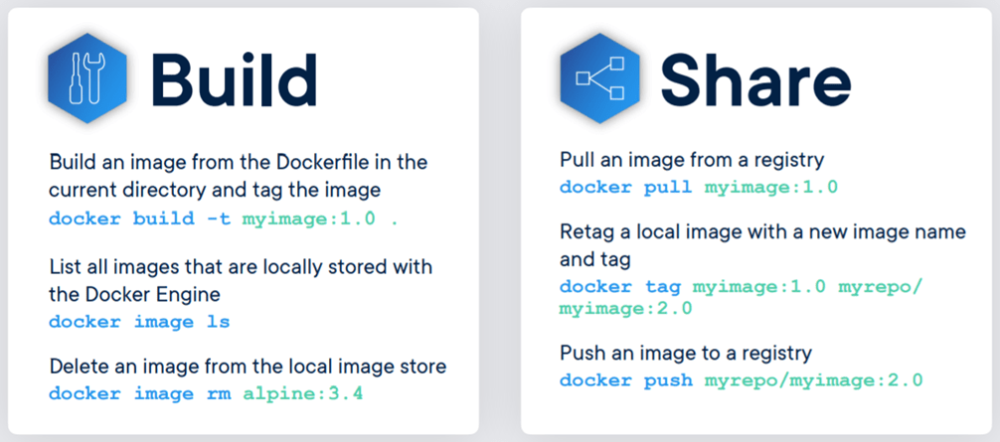
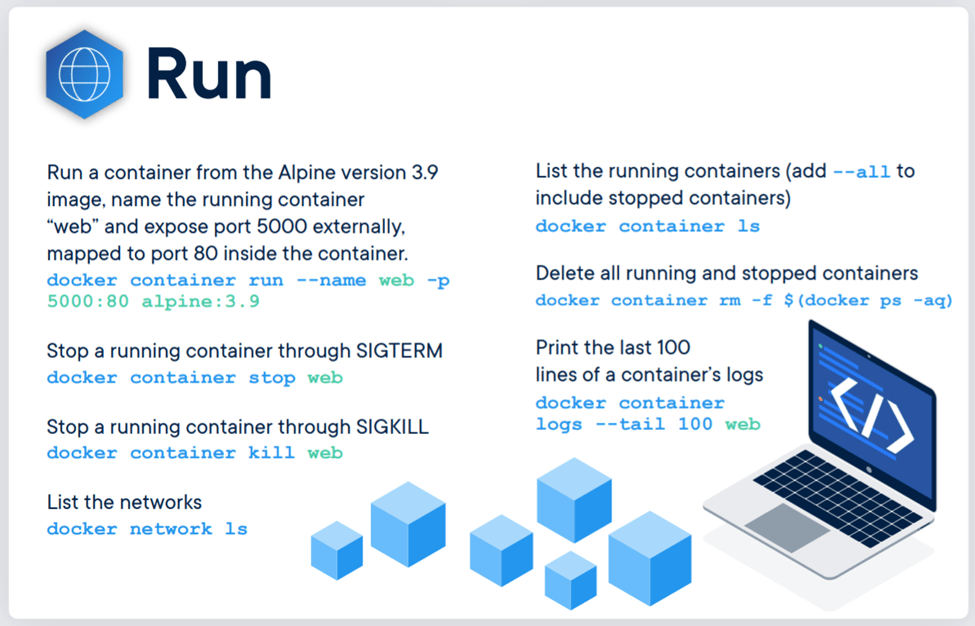
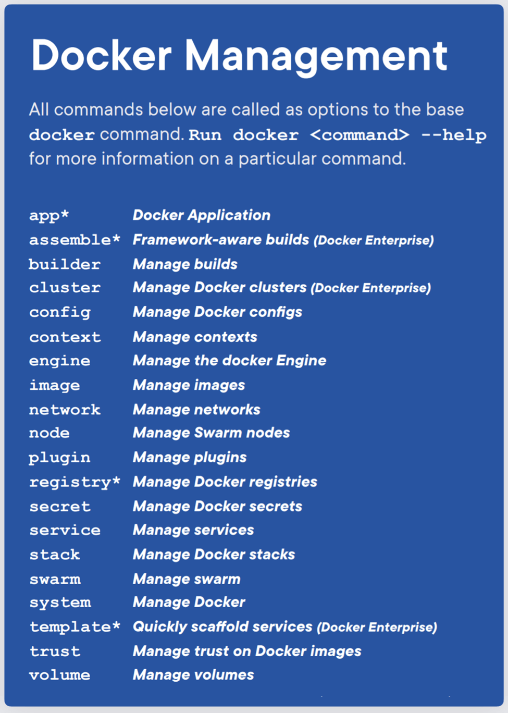


# Quick Hands on


## 1. Building & Deploying Docker Image

1.Checkout this GITHUB project 
```go
https://github.com/smlcodes/Docker-SpringBoot-EmployeeServices.git
```

  <br>


2.To Build the Image 
```dockerfile
docker build -t empapp .
```
You can see Image stored in Local Docker Registry, but not Running.
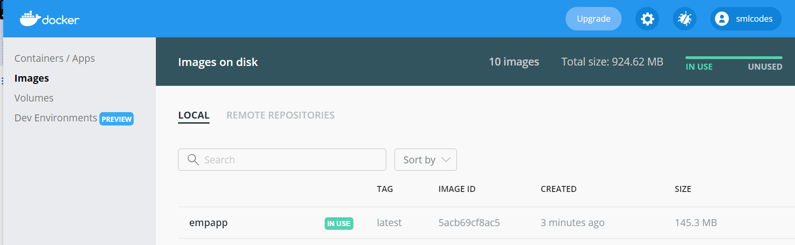


  <br>


3.Run the Dokcer Imaage, Now its called as Docker Container.
```dockerfile
docker run -it -p 8080:8080 empapp
```
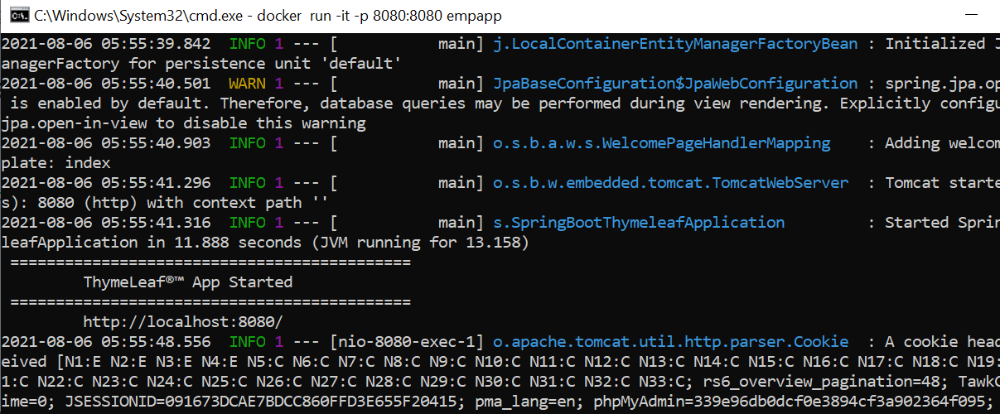

Open Application In Browser
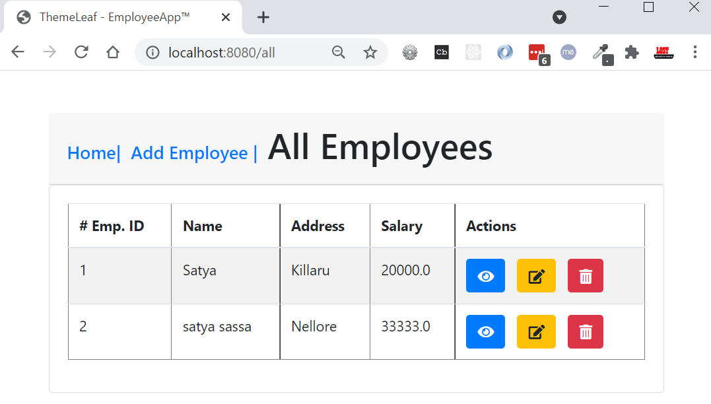

  <br>


4.Our App is Good. Its time to upload in DokcerHub. But before that we need to TAG the Image.
```dockerfile
Syntax:
docker tag <Docker_Image_Name> YOUR_DOCKERHUB_NAME/<Docker_Image_Name>

docker tag empapp smlcodes/empapp
```

  <br>


5.Now Push the tagged Image `smlcodes/empapp` to DockerHub
```dockerfile
docker push smlcodes/empapp
```

Now it will create New Repo at DockerHub automatically & Stores Images inside with TAG.
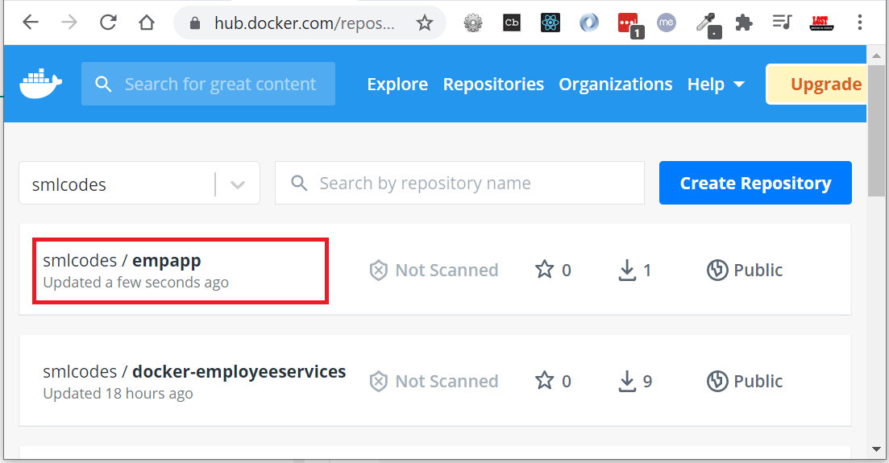
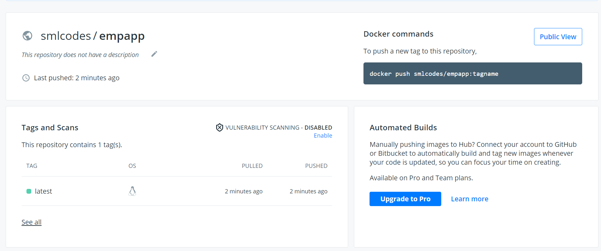

You can also check in Docker Desktop.
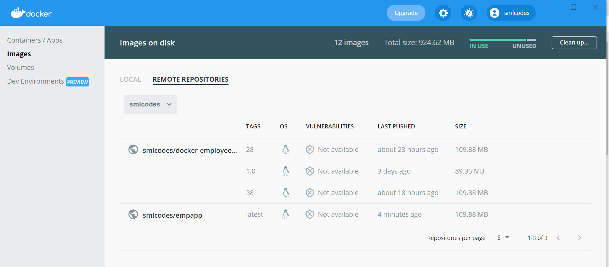


# 2. Docker + Kubernetes Integration

#### Kuberneters Architecture 
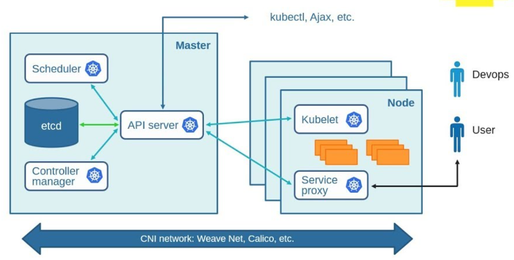

**Kubernetes Master**
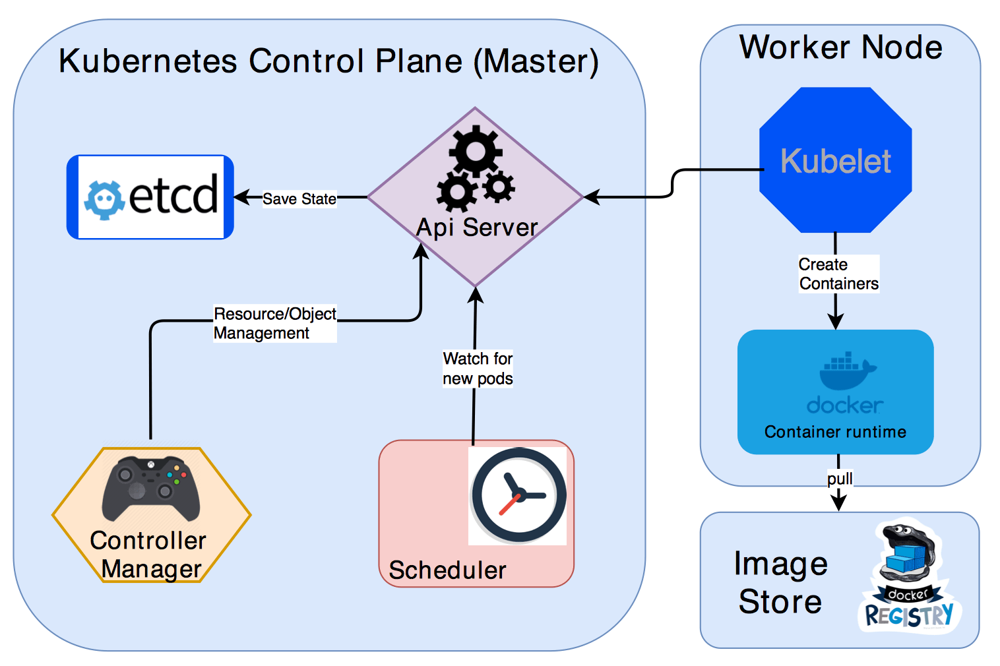

1. **kube-apiserver**: REST API endpoint to serve as the frontend for the Kubernetes control plane

2. **etcd**: Key value store for the cluster data (regarded as the single source of truth)
 
3. **kube-scheduler**: Watches new workloads/pods and assigns them to a node based on several scheduling factors (resource constraints, anti-affinity rules, data locality, etc.)
 
4. **kube-controller-manager:** Central controller that watches the node, replication set, endpoints (services), and service accounts.


  <br>


**Node Components**

Unlike Master components that usually run on a single node (unless High Availability Setup is explicitly stated), Node components run on every node.

1. **kubelet**: Agent running on the node to inspect the container health and report to the master as well as listening to new commands from the kube-apiserver

2. **kube-proxy**: Maintains the network rules

3. **container runtime**: Software for running the containers (e.g. Docker, rkt, runc)

 - `Node` single machine in your cluster
 
 - `Pods` Kubernetes doesn’t run containers directly; instead it wraps one or more containers into a higher-level structure called a pod. 
 
 - Master + Nodes = Kubernetes Cluster 
 
 In Simple,
  - We have a Cluster
  - Inside Cluster, we have POD
  - Inside POD, We have a Container
  - Running Cantainer called as a Service, which is accessed by hostname:port.
  
  
    

  <br>


## MiniKube Installation Windows 10
minikube is local Kubernetes, focusing on making it easy to learn and develop for Kubernetes.

All you need is Docker (or similarly compatible) container or a Virtual Machine environment, and Kubernetes is a single command away: `minikube start`

1. Download .exe from <a href="https://minikube.sigs.k8s.io/docs/start/" target="_blank">Here</a>


2. Open PowerShell as Administrator & Set Path by running below code
    ```powershell
    $oldpath=[Environment]::GetEnvironmentVariable("Path", [EnvironmentVariableTarget]::Machine)
    if($oldpath -notlike "*;C:\minikube*"){`
      [Environment]::SetEnvironmentVariable("Path", $oldpath+";C:\minikube", [EnvironmentVariableTarget]::Machine)`
    }
    ```

3. Start your cluster
    ```powershell
    minikube start --driver=hyperv
    ```
    
    If Any error Create Swith manually in Hyper-V Manager, <a href="https://stackoverflow.com/questions/62221215/minikube-hanging-on-creating-hyperv-vm" target="_blank">Follow Here</a>
    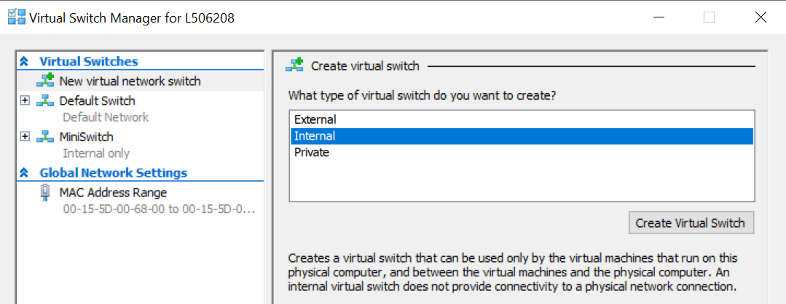
    
    Run Below command  
    ```dos
    minikube start --vm-driver hyperv --hyperv-virtual-switch "MiniSwitch"
    ```

    
    
    
4. Install minikube Dashboard
    ```dockerfile
    minikube dashboard
    ```
    
    
    Open above URL in Browser
    
    

## Create Pod.yaml

A POD can have one or more containers

1.Create `pod.yaml` in Project Root
```yaml
apiVersion: v1
kind: Pod
metadata:
  name: pod1
  labels:
    app: java
spec:
  containers: 
    - name: pod1
      image: smlcodes/empapp:latest
```

  <br>


2.Check if any other PODS are running
```bash
kubectl get pods
No POD Resources are Running
```

  <br>


3.Now Create POD, using below cmd where `pod.yaml` resides
```yaml
kubectl create -f pod.yaml
```


Now if we see Kubernetes Dashboard, You will find POD with one Node there
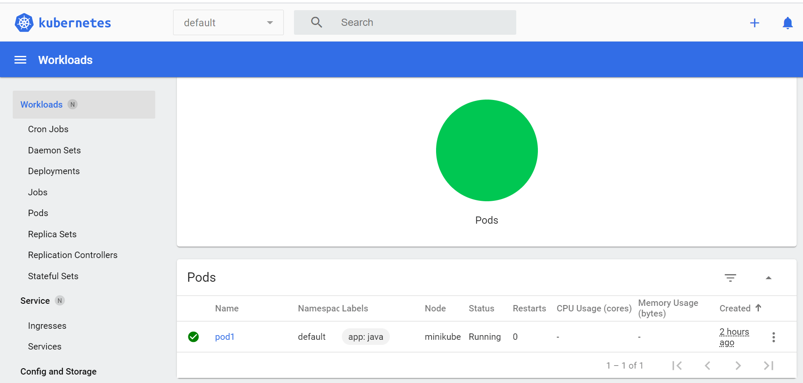


  <br>

4.We have POD created, inside we have empapp container Running. To expose the application to outside world we need to do `kubectl expose -h`  
```bash
Syntax:
kubectl expose pod <POD_NAME> --name <EXPOSE_SERVICE_NAME> --port <PORT_NO> --type [ClusterIP/NodePort/LoadBalancer]
```

```dos
kubectl expose pod pod1 --name pod1srv --port 5001 --type  NodePort
```


  <br>
  
5.To access Application, we must know the IP/host where `pod1srv` service is Running. for that we use below one.

```dos
minikube service pod1srv
```


## ReplicationController 


## ReplicationSet


