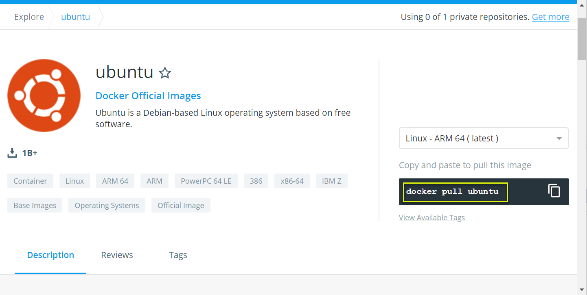
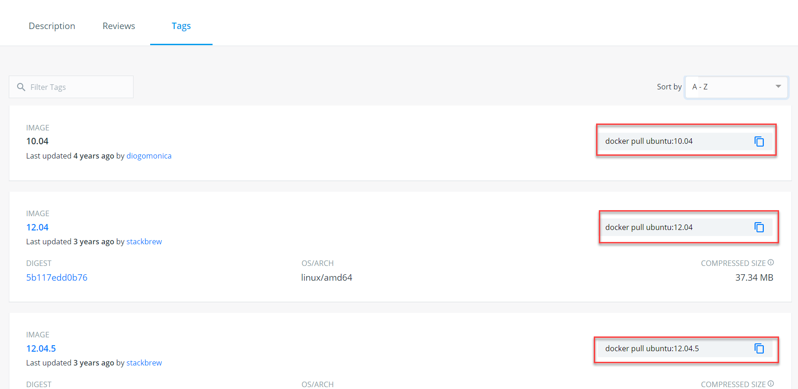
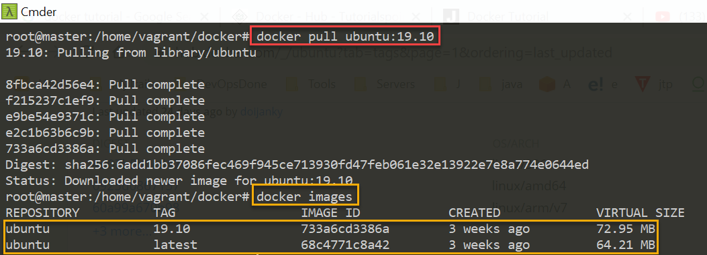
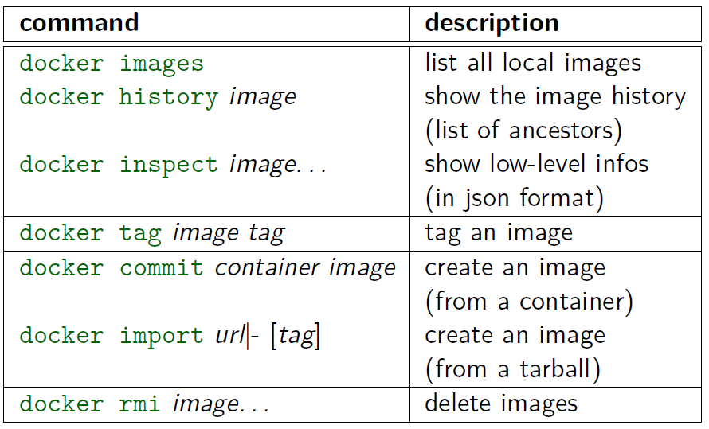
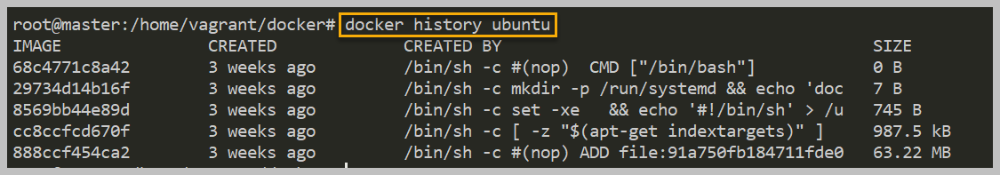

Docker – Images
===============

In Docker, everything is based on Images. An image is a combination of a file
system and parameters(some metadata).

-   Docker Images are immutable

-   Docker Images are used for instantiating containers

-   We can create new versions of the image (multiple layers)

-   Each Image identified by

    -   **Image ID**: randomly generated
    -   **Digest**: hashed from the content

Docker Hub
----------

Docker Hub is a registry service on the cloud that allows you to download Docker
images that are built by other communities.

You can also upload your own Docker built images to Docker hub.

### Pull Ubuntu Image from Docker hub

1.login to <https://hub.docker.com/>

2.serach for ubuntu image, to pull the image just copy the code

```powershell
root@master:/home/vagrant/docker# docker pull ubuntu
Using default tag: latest
latest: Pulling from library/ubuntu

Digest: sha256:febe5aef67d005c38c118a2b0335040b29614547a621cd7e52323f18eef25971
Status: Image is up to date for ubuntu:latest
root@master:/home/vagrant/docker#
```

Check available images
```powershell
root@master:/home/vagrant/docker# docker images
REPOSITORY          TAG                 IMAGE ID            CREATED             VIRTUAL SIZE
ubuntu              latest              68c4771c8a42        3 weeks ago         64.21 MB
```


3.Each image consists of Tags. We can pull image by tag as well.


`docker pull <image>:<TAG>`



# Docket - Image management commands




### docker images
list all local images
```powershell
root@master:/home/vagrant/docker# docker images
REPOSITORY          TAG                 IMAGE ID            VIRTUAL SIZE
ubuntu              19.10               733a6cd3386a        72.95 MB
ubuntu              latest              68c4771c8a42        64.21 MB
```


**<u>Options:</u>**

**docker images -q**  
Only shows the ID's of Images
```powershell
root\@master:/home/vagrant/docker\# docker images -q
733a6cd3386a
68c4771c8a42
```


**docker images -f -dangling=false”**  
Filter with Conditions : it will show only not running / not associated images.
```powershell
root@master:/home/vagrant/docker# docker images -f "dangling=false"
REPOSITORY          TAG                 IMAGE ID          VIRTUAL SIZE
ubuntu              19.10               733a6cd3386a        72.95 MB
ubuntu              latest              68c4771c8a42        64.21 MB
```


### docker history 
Show the history of an image.
```powershell
docker history <image>
```



### docker inspect 
Return low-level & in detailed information on a container or image (in json
format)
```powershell
docker inspect <image>
```


### docker rmi 
Remove one or more images. Use -f for force remove.
```powershell
#> docker rmi -f ubuntu
Untagged: ubuntu:latest
Deleted: 68c4771c8a420d8e1bee016457b1d5ef8e08f72ffea01fcae6c24a1fc429598b
Deleted: 29734d14b16f9c40ce348b03eeda416a30b7f7c69af366cdbf6df8c779ba2366
Deleted: 8569bb44e89ddba5e734e4adbb4a2bfea786ce2da20dcc8a411836982cf10400
Deleted: cc8ccfcd670f0d82a720cf5e1d26aa944c07e107430c8668f9b69466d8679715
Deleted: 888ccf454ca27178e025af00f7ba372b70f469e9ebfe9d49dabcec7180316817
```

## Misc.

**docker tag \<image\> \<tag\>** :   
tag an image

**docker commit \<container\> \<image\>** :   
create an image (from a container)

**docker import url\|- [tag]** :   
create an image (from a tarball)
