Docket – Container
==================

Docker Containers are the running instances of Docker Images. Whenever you run
an image it will create the container.

In one line, Docker images are Static OS templates & Docker Containers are
runtime instances of those images.

Docker Engine
-------------

*Docker Engine* is a client-server application with these major components:

-   A server which is a type of long-running program called a daemon process
    (the dockerd command).

-   A REST API which specifies interfaces that programs can use to talk to the
    daemon and instruct it what to do.

-   A command line interface (CLI) client (the docker command).


The CLI uses the Docker REST API to control or interact with the Docker daemon
through scripting or direct CLI commands. Many other Docker applications use the
underlying API and CLI.

The daemon creates and manages Docker *objects*, such as images, containers,
networks, and volumes.

# Docker Architecture


Docker uses a client-server architecture. The Docker *client* talks to the
Docker *daemon(Docker Host, where actually docker containers run)*, which does
the heavy lifting of building, running, and distributing your Docker containers.

The Docker client and daemon *can* run on the same system(we are doing same), or
you can connect a Docker client to a remote Docker daemon.

The Docker client and daemon communicate using a REST API, over UNIX sockets or
a network interface.

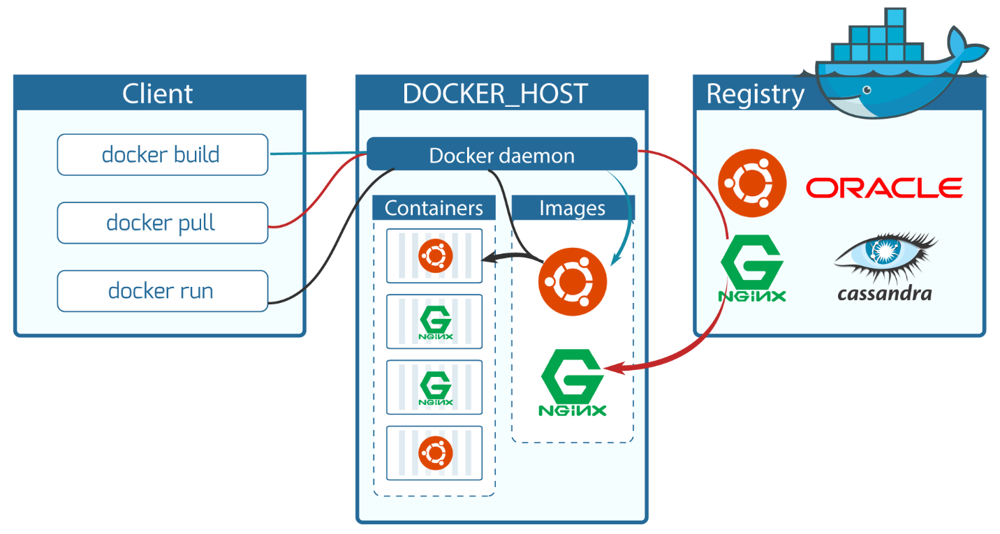

###### The Docker daemon

The Docker daemon (dockerd) listens for Docker API requests and manages Docker
objects such as images, containers, networks, and volumes. A daemon can also
communicate with other daemons to manage Docker services.

###### The Docker client

The Docker client (docker) is the primary way that many Docker users interact
with Docker. When you use commands such as docker run, the client sends these
commands to dockerd, which carries them out. The docker command uses the Docker
API. The Docker client can communicate with more than one daemon.

###### Docker registries

A Docker *registry* stores Docker images. Docker Hub is a public registry that
anyone can use, and Docker is configured to look for images on Docker Hub by
default. You can even run your own private registry. If you use Docker
Datacenter (DDC), it includes Docker Trusted Registry (DTR).

When you use the docker pull or docker run commands, the required images are
pulled from your configured registry. When you use the docker push command, your
image is pushed to your configured registry

Commands
--------

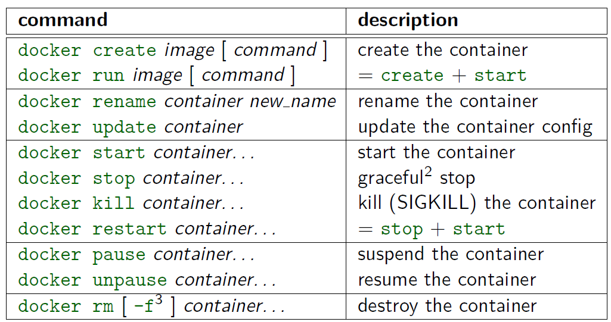

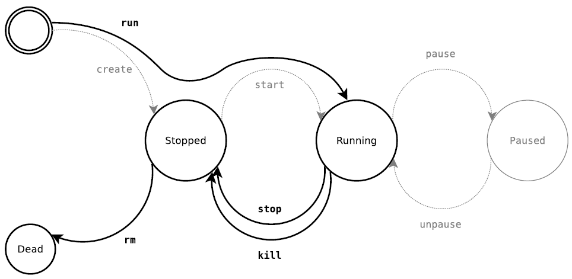

To run Docker Container first we need to get Docker Image, for that

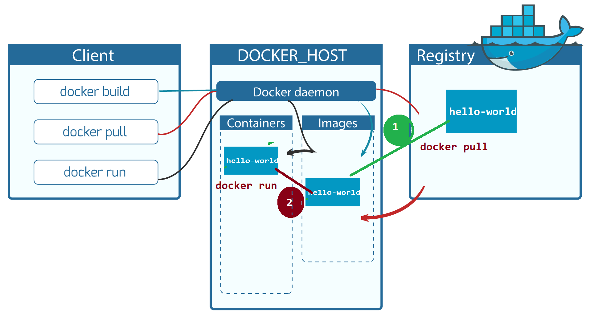

docker pull hello-world

we use above command it just pull the image from Docker hub to our local
system(Docker Host) & saves it under Images section.

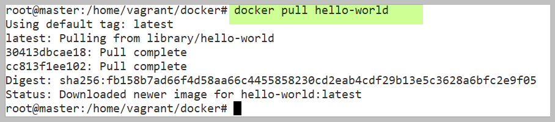

`docker run hello-world`

But if we run this command, first it will check Image is available in local
system or not. if not it will download the image from Docker hub & its Run the
image by creating Hello-world Container inside Containers block.

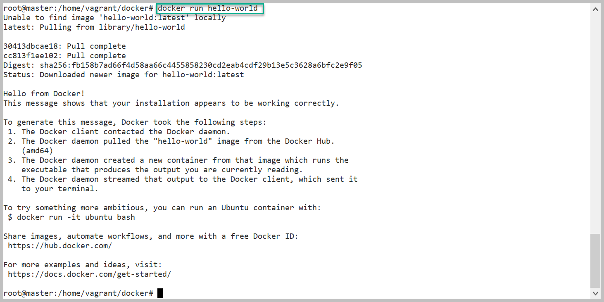


### docker ps
Will display the all the available Containers  
`docker ps` – will Displays only active/running containers
```powershell
docker ps – will Displays only active/running containers
$ docker ps
CONTAINER ID        IMAGE              CREATED             STATUS 

docker ps -a : will Displays both active/running containers
$ docker ps -a
CONTAINER ID        IMAGE           CREATED             STATUS                    
df3d6bb9dab4        hello-world     7 minutes ago       Exited (0) 7 minutes ago  
8c70757a72c0        68c4771c8a42    43 hours ago        Exited (137) 27 hours ago 
73cfd3517748        68c4771c8a42    43 hours ago        Exited (0) 43 hours ago   
6569390e940d        hello-world     2 days ago          Exited (0) 2 days ago
```


### docker run

we already seen docker run basic command.

Now, i want to download Ubuntu Image & Run the container with Interactive
mode(Login) and also want to give a name to the Container.

`docker run --name SatyaUbuntu -it ubuntu`

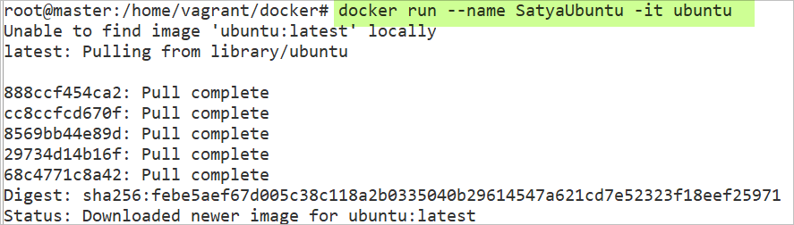
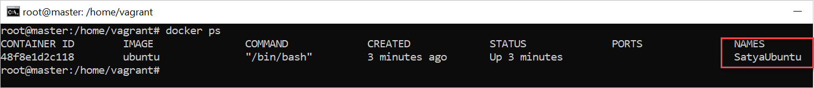

If container is already in running, we can do interactive by
```powershell
docker exec -it <Container-ID> /bin/bash

or

docker attach <Con-id>
```


### docker attach

This command to attach your terminal’s standard input, output, and error (or any
combination of the three) to a running container using the container’s ID or
name.

The docker exec and docker attach commands allow you to connect to a running
container.

-   To get an interactive shell to a container, use the exec command to start a
    new shell session.

-   The attach command attaches your terminal to a running container.


### docker start/stop/restart

**docker start** *\<con \_ID\>* : Start one or more stopped containers

**docker stop** *\<con \_ID\>* : Stop a running container

**docker restart** *\<con \_ID\>* : Restart a container

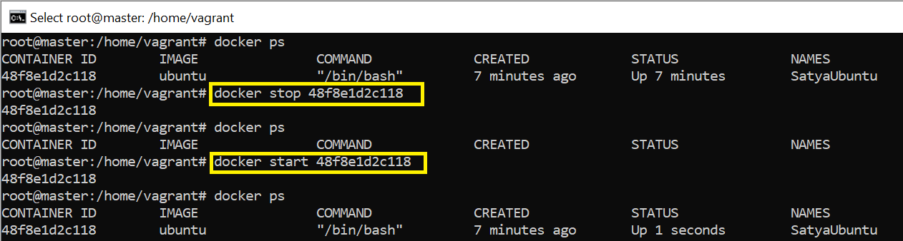


### docker pause/unpause

**docker pause \<con-id\>** : Pause all processes within a container

**docker unpause \<con-id\>** : Unpause all processes within a container

**docker top \<con-id\>** : To Display the running processes of a container


### docker stats

Display a live stream of container(s) resource usage statistics like CPU, Memory
& Disc usage details
```powershell
#> docker stats 48f8e1d2c118
CONTAINER           CPU %   MEM USAGE / LIMIT     MEM %      NET I/
48f8e1d2c118        0.00%   860.2 kB / 513.6 MB   0.17%      648 B / 648 / 0 B

CONTAINER           CPU %   MEM USAGE / LIMIT     MEM %      NET I/O             
48f8e1d2c118        0.00%   860.2 kB / 513.6 MB   0.17%      648 B / 648 / 0 B

CONTAINER           CPU %   MEM USAGE / LIMIT     MEM %      NET I/O             
48f8e1d2c118        0.00%   860.2 kB / 513.6 MB   0.17%      648 B / 648 / 0 B
```


### docker rename
Rename a container
`docker rename <OLD_NAME>  <NEW_NAME>`

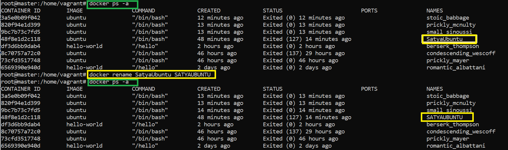


### docker kill
Kill a running container


### docker rm
Remove one or more containers from containers space.  
`docker rm <cont-id>`

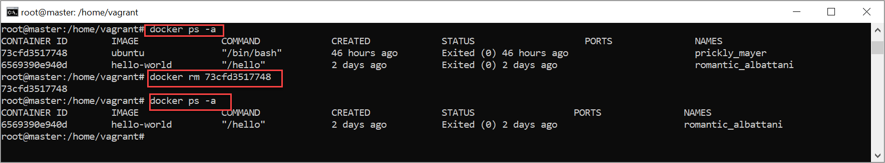
