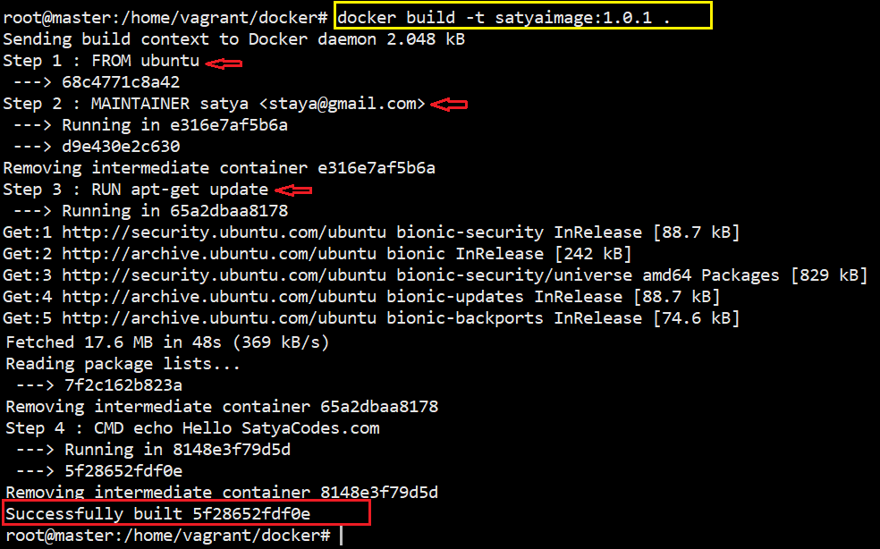
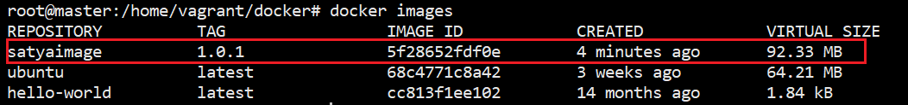
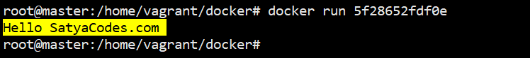

Docker – Dockerfile 
====================

Docker file is text file is simple text which contains instructions to Build
image.


## Dockerfile example


1.Create a new file called `Dockerfile` without extension
```powershell
#Syntax
FROM <BASE-IMAGE>/<SCRATCH>

MAINTAINER <Author_name> <email>

RUN <to run any cmds>

CMD ["echo", "To run anything once container is running"]
```

Example
```
# example
FROM ubuntu

MAINTAINER satya <staya@gmail.com>

RUN apt-get update

CMD ["echo", "Hello SatyaCodes.com"]
```


**2.Build an Image**

```powershell
#Syntax
docker build <file-location>

#Syntax - with tage
docker build -t [tag name]:[version] <file-location>

#Example
docker build -t SATYAIMAGE:1.0.1 .
```



**3.Check images**



**4.Run created image**


<https://github.com/wsargent/docker-cheat-sheet>

[Read More  on this...](https://medium.com/@devopslearning/21-days-of-docker-day-5-introduction-to-dockerfile-98d46f3ddcf)
