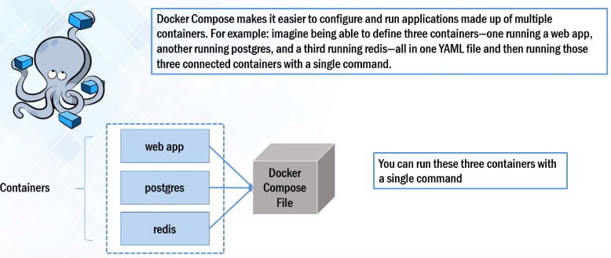
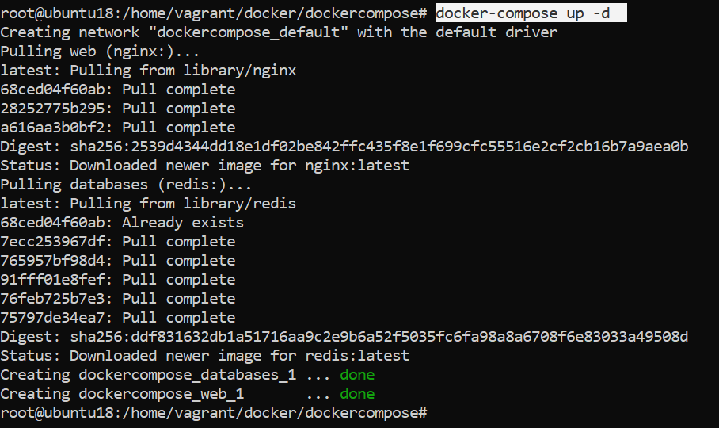
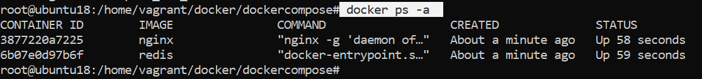
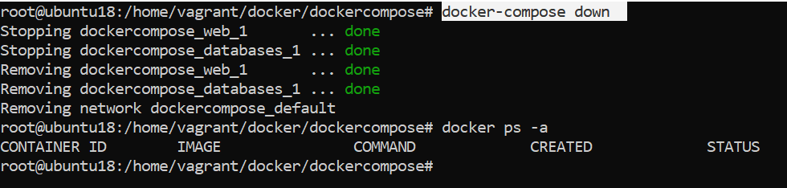
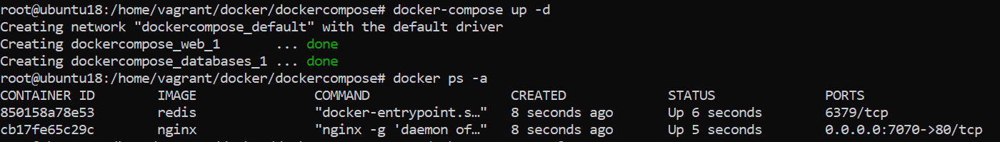
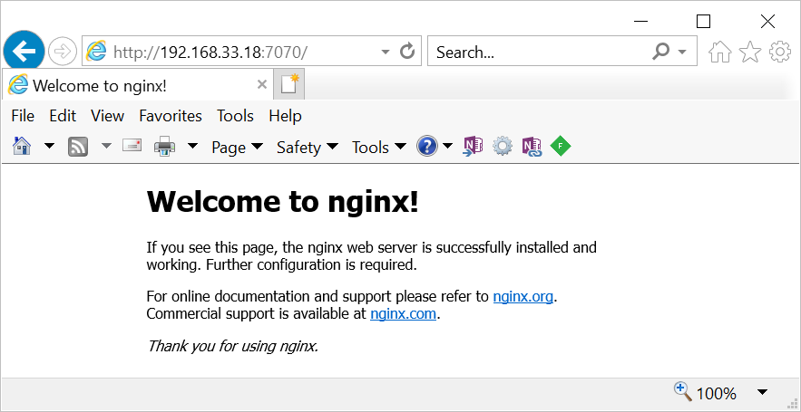
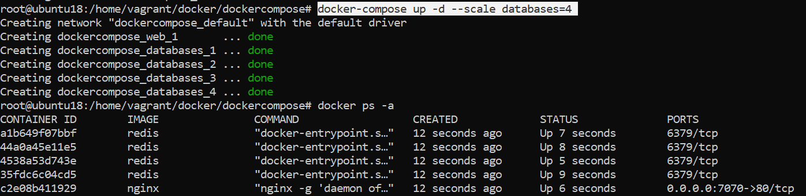

Docker – Compose
================

when I had to containerize multiple services in separate containers, who can you
communicate beween them ? & How can start them with Single Operations. That
Stage Docker Compose Come into the picture.



Docker Compose can be used to create separate containers and host them for each
of the stacks in a Full stack application which contains MongoDB Express Angular
& NodeJs.

By using Docker Compose, we can host each of these technologies in separate
containers on the same host and get them to communicate with each other. Each
container will expose a port for communicating with other containers.

The communication and up-time of these containers will be maintained by Docker
Compose

Docker Compose is a tool for defining & running multi-container docker
applications.

If we go to docker hub we can see Images for Jenkins, MySQL, Nginx etc. but in
real time we need multiple services/containers run together for an application.

For example, see below microservice, which have independent Database & their
application service.


If we want to create this type Micro Service, i.e multiple containers are needed
to work together. for that we need to use Docker Compose.

We will use YAML file for Docker Compose. Use YAML files to configure
application services (docker-compose.yml)

we can do

-   can start all services with a single command docker compose up

-   can stop all services with a single command docker compose down

-   can scale up selected services when required


# Docker Compose Installation


We’ll check the [current release](https://github.com/docker/compose/releases)
and if necessary, update it in the command below: 
```powershell
sudo curl -L https://github.com/docker/compose/releases/download/1.25.4/docker-compose-`uname -s`-`uname -m` -o /usr/local/bin/docker-compose
```


Next we’ll set the permissions:  
`sudo chmod +x /usr/local/bin/docker-compose`


Then we’ll verify that the installation was successful by checking the version:
```
docker-compose --version
docker-compose version 1.25.4, build 8d51620a
```


## Example


In the example We need to Create Web Application

For that we need
-   Webserver - Ngnix
-   Database - Redis


**1.Create docker compose file at any location on your system**
```powershell
>   mkdir dockercompose

>   cd dockercompose

>   vi docker-compose.yml
```


**2.Write `docker-compose.yml` file with required images**
```powershell
version: '3'
services:
    web:
        image: nginx
    databases:
        image: redis
```


**3.Validate docker-compose** file is valid or not(Syntax & image availability
checks)

Go to `docker-compose.yml` location & run below command. If it print file content,
then we are good.  
`docker-compose config`

```powershell
root@master:# docker-compose config
services:
  databases:
    image: redis
  web:
    image: nginx
version: '3.0'
```

4.Run docker-compose.yml file by command  
`docker-compose up -d`


Check running instances



5.Bring down application by command  
`docker-compose down`




## Expose Ports

If you want to access Nginx server from your system, you need to expose the
port.

For example, Nginx running on port 80 in container, and you need to access with
port 7070 from your system. Then the `docker-compose.yaml` should like,
```powershell
version: '3'
services:
    web:
        image: nginx
        ports:
         - 7070:80/tcp
    databases:
        image: redis
```


Then run `docker-compose up` & check it is running.


Access browser, 192.168.33.18 is vagrant System IP, where docker is running



Scaling services
----------------

I want to run 4 redius database instaces, we need to scale up the databases=4

`docker-compose up -d --scale database=4`




Follow this : <https://www.digitalocean.com/community/tutorials/how-to-install-docker-compose-on-ubuntu-16-04>
