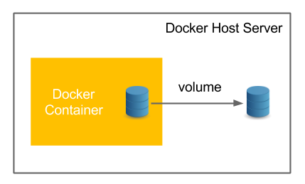
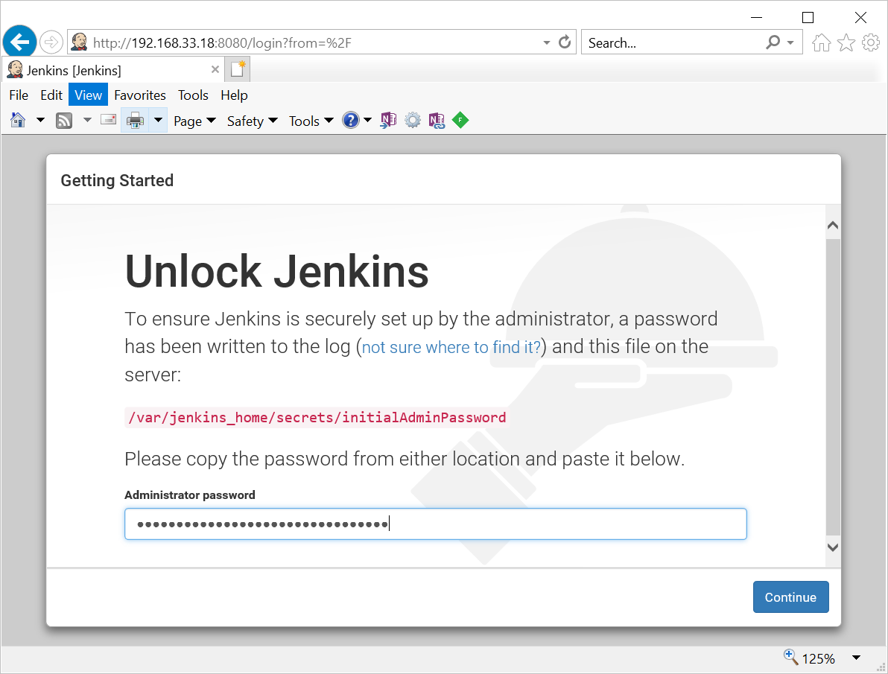

Docker – Volumes 
=================

If we Run any Docker Conatser, they have stored the container related data in
Some place.

If we won't specify the explicit location to store Data, it will store data in
default location. When we delete the container, the data also be deleted.

To store data in permanent location, which is independent on Docker containers,
we will user Docker Volume.


Commands
--------
```powershell
# Syntax
docker volume <COMMAND>
```


**Commands:**

-   **create** : Create a volume

-   **inspect** : Display detailed information on one or more volumes

-   **ls** : List volumes

-   **rm** : Remove one or more volumes

-   **prune** : Remove all unused local volumes


## Example - Create a Volume
```powershell
root@ubuntu18: docker:#docker volume create SatyaVolume
SatyaVolume


root@ubuntu18: docker:#docker volume inspect SatyaVolume
[
    {
        "CreatedAt": "2020-03-19T04:47:09Z",
        "Driver": "local",
        "Labels": {},
        "Mountpoint": "/var/lib/docker/volumes/SatyaVolume/_data",
        "Name": "SatyaVolume",
        "Options": {},
        "Scope": "local"
    }
]


root@ubuntu18: docker:#docker volume ls
DRIVER              VOLUME NAME
local               0afecfb5eda9009f595dae8dfb6e584230390a6fa44ddb54266e33ffdf39df38
local               57c88cf50d0427ce158ce6a4bcc1b1339739b1a0bed8a99a303683fceafab9a1
local               574aeaf5068d44b584147cc86ce7e77fe3b25a0e9cad9051ff853cde93f6d298
local               SatyaVolume
local               bf0d4fcfffc57742fbcb20aea03bc8cc274dffde01abe897988514d66d188669
local               c569a41c865ca4160322adcad931287a278814d60367ab71edc596177d677ffd
local               c916ef63e70b0ed0b15db9560875be34d8262357b8ec0a8a5fbfce97718448b5


root@ubuntu18: docker:#docker volume rm SatyaVolume
SatyaVolume


root@ubuntu18: docker:#docker volume ls
DRIVER              VOLUME NAME
local               0afecfb5eda9009f595dae8dfb6e584230390a6fa44ddb54266e33ffdf39df38
local               57c88cf50d0427ce158ce6a4bcc1b1339739b1a0bed8a99a303683fceafab9a1
local               574aeaf5068d44b584147cc86ce7e77fe3b25a0e9cad9051ff853cde93f6d298
local               bf0d4fcfffc57742fbcb20aea03bc8cc274dffde01abe897988514d66d188669


root@ubuntu18: docker:#docker volume prune
WARNING! This will remove all local volumes not used by at least one container.
Are you sure you want to continue? [y/N] y
Deleted Volumes:
0afecfb5eda9009f595dae8dfb6e584230390a6fa44ddb54266e33ffdf39df38
574aeaf5068d44b584147cc86ce7e77fe3b25a0e9cad9051ff853cde93f6d298
eb58eb074fc411f2e9223123dbb8c54c1d80eab30037b11799bedb01117565ca
f7b3c19fe913a44e077a1a11977ec11892aedf3af9e93266c2c3898246186993
57c88cf50d0427ce158ce6a4bcc1b1339739b1a0bed8a99a303683fceafab9a1
Total reclaimed space: 460B


root@ubuntu18: docker:#docker volume ls
DRIVER              VOLUME NAME
```


## Example: Use Docker Volume for Storing Jenkins_Home Data

Create Volume for Jenkins  
`docker volume create JenkinsVolume`


```powershell
#> docker volume ls
DRIVER              VOLUME NAME
local               JenkinsVolume
```


I’m using Jenkins Container
```powershell
#> docker pull jenkins

Using default tag: latest
latest: Pulling from library/jenkins
55cbf04beb70: Pull complete
12b47c68955c: Pull complete
1322ea3e7bfd: Pull complete
Digest: sha256:eeb4850eb65f2d92500e421b430ed1ec58a7ac909e91f518926e02473904f668
Status: Downloaded newer image for jenkins:latest
docker.io/library/jenkins:latest
```


**Start/Run Jenkins Container**
```powershell
docker run -p 8080:8080 -p 50000:50000 -v JenkinsVolume:/var/jenkins_home --name SatyaCodesJenkins jenkins
```
-   Runing port 8080 in local-sytem:docker container

-   API port 50000 in local-sytem:docker container

-   -v : Store all jenkins_home related data in JenkinsVolume

-   --name : name this container as 'SatyaCodesJenkins'

```powershell
#> docker run -p 8080:8080 -p 50000:50000 -v JenkinsVolume:/var/jenkins_home --name SatyaCodesJenkins jenkins


Running from: /usr/share/jenkins/jenkins.war
INFO: Started Download metadata
Mar 19, 2020 5:15:34 AM jenkins.util.groovy.GroovyHookScript execute 
INFO: Completed initialization 
Mar 19, 2020 5:15:36 AM jenkins.install.SetupWizard init 
*************************************************************
Jenkins initial setup is required. An admin user has been created and a password generated.
Please use the following password to proceed to installation

c37b8bb764b14b7bbd2028ac8ea3f507

This may also be found at: /var/jenkins_home/secrets/initialAdminPassword
*************************************************************
INFO: Jenkins is fully up and running 
INFO: Finished Download metadata. 18,806 ms
```


Now, Jenkins is up & run. access localhost:8080 (Vagrant IP, 192.168.33.18:8080)
via browser



If we run another container with same volume, both will share same Docker
volume.Start/Run another Jenkins Container with same Volume
```powershell
docker run -p 5080:8080 -p 10000:50000 -v JenkinsVolume:/var/jenkins_home --name SatyaCodesJenkins2 jenkins
```

