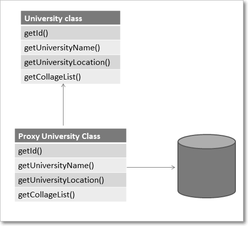

Hibernate- Introduction
=========================

Hibernate is the ORM tool given to transfer the data between a java (object)
application and a database (Relational) in the form of the objects.  Hibernate
is the open source light weight tool given by **Gavin King**.

Hibernate is a non-invasive framework, means it won’t force the programmers to
extend/implement any class/interface, and in hibernate we have all POJO classes
so its light weight.

 

**JDBC vs HIBERNATE**
---------------------

| **JDBC**                                                                                                                | **HIBERNATE**                                                                                                                                                                                                                |
|--------------------------------------------------------------------------------|------------------------------------------------------------------------------------------------------------------------------------------------------------------------------------------------------------------------------|
| Programmer must close the connection. Jdbc doesn’t responsible to close the connection.                                 | Hibernate will take care about closing the connections                                                                                                                                                                       |
| if the table structure is modified then the JDBC program doesn’t work, again we need to modify and compile the programs | Hibernate has its own query language(HQL) and it is database independent. So if we change the database, then also our application will work, because HQL is database independent                                             |
| In jdbc all exceptions are checked exceptions, so we must write code in try, catch and throws                           | hibernate we have only Un-checked exceptions, so no need to write try, catch, or throws                                                                                                                                      |
| JDBC won’t generate primary keys automatically                                                                          | Hibernate has capability to generate primary keys automatically while we are storing the records into database.                                                                                                              |
| JDBC won’t support Caching mechanism                                                                                    | Hibernate supports caching mechanism. By this, the number of round trips between an application and the database will be reduced. Because of this, the Application performance will be increased automatically. |
| In JDBC , we need to write SQL queries manually                                                                         | Hibernate provided Dialect classes, so we no need to write sql queries in hibernate, instead we use the methods provided by that API                                                                                         |

 

Hibernate implemented based on Proxy Template 
----------------------------------------------

-   Hibernate doesn’t hit the database always, it returns Proxy object if data
    is already available in cache.

-   If data not available, proxy will hit the database, and stores the data in
    Proxy object & return Proxy object to application/client.

-   The proxy attribute enables lazy initialization of persistent instances of
    the class. Hibernate will initially return CGLIB proxies which implement the
    named interface. The actual persistent object will be loaded when a method
    of the proxy is invoked.

    
