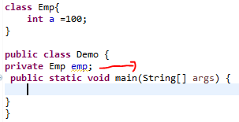
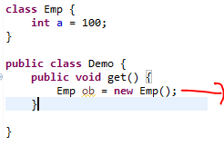
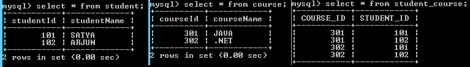

Hibernate Relationships
===========================

In JAVA we have *three types* of relationships

1.  *IS – A*

2.  *HAS –A*

3.  *Uses – A*

<br>

**1.Is-a** relationship is one in which **data members of one class is obtained
into another class through the concept of inheritance.**
```java
class B{ 
}
 
public class A extends B{     
 
}
```


**2.Has-a** relationship is one in which an **object of one class is created as
a data member in another class**.



**3.Uses-a** relationship is one in which an **Object of one class is created
inside a method of another class.**



> NOTE: But in Database We don’t have is-a,has-a,uses-a relationships like in java


<br>

Relationships in Hibernate
--------------------------

In database we don’t have above mentioned relationships, but we can form the
relationship between database tables by using **Primary Key (P.K), Foreign Key
(F.K). We can only form HAS-A relationship in hibernate.**

We have four types of relationships

1.  **One-To-One (P.K → P.K, F.K(Unique) → P.K)**

2.  **One-To-Many (P.K → F.K)**

3.  **Many-To-One (F.K → P.K)**

4.  **Many-To-Many (Table1 → LinkTable → Table2)**

**If you see above replations One→P.K, Many→F.K. Just kidding**

<br>

### Mapping Directions

Each relationship can be achived in two directions

**1.Unidirectional** relationship refers to the case when relationship between
two objects can be accessed by **one way only**. i.e. from Library we can access
books, from book we can’t access Library, not vice versa.


**2.Bidirectional** relationship refers to the case when relationship between
two objects can be accessed both ways. i.e. From Library we can access books,
from book we can access Library, vice versa.


| **Relationship**                 | **Explanation**                                                                                                                           | **Example**                                                                                    |
|----------------------------------|-------------------------------------------------------------------------------------------------------------------------------------------|------------------------------------------------------------------------------------------------|
| **One-To-One**                   | Each record in one table is related to exactly one record in the second table and vice versa. The other side could also be a zero record. | A car has only one engine.                                                                     |
| **One-To-Many (or) Many-To-One** | Each record in one table is related to zero or more records in the second table.                                                          | A movie has many actors (one-to-many); an actor can act in many movies (manyto-one).           |
| **Many-To-Many**                 | Each record in either of the tables is related to zero or more records in the other table                                                 | Each student can enroll in multiple courses, and each course can have manystudents registered. |

REMEMBER: Object means one row in hibernate terminology

<br>

1.One-to-One Relationship Mapping Example
--------------------------------------------

Using our **Car and Engine example**, we develop a one-to-one association. There
are two ways of establishing a one-to-one association, **using a primary key
using a foreign key.**

**Example: OneToOne Mapping (BiDirectional)**
```sql
CREATE TABLE CAR (
CAR_ID int(10) NOT NULL,
NAME varchar(20) DEFAULT NULL,
COLOR varchar(20) DEFAULT NULL,
PRIMARY KEY (CAR_ID));

CREATE TABLE ENGINE (
CAR_ID int(10) NOT NULL,
SIZE varchar(20) DEFAULT NULL,
MODEL varchar(20) DEFAULT NULL,
PRIMARY KEY (CAR_ID),
FOREIGN KEY (CAR_ID) REFERENCES car (CAR_ID));
```

-	**CAR** table with a **CAR_ID** as the primary key.
-	**ENGINE** table, primary key is a **CAR_ID**.
-	**ENGINE** table has a foreign key constraint pointing to the primary key of the CAR table. So, an engine will always be created with the same id as that of a car. Thus, we say both tables share the same primary key.


Car.java
```java
package onetoone;
public class Car {
	private int id;
	private String name;
	private String color;
	private Engine engine;
	//Setters & Getters
}
```

Engine.java
```java
package onetoone;
public class Engine {
	private int id = 0;
	private String model = null;
	private String size = null;
	// this engine is fitted to a car
	private Car car = null;
	 //Setters & Getters
}
```

Car.hbm.xml
```xml
<hibernate-mapping package="onetoone">
	<class name="Car" table="CAR">
		<id name="id" column="CAR_ID">
			<generator class="assigned" />
		</id>
		<property name="name" column="NAME" />
		<property name="color" column="COLOR" />
		<one-to-one name="engine" class="Engine" cascade="all" />
	</class>
</hibernate-mapping>
```


Engine.hbm.xml
```xml
<hibernate-mapping package="onetoone">
	<class name="Engine" table="ENGINE">
		<id name="id" column="CAR_ID">
			<generator class="foreign">
				<param name="property">car</param>
			</generator>
		</id>
		<one-to-one name="car" class="Car" constrained="true" />
		<property name="size" column="SIZE" />	
		<property name="model" column="model" />
	</class>
</hibernate-mapping>
```

hibernate.cfg.xml
```xml
<hibernate-configuration>
	<session-factory>
		 . . . . . 		
		<mapping resource="onetoone/Car.hbm.xml" />
		<mapping resource="onetoone/Engine.hbm.xml" />
		. . . . . 
	</session-factory>
</hibernate-configuration>
```


OneToOneTest.java
```java
package onetoone;
public class OneToOneTest {
public static void main(String[] args) {
	Configuration cfg = new Configuration();
	cfg.configure("hibernate.cfg.xml");
	SessionFactory sf = cfg.buildSessionFactory();
	Session session = sf.openSession();
	
	Car car = new Car();
	// Remember, we are using application generator for ids
	car.setId(1);
	car.setName("SWIFT");
	car.setColor("BLUE");
	// Next, create an instance of engine and set values.
	// Note: you are not setting the id!
	Engine engine = new Engine();	
	engine.setModel("2009");
	engine.setSize("85KG");
	// Now we associate them together using the setter on the car
	car.setEngine(engine);
	engine.setCar(car);
	// Lastly, we are persisting them
	
	Transaction tx = session.beginTransaction();
	session.save(car);
	session.save(engine);
	tx.commit();	
	System.out.println("Succuess");
}
}

mysql> select * from car;
+--------+--------------------+-------+
| CAR_ID | NAME               | COLOR |
+--------+--------------------+-------+
|      1 | SWIFT              | BLUE  |
+--------+--------------------+-------+
2 rows in set (0.00 sec)

mysql> select * from engine;
+--------+------------+-------+
| CAR_ID | size       | MODEL |
+--------+------------+-------+
|      1 | 85KG       | 2009  |
+--------+------------+-------+
```


2.One-to-Many / Many-to-One Relationship
-------------------------------------------

To achieve one-to-many between two pojo classes in the hibernate, then the
following two changes are required

-   In the parent pojo class, we need to take a **collection property**, the
    collection can be either **Set, List, Map** .
```java
public class Movie {
	private int mid;
	private String title;
	private Set<Actor> actors;
	 //Setters & Getters
}
```


-   In the mapping file of that parent pojo class, we need to configure the
    collection
```java
<set name="actors" table="actor" cascade="all">
     <key column="mid" not-null="true" />
     <one-to-many class="Actor" />
</set>
```


In this example we are taking Movie & Actor table, the relation between them is
**“one" movie consists of “one or more (i.e., many)" actors**
```sql
CREATE TABLE `movie` (
`mid` INT(10) NOT NULL AUTO_INCREMENT,
`title` VARCHAR(10) NULL DEFAULT NULL,
PRIMARY KEY (`mid`)
)


CREATE TABLE `actor` (
`actorid` INT(10) NOT NULL AUTO_INCREMENT,
`name` VARCHAR(20) NULL DEFAULT NULL,
`age` INT(10) NULL DEFAULT NULL,
`mid` INT(10) NULL DEFAULT NULL,
PRIMARY KEY (`actorid`),
INDEX `FK585A9F550821B2A` (`mid`),
INDEX `FK585A9F578674FF6` (`mid`),
CONSTRAINT `FK585A9F550821B2A` FOREIGN KEY (`mid`) REFERENCES `movie` (`mid`)
)
```


Actor.java
```java
package onetomany;
public class Actor {
	private int actorid;
	private String actorname;
	private int age;
 //Setters & getters
}
```


Movie.java
```java
package onetomany;
public class Movie {
	private int mid;
	private String title;
	private Set<Actor> actors;
	 //Setters & Getters
}
```


Actor.hbm.xml
```xml
<hibernate-mapping package="onetomany">
	<class name="Actor" table="actor">
		<id name="actorid" column="actorid">
			<generator class="assigned" />
		</id>
		<property name="actorname" column="name" />
		<property name="age" column="age" />		 
	</class>
</hibernate-mapping>
```


Movie.hbm.xml
```xml
<hibernate-mapping package="onetomany">
	<class name="Movie" table="movie">
		<id name="mid" column="mid">
			<generator class="assigned"/>
		</id>

		<property name="title" column="title" />
		<set name="actors" table="actor" cascade="all">
			<key column="mid" not-null="true" />
			<one-to-many class="Actor" />
		</set>
	</class>
</hibernate-mapping>
```

-   In order to transfer operations on parent object to child object we need to
    add **cascade** attribute

-   By default, cascade value is none, it means even though relationship is
    exist, the operations we are doing on parent will not transfer to child.

-   In above xml, we used **cascade =" all"** means all operations at parent
    object will be transfer to child

-   Inthe mapping file, we need to use **<key > element to configure foregin
    key column name**, in this example “*mid"* is foreign key

-   **<one-to-many>** is child class with which relation been done,  in our
    example** Actor** is the child class 

**OneToManyTest.java**
```java
package onetomany;

import java.util.HashSet;
import java.util.Set;

import org.hibernate.Session;
import org.hibernate.SessionFactory;
import org.hibernate.Transaction;
import org.hibernate.cfg.Configuration;

public class OneToManyTest {
public static void main(String[] args) {
		 
	Configuration cfg = new Configuration();
	cfg.configure("hibernate.cfg.xml");	 
	SessionFactory sf = cfg.buildSessionFactory();
	Session session = sf.openSession();
	
	Actor amir = new Actor();
	amir.setActorname("AMIR KHAN");
	amir.setAge(42);
	amir.setActorid(101);
	
	Actor madhav = new Actor();
	madhav.setActorname("R. MADHAVAN");
	madhav.setAge(36);
	madhav.setActorid(102);
	
	Actor kareena = new Actor();
	kareena.setActorname("KAREENA KAPOOR");
	kareena.setAge(31);
	kareena.setActorid(103);
	
	Set<Actor> actors =new HashSet<Actor>();
	actors.add(amir);
	actors.add(madhav);
	actors.add(kareena);	
	
	Movie movie = new Movie();
	movie.setTitle("3 IDIOTS");
	movie.setActors(actors);
	movie.setMid(501);
	
	Transaction tx = session.beginTransaction();
	session.save(movie);
	tx.commit();
	System.out.println("Succuess");
}
}
```

<br>


3.Many to Many Relationship
------------------------------

Applying many to many relationships between two pojo class objects is nothing
but applying **one to many relationships on both sides**, which tends
to Bi-Directional i mean many to many.

-   when ever we are applying many to many relationships between two pojo class
    objects**, on both sides we need a collection property **

-   While applying **many to many** relationships between pojo classes, a
    **mediator table is mandatory in the database**, to store primary key as
    foreign key both sides, we call this table as Join table

In the example of **Student and Course**, the relationship can be many-to-many:
a student can take many courses, while a course may consist of many students
```sql
CREATE TABLE `course` (
`courseId` INT(11) NOT NULL AUTO_INCREMENT,
`courseName` VARCHAR(50) NULL DEFAULT NULL,
PRIMARY KEY (`courseId`)
)

CREATE TABLE `student` (
`studentId` INT(11) NOT NULL AUTO_INCREMENT,
`studentName` VARCHAR(50) NULL DEFAULT NULL,
PRIMARY KEY (`studentId`)
)

// mediator table
CREATE TABLE `student_course` (
`COURSE_ID` INT(10) NOT NULL,
`STUDENT_ID` INT(10) NOT NULL,
PRIMARY KEY (`COURSE_ID`, `STUDENT_ID`),
INDEX `FKCB6FBEBFAD895D0F` (`COURSE_ID`),
INDEX `FKCB6FBEBF88820545` (`STUDENT_ID`),
CONSTRAINT `fk_c_id` FOREIGN KEY (`COURSE_ID`) REFERENCES `course` (`courseId`),
CONSTRAINT `fk_s_id` FOREIGN KEY (`STUDENT_ID`) REFERENCES `student` (`studentId`)
)
```


Course.java
```java
package manytomany;

public class Course {
	private int courseId;
	private String courseName;
	private Set<Student> students;
//Setters & Getters
}
```

Student.java
```java
package manytomany;

public class Student {
	private int studentId;
	private String studentName;
	private Set<Course> courses; 
//Setters & Getters
}
```


Course.hbm.xml
```xml
<hibernate-mapping package="manytomany">
	<class name="Course" table="course">
		<id name="courseId" column="courseId">
			<generator class="assigned" />
		</id>
		<property name="courseName" column="courseName" />
		<set name="students" table="STUDENT_COURSE" inverse="true"
			cascade="all">
			<key column="COURSE_ID" />
			<many-to-many column="STUDENT_ID" class="Student" />
		</set>
	</class>
</hibernate-mapping>
```


Student.hbm.xml
```xml
<hibernate-mapping package="manytomany">
	<class name="Student" table="student">
		<id name="studentId" column="studentId">
			<generator class="assigned" />
		</id>
		<property name="studentName" column="studentName" />
		<set name="courses" table="STUDENT_COURSE" cascade="all">
			<key column="STUDENT_ID" />
			<many-to-many column="COURSE_ID" class="Course" />
		</set>
	</class>
</hibernate-mapping>
```


```java
package manytomany;
public class ManyToManyTest {
public static void main(String[] args) {
		 
	Configuration cfg = new Configuration();
	cfg.configure("hibernate.cfg.xml");	 
	SessionFactory sf = cfg.buildSessionFactory();
	Session session = sf.openSession();
	
	 Student s1 = new Student();
	 s1.setStudentId(101);
	 s1.setStudentName("SATYA");
	 Student s2 = new Student();
	 s2.setStudentId(102);
	 s2.setStudentName("ARJUN");	 

	 Course c1 = new Course();
	 c1.setCourseId(301);
	 c1.setCourseName("JAVA");	

	 Course c2 = new Course();
	 c2.setCourseId(302);
	 c2.setCourseName(".NET");
	
	 Set<Student> students = new HashSet<Student>();
	 students.add(s1);
	 students.add(s2);
	 c1.setStudents(students);
	 c2.setStudents(students);	 
	 
	 Set<Course> courses = new HashSet<Course>();
	 courses.add(c1);
	 courses.add(c2);
	 s1.setCourses(courses);
	 s2.setCourses(courses);	
 
	Transaction tx = session.beginTransaction();
	session.save(s1);
	session.save(s2);
	tx.commit();
	System.out.println("Succuess");
}
}
```

