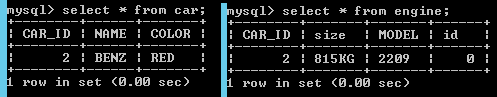
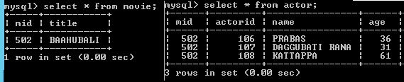
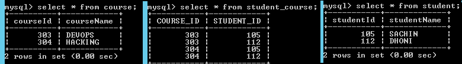

Hibernate -Mappings using Annotations
=============================

### 1.one-to-one mapping using Annotations


Car.java
```java
package annotations.onetoone;

@Entity
@Table(name="car")
public class Car {
	
	@Id
	@Column(name="CAR_ID")
	private int id;
	
	@Column(name="NAME")
	private String name;
	
	@Column(name="COLOR")
	private String color;
	
	//Setters & Getters
}
```


Engine.java
```java
package annotations.onetoone;

@Entity
@Table(name="engine")
public class Engine {
	
	@Id
	private int id = 0;
	
	@Column
	private String model = null;
	
	@Column
	private String size = null;
	
	
	@OneToOne(targetEntity=Car.class,cascade=CascadeType.ALL)
	 @JoinColumn(name="CAR_ID",referencedColumnName="CAR_ID")
	private Car car = null;
	
//Setters & Getters
}
```


OneToOneTest.java
```java
package annotations.onetoone;

public class OneToOneTest {
public static void main(String[] args) {
	
	Configuration cfg = new AnnotationConfiguration();
	cfg.configure("hibernate.cfg.xml");


	SessionFactory sf = cfg.buildSessionFactory();
	Session session = sf.openSession();
	 
	Car car = new Car();
	car.setId(2);
	car.setName("BENZ");
	car.setColor("RED");
		
	Engine engine = new Engine();	
	engine.setModel("2209");
	engine.setSize("815KG");
	engine.setCar(car);
	
	Transaction tx = session.beginTransaction();
	session.save(car);
	session.save(engine);
	tx.commit();	
	System.out.println("Succuess");
}
}
```



<br>


### 2.one-to-many Mapping Using Annotations


Actor.java
```java
package annotations.onetomany;

@Entity
@Table(name="actor")
public class Actor {
	@Id
	@Column
	private int actorid;
	
	@Column(name="name")
	private String actorname;
	
	@Column
	private int age;
 
	//Setters & Getters

}
```


Movie.java
```java
package annotations.onetomany;

@Entity
@Table(name="movie")
public class Movie {
	
	@Id
	@Column
	private int mid;
	
	@Column
	private String title;
	
	 @OneToMany(cascade = CascadeType.ALL)
	 @JoinColumn(name="mid",referencedColumnName="mid")
	private Set<Actor> actors;
//Setters & Getters
}
```


OneToManyTest.java
```java
package annotations.onetomany;

public class OneToManyTest {
public static void main(String[] args) {
	Configuration cfg = new AnnotationConfiguration();
	cfg.configure("hibernate.cfg.xml");


	SessionFactory sf = cfg.buildSessionFactory();
	Session session = sf.openSession();
	
	Actor amir = new Actor();
	amir.setActorname("PRABAS");
	amir.setAge(36);
	amir.setActorid(106);
	
	Actor madhav = new Actor();
	madhav.setActorname("DAGGUBATI RANA");
	madhav.setAge(31);
	madhav.setActorid(107);
	
	Actor kareena = new Actor();
	kareena.setActorname("KATTAPPA");
	kareena.setAge(61);
	kareena.setActorid(108);
	
	Set<Actor> actors =new HashSet<Actor>();
	actors.add(amir);
	actors.add(madhav);
	actors.add(kareena);
	
	
	Movie movie = new Movie();
	movie.setTitle("BAAHUBALI");
	movie.setActors(actors);
	movie.setMid(502);
	
	Transaction tx = session.beginTransaction();
	session.save(movie);
	tx.commit();
	System.out.println("Succuess");
}
}
```


<br>

### 3.Many-to-many Mapping Using Annotations

Course.java
```java
package annotations.manytomany;

@Entity
@Table(name="course")
public class Course {

	@Id
	@Column
	private int courseId;

	@Column
	private String courseName;
	
	@ManyToMany(fetch = FetchType.LAZY, cascade = CascadeType.ALL)
	@JoinTable(name = "student_course",   joinColumns = { 
	@JoinColumn(name = "COURSE_ID", nullable = false, updatable = false) }, 
	inverseJoinColumns = { @JoinColumn(name = "STUDENT_ID", 
					nullable = false, updatable = false) }) 
	private Set<Student> students;
	
 //Setters & Getters	

}
```

Student.java
```java
package annotations.manytomany;

@Entity
@Table(name="student")
public class Student {
	@Id
	@Column
	private int studentId;
	
	@Column
	private String studentName;
	
	@Column
	@ManyToMany(mappedBy = "students")
	private Set<Course> courses;
	 
//Setters & Getters
}
```


ManyToMantTest.java
```java
package annotations.manytomany;
public class ManyToManyTest {
public static void main(String[] args) {		 
	Configuration cfg = new AnnotationConfiguration();
	cfg.configure("hibernate.cfg.xml");
	SessionFactory sf = cfg.buildSessionFactory();
	Session session = sf.openSession();
	
	Student s1 = new Student();
	 s1.setStudentId(105);
	 s1.setStudentName("SACHIN");	 
	 Student s2 = new Student();
	 s2.setStudentId(112);
	 s2.setStudentName("DHONI");
	 

	 Course c1 = new Course();
	 c1.setCourseId(303);
	 c1.setCourseName("DEVOPS");
	 Course c2 = new Course();
	 c2.setCourseId(304);
	 c2.setCourseName("HACKING");
	
	 Set<Student> students = new HashSet<Student>();
	 students.add(s1);
	 students.add(s2);
	 c1.setStudents(students);
	 c2.setStudents(students);
	 
	 
	 Set<Course> courses = new HashSet<Course>();
	 courses.add(c1);
	 courses.add(c2);
	 s1.setCourses(courses);
	 s2.setCourses(courses);
	 
//we have to save the Course object, because we defiend M2M in Course class only	  
	Transaction tx = session.beginTransaction();
	session.save(c1);
	session.save(c2);
	tx.commit();
	System.out.println("Succuess");
}
}
```

