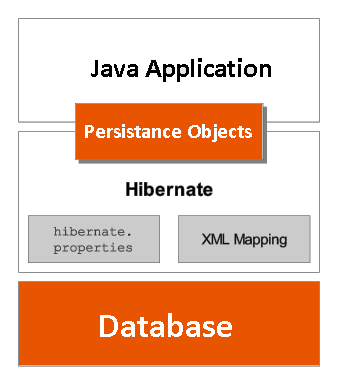

Hibernate Architecture
========================

The diagram below provides a high-level view of the Hibernate architecture:



Following is a detailed view of the Hibernate Application Architecture


Hibernate uses various existing Java APIs, like JDBC, Java Transaction API(JTA),
and Java Naming and Directory Interface (JNDI) along with its own API objects
like SessionFactory, Session, Transaction etc.,

<br>

### 1. Configuration 

It represents a **configuration or properties file required by the Hibernate**.
Configuration is the file loaded into hibernate application when working with
hibernate.

Configuration file contains 3 types of information.

1.  **Connection Properties**

2.  **Hibernate Properties**

3.  **Mapping file name(s)**

```xml
<? xml version='1.0' encoding='utf-8'?>
<! DOCTYPE hibernate-configuration PUBLIC
        "-//Hibernate/Hibernate Configuration DTD 3.0//EN"
        "http://hibernate.sourceforge.net/hibernate-configuration-3.0.dtd">

<hibernate-configuration>
    <session-factory>
        <! -- Database connection settings -->
        <property name="connection.driver_class">com.mysql.jdbc.Driver</property>
        <property name="connection.url">jdbc:mysql://localhost:3306/mydb</property>
        <property name="connection.username">root</property>
        <property name="connection.password">root</property>        
        <property name="connection.pool_size">1</property>
        
        <!-- Hibernate Properties -->
        <property name="dialect">org.hibernate.dialect.MySQLDialect</property>
        <property name="show_sql">true</property>
            <property name="hbm2ddl.auto">validate</property>  
      
<!-- Mapping file name(s)-->
        <mapping resource="res/employee.hbm.xml"/>
    </session-factory>
</hibernate-configuration>
```
<br>


**How do you switch between relational databases without code changes?**  
Using Hibernate SQL Dialects, we can switch databases. Hibernate will generate
appropriate hql queries based on the dialect defined.

<br>

#### Hibernate dialect class vs Driver

**Driver**: A database driver is a program for which implements a protocol
(ODBC, JDBC) for connecting to a database. It is an Adaptor which connects a
generic interface to a specific vendor's implementation, just like printer
drivers etc.  
**“Driver is like English"**

**Dialect** : A database dialect is a configuration setting for platform
independent software (JPA, Hibernate, etc) which allows such software to
translate its generic SQL statements into vendor specific DDL, DML.   
**“Dialect is the different pronunciations of English"**

We all know there are different versions of Oracle... Oracle 9i, Oracle8, Oracle
10g.The driver we would use would be a common for all of these. But the dialect
we use is specific to each one of them, which helps Hibernate in generating
optimized queries to those specific versions of database and also this is not
mandatory to be given in cfg.xml.

This is the SQL dialect (database type) for the database being used.

For connecting any hibernate application with the database, you must specify the
SQL dialects. There are many Dialects classes defined for RDBMS in the
org.hibernate.dialect package. They are as follows:

| **RDBMS**                | **Dialect**                                  |
|--------------------------|----------------------------------------------|
| **Oracle (any version)** | **org.hibernate.dialect.OracleDialect**      |
| **Oracle9i**             | **org.hibernate.dialect.Oracle9iDialect**    |
| **Oracle10g**            | **org.hibernate.dialect.Oracle10gDialect**   |
| **MySQL**                | **org.hibernate.dialect.MySQLDialect**       |
| **MySQL with InnoDB**    | **org.hibernate.dialect.MySQLInnoDBDialect** |
| **MySQL with MyISAM**    | **org.hibernate.dialect.MySQLMyISAMDialect** |
| **DB2**                  | **org.hibernate.dialect.DB2Dialect**         |
| **DB2 AS/400**           | **org.hibernate.dialect.DB2400Dialect**      |
| **DB2 OS390**            | **org.hibernate.dialect.DB2390Dialect**      |
| **Microsoft SQL Server** | **org.hibernate.dialect.SQLServerDialect**   |
| **SAP DB**               | **org.hibernate.dialect.SAPDBDialect**       |
| **Informix**             | **org.hibernate.dialect.InformixDialect**    |

<br>


### 2. SessionFactory Object

The **org.hibernate.SessionFactory** interface provides factory method **to get
the object of Session**

It holds second level cache (optional) of data like **Dialect, username and
password**. All these data are fixed for whole application, so it is
**immutable**. And if many threads access at same time there is no change in
data, so it is **thread safe**.

<br>


### 3. Session Object

It Opens a Session between Database and our Application. It holds a
**first-level cache (mandatory**) of data. The **org.hibernate.Session**
interface provides **methods to insert, update and delete** the object

Session is a light weight and a non-threadsafe object (No, you cannot share it
between threads) that represents a single unit-of-work with the database

<br>


### 4. Transaction Object

The **org.hibernate.Transaction** interface provides methods for transaction
management.

<br>


### 5. Query Object

Query objects use SQL or Hibernate Query Language (HQL) string to retrieve data
from the database and create objects.

<br>


### 6. Criteria Object

Criteria object are used to create and execute object oriented criteria queries
to retrieve objects.
