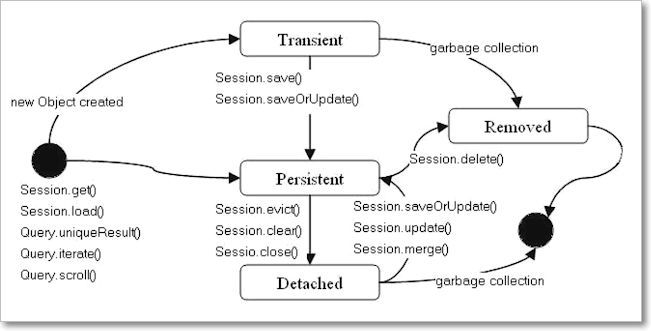

Hibernate INSERT Operation
=====================================

We have Following methods to perform insert Operation in Hibernate

-   Serializable **`save(Object object)`**

-   void **`persist(Object object)`**

-   void **`saveOrUpdate(Object object)`**


<br>

```java
package curd; 
public class EmployeeInsert {
	public static void main(String[] args) {
 // 1.Load Configuration
 Configuration cfg = new Configuration();
 cfg.configure("hibernate.cfg.xml");

 // 2.Create Session
 SessionFactory sf = cfg.buildSessionFactory();
 Session session = sf.openSession();

 // 3.Create Transaction Object
 Transaction tx = session.beginTransaction();

 EmployeeBo ob1 = new EmployeeBo(12, "KARTHIK", "ONGOLE");
 session.save(ob1);
 tx.commit();

 tx.begin();
 EmployeeBo ob3 = new EmployeeBo(10, "NAG", "HYD");
 session.saveOrUpdate(ob3);
 tx.commit();

 EmployeeBo ob2 = new EmployeeBo(11, "PERSIST", "VIZAG");
 session.persist(ob2);

 System.out.println("Data Saved Sussesfully");
 session.close();
 sf.close();
	}
}
-----------------------------------------------------------
mysql> select * from employee;
+-----+---------+-------------+
| eid | name    | address     |
+-----+---------+-------------+
|   1 | Satya   | VIJYAYAWADA |
|   2 | Ravi    | HYDERABAD   |
|   3 | SURYA   | HYDERABAD   |
|   4 | RAMAN   | PUNE        |
|   5 | DILEEP  | BANGLORE    |
|   6 | DILEEP  | BANGLORE    |
|   7 | ANANTH  | CHENNAI     |
|   8 | vijay   | CHENNAI     |
|   9 | KARTHIK | ONGOLE      |
|  10 | NAG     | HYD         |
|  12 | KARTHIK | ONGOLE      |
+-----+---------+-------------+
```

<br>

## Save vs Persist

-   save() is Hibernate-proprietary, whereas persist() is a standard JPA method

-   **save()** method can **return that primary key id** value which is
    generated by hibernate generator while inserting data, **persist() will
    never give any value back to the client**
    `long s = session.save(k);`

-   **save()** method will move the Student Object to **Transit state to
    Persistent state immediate**. But **persist()** method **doesn't guarantee**
    that the identifier value will be assigned to the persistent instance
    immediately, the assignment might happen **at flush time**.

    
 

-   **At Transaction boundaries**, persist() method guarantees that it will not
    execute an INSERT statement if it is called outside of transaction
    boundaries. **save() **also doesn’t insert but it will return the next
    generated key value.
```java
public class App {
	public static void main(String[] args) {
 Configuration cfg = new Configuration();
 cfg.configure("hibernate.cfg.xml");

 SessionFactory factory = cfg.buildSessionFactory();
 Session session = factory.openSession();

 // Without Transaction it will return id if success
 System.out.println("save \n ===========");
 Object o = session.save(new Student("Ravi", "HYD"));
 System.out.println("Next Genearated Key value : " + o);

 // Without Transaction it wont commit transaction
 System.out.println("Persist \n ===========");
 session.persist(new Student("Mohan", "HYD"));
	}
}
save 
 ===========
Hibernate: select max(sno) from student
Next Generated Key value : 102
Persist 
 ===========
```

<br>    
    
 

**saveOrUpdate()** method either INSERT or UPDATE based upon existence of object
in database. If persistence object already exists in database then UPDATE SQL
will [execute](http://javarevisited.blogspot.sg/2012/03/how-to-create-and-execute-jar-file-in.html) and
if there is no corresponding object in database than INSERT will run.
