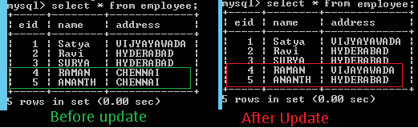
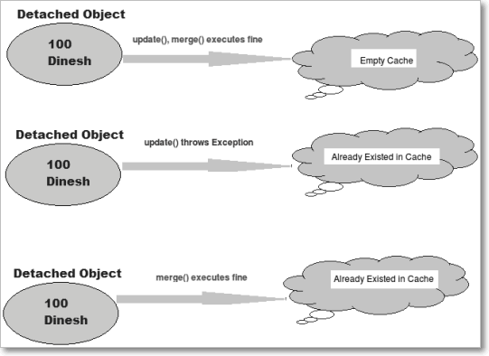

Hibernate - UPDATE Operation 
=====================================

We have two approaches for updating already saved data in database.

### Approach 1:

In this approach we load the existing row, and we will set the appropriate
properties. On committing transaction hibernate automatically updates the data.
But this is **not recommended**.

### Approach 2:

In this approach to modify object in the database, we need to create new
object with same id and we must call **update()** given by session interface

We have following method to perform UPDATE Operation in Hibernate
```java
void	update(Object object) 
Object	merge(Object object)
```

<br>


```java
package curd;
 
public class EmployeeUpdate {

 public static void main(String[] args) {
     // 1.Load Configuration
     Configuration cfg = new Configuration();
     cfg.configure("hibernate.cfg.xml");
    
     // 2.Create Session
     SessionFactory sf = cfg.buildSessionFactory();
     Session session = sf.openSession();
     
     //======Approach 1 ==========
     Transaction tx = session.beginTransaction();
     EmployeeBo ob1 = (EmployeeBo)session.load(EmployeeBo.class, new Integer(4));
     ob1.setAddress("VIJAYAWADA");
     tx.commit();
     
     //======Approach 2 ==========
     tx = session.beginTransaction();
     EmployeeBo ob2 = new EmployeeBo(new Integer(5), "ANANTH", "HYDERABAD");
     session.update(ob2);
     tx.commit();
     System.out.println("Update Completed!");
      
     session.close();
     sf.close();

	}
}
```




<br>

###### What is the difference between and merge and update?
```java
 Employee emp1 = new Employee();            
 emp1.setEmpId(100);
 emp1.setEmpName("Dinesh");
 
 Session session1 = createNewHibernateSession();
 session1.saveOrUpdate(emp1);   // s1 ----+---- emp1[100, Dinesh]
 session1.close();
 //emp1 object in detached state now
 // s1 ----X---- emp1[100, Dinesh]
 // s1           emp1[100, Dinesh]  (cache)

 emp1.setEmpName("Satya");//Updated Name
 //s1            emp1[100, Satya]   (cache)
 
 //Create session again
 Session session2 = createNewHibernateSession();
 Employee emp2 =(Employee)session2.get(Employee.class, 100);
 //emp2 object in persistent state with id 100.
 //s2    ----- emp2[100, Satya]   (cache)

So we have Two Emp Objects in Cache with Same Id = 100
//s1            emp1[100, Satya]   (cache)
//s2    -----   emp2[100, Satya]   (cache)


//below we try to make on detached object with id 100 
//to persistent state by using update method of hibernate
 
 session2.update(emp1);
 
//It occurs the exception `NonUniqueObjectException` because 
//emp1, emp2 object is having employee with same empid as 100.
//In order to avoid this exception we are using merge like given below instead of session.update(emp1);

 session2.merge(emp1); //it merge the object state with emp2
 session2.update(emp1); //Now it will work with exception
```



**Update:**

-   Suppose we are dealing with any employee object in the same session then we
    should use update() or saveOrUpdate() method.

-   if you are sure that the session does not contains an already persistent
    instance with the same identifier,then use update to save the data in
    hibernate

**Merge:**

-   Suppose we are creating a session and load an employee object. Now object in
    session cache. If we close the session at this point and we edit state of
    object and tried to save using update() it will throw exception. To make
    object persistent we need to open another session. Now we load same object
    again in current session. So if we want to update present object with
    previous object changes we have to use merge() method. Merge method will
    merge changes of both states of object and will save in database.

-   if you want to save your modifications at any time with out knowing about
    the state of an session, then use merge() in hibernate.
