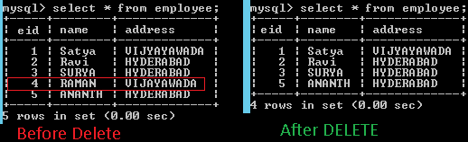

Hibernate- DELETE Operation
=====================================

We have following method to perform DELETE Operation in Hibernate

`void delete(Object object)`

```javascript
package curd;
import bo.EmployeeBo;

public class EmployeeDelete {

	public static void main(String[] args) {
 // 1.Load Configuration
 Configuration cfg = new Configuration();
 cfg.configure("hibernate.cfg.xml");

 // 2.Create Session
 SessionFactory sf = cfg.buildSessionFactory();
 Session session = sf.openSession();
 
 //======Load the Object & DELETE ==========
 Transaction tx = session.beginTransaction();
	EmployeeBo bo =(EmployeeBo)session.load(EmployeeBo.class, new Integer(4));
 session.delete(bo);
 tx.commit();
   
 session.close();
 sf.close();

	}
}
```

