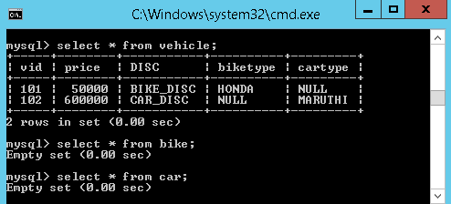

Hibernate- Inheritance Mapping
================================

In hibernate inheritance, if we have base and derived classes, now **if we save
derived(sub) class object, base class object will also be stored into
the database.**

Hibernate supports 3 types of Inheritance Mappings:

1.  **Table per class hierarchy**

2.  **Table per sub-class hierarchy**

3.  **Table per concrete class hierarchy**

We will understand one by one with examples. Below tables are used in upcoming
examples.
```sql
CREATE TABLE `vehicle` (
`vid` INT(11) NOT NULL AUTO_INCREMENT,
`price` DOUBLE NOT NULL DEFAULT '0',
PRIMARY KEY (`vid`));


CREATE TABLE `bike` (
`type` VARCHAR(50) NULL DEFAULT NULL
);

CREATE TABLE `car` (
`type` VARCHAR(50) NULL DEFAULT NULL
);
```


<br>

Following files are common to all examples, only we need to change mapping xml &
Application class

**Vehicle.java**
```java
package inheritance;

public class Vehicle {
	private int vid;
	private double price;

	public int getVid() {
		return vid;
	}

	public void setVid(int vid) {
		this.vid = vid;
	}

	public double getPrice() {
		return price;
	}

	public void setPrice(double price) {
		this.price = price;
	}
}
```

**Bike.java**
```java
 package inheritance;

public class Bike extends Vehicle {
	private String biketype;

	public String getBiketype() {
		return biketype;
	}

	public void setBiketype(String biketype) {
		this.biketype = biketype;
	}
}

```


**Car.java**
```java
 package inheritance;
public class Car extends Vehicle {
	private String cartype;

	public String getCartype() {
		return cartype;
	}

	public void setCartype(String cartype) {
		this.cartype = cartype;
	}
}

```


**hibernate.cfg.xml**

```xml
<?xml version='1.0' encoding='utf-8'?>
<!DOCTYPE hibernate-configuration SYSTEM
"hibernate-configuration-3.0.dtd">

<hibernate-configuration>
	<session-factory>
		<property name="hibernate.connection.driver_class">com.mysql.jdbc.Driver</property>
		<property name="hibernate.connection.url">jdbc:mysql://localhost:3306/smlcodes</property>
		<property name="hibernate.connection.username">root</property>
		<property name="hibernate.connection.password">root</property>

		<property name="hibernate.dialect">org.hibernate.dialect.MySQLDialect</property>
		<property name="show_sql">true</property>
		<property name="hbm2ddl.auto">update</property>

		<!-- <mapping resource="EmployeeBo.hbm.xml" /> -->
		<mapping resource="Vehicle.hbm.xml" />
	</session-factory>
</hibernate-configuration>
```


**InheritanceCommonApp.java**
```java
package inheritance;
import org.hibernate.*;
import org.hibernate.cfg.*;

public class TablePerClassExample {
	
	public static void main(String[] args) {		
		Configuration cfg = new Configuration();
		cfg.configure("hibernate.cfg.xml");
		
		SessionFactory factory = cfg.buildSessionFactory();
		Session session = factory.openSession();
		
		Bike bike = new Bike();
		bike.setVid(101);
		bike.setBiketype("HONDA");
		bike.setPrice(50000);
		
		Car car = new Car();
		car.setVid(102);
		car.setCartype("MARUTHI");
		car.setPrice(600000);
		
		Transaction tx = session.beginTransaction();
		session.save(bike);		 
		session.save(car);
		tx.commit();
       	session.close();
        	factory.close();		
	}
}
```

<br>  


# 1. Table per class hierarchy
If we **save** the derived class object in the database, then automatically base
class data will also be saved into the database in base class Table

For example, if we save the **derived class** object like Car or Bike then
automatically Vehicle class object will also be saved into the database, and in
the **database** all the data will be stored into a **single table** only, which
is base class table.

For this type of hierarchy, we must use one extra **discriminator column** in
the database, to identify which **derived** class object we have been saved in
the table along with the base class object, if we are not using this column
hibernate will **throws the exception.**

**Vehicle.hbm.xml**
```xml
<hibernate-mapping>
  <class name="inheritance.Vehicle" table="vehicle">
	<id name="vid" column="vid"></id>
	<discriminator column="DISC" type="string"/>
	<property name="price" column="price"></property>
	
	<subclass name="inheritance.Bike" discriminator-value="BIKE_DISC">
		<property name="biketype" column="biketype"></property>	
	</subclass>		
	
<subclass name="inheritance.Car" discriminator-value="CAR_DISC">
		<property name="cartype" column="cartype"></property>	
	</subclass>		 
  </class>
</hibernate-mapping>
```


We added one new line discriminator, after the id element just to identify which
derived class object we have been saved in the table. Here everything has been
saved in a single table(vehicle)

<br>


# 2. Table per sub-class hierarchy

In this type of hierarchy**, if we save the Base class object, first hibernate
will saves the Base class object into the base class table**, **then it will
save the subclass object data into subclass table**. Here first it will save
data into Base class table.

In below Example, if we save the Car/Bike class object, first hibernate
will saves the data related to Vehicle class object into the vehicle table and
then Car/Bike object data in Car/Bike related tables.so we can say, **No. of
classes equals to No. of Tables**

> No. of classes = No. of Tables


Here **<joined-subclass>** element of **<class>** is used to map the child
class with parent class using the primary key and foreign key relation

**Vehicle.hbm.xml**
```xml
<hibernate-mapping>
	<class name="inheritance.Vehicle" table="vehicle">
	<id name="vid" column="vid"></id> 
	<property name="price" column="price"></property>
	
	<joined-subclass name="inheritance.Bike" table="bike">
		<key column="BIKE_KEY" />
		<property name="biketype" column="type"></property>	
	</joined-subclass>
		
	 <joined-subclass name="inheritance.Car" table="car">
		<key column="CAR_KEY" />
		<property name="cartype" column="type"></property>	
	</joined-subclass>	 	 
	</class>
</hibernate-mapping>
```


-   Once we save the **derived** class object, then hibernate will first save
    the **base class** object then derived class object.

-   At the time of saving the derived class object, hibernate will copy
    the **primary key** value of the base class into the corresponding derived
    class, by using **<key>** tag. From the above output

    -   102 copied into **CAR_KEY** column of **car** table

    -   101 copied into **BIKE_KEY** column of the **bike** table

<br>

# 3. Table per concrete class hierarchy


-   Once we save the **derived class object**, **then derived class data and
    base class data will be saved in the derived class related table** in the
    database

-   for this type we **need** the tables for **derived classes**, but **not for
    the base class**

-   we need to use one new element **<union-subclass>** under <class>

**Vehicle.hbm.xml**
```xml
<hibernate-mapping>
	<class name="inheritance.Vehicle" table="vehicle">
	<id name="vid" column="vid"></id> 
	<property name="price" column="price"></property>
	
	<union-subclass name="inheritance.Bike" table="bike">		
		<property name="biketype" column="type"></property>	
	</union-subclass>
		
	 <union-subclass name="inheritance.Car" table="car">		 
		<property name="cartype" column="type"></property>	
	</union-subclass>	 	 
	</class>
</hibernate-mapping>
```


