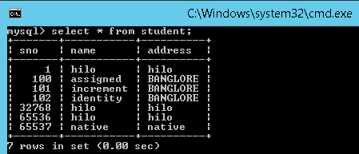

Hibernate Generators <generator>
=====================================

The **`<generator>`** subelement of `<id>` used to **generate the unique
identifier** for the objects of persistent class. There are many generator
classes defined in the Hibernate Framework.

**Example:**
```xml
<hibernate-mapping>
	<class name="bo.EmployeeBo" table="employee">
            <id name="eid" column="eid">
            	<generator class="assigned" />
            </id>
            <property name="name" column="name" />
            <property name="address" column="address" />
	</class>
</hibernate-mapping>
```

In Above example `class="assigned"` means, while inserting data into database
user will take care about generating Primary key value.

But, Hibernate can also
generate the primary keys without user interaction, by using **Generators**.

List of generators
------------------

-   hibernate using different primary key generator algorithms, for each
    algorithm internally a class is created by hibernate for its implementation

-   hibernate provided different primary key generator classes and all these
    classes are implemented from **org.hibernate.id.IdentifierGeneratar**
    Interface

The following are the list of main generators we are using in the hibernate
framework

1.  **assigned**

2.  **increment**

3.  **sequence**

4.  **identity**

5.  **hilo**

6.  **native**

7.  **foregin**

8.  **uuid**

### 1.assigned

-   This is the **default generator class** used by the hibernate, **if we do
    not specify `<generator>`** element under `<id>` element then hibernate by
    **default assumes it as -assigned"**

-   If generator class is assigned, then the **programmer is responsible for
    assigning the primary key** value to object which is going to save into the
    database
    
```xml
<class name="bo.EmployeeBo" table="employee">
	<id name="eid" column="eid">
            <generator class="assigned" />
	</id>
	<property>....</property>
</class>
```


<br>


### 2.increment

-   First select the max id if there, if no 1 as max

-   for each record it **increments by 1 (i++)**

-   Increment will take **care by Application Layer[Hibernate]**

```xml
<class name="bo.EmployeeBo" table="employee">
	<id name="eid" column="eid">
            <generator class="increment"/>
	</id>
	<property>....</property>
</class>
```
<br>

### 3.identity

-   First select the max id if there, if no 1 as max

-   for each record it **increments by 1 (i++)**

-   Increment will **have taken care by DB Layer[MySQL]**

-   MySQL, DB2 Support this. Oracle Won’t Support it.  


```xml
<class name="bo.EmployeeBo" table="employee">
	<id name="eid" column="eid">
            <generator class=" identity"/>
	</id>
	<property>....</property>
</class>
```

  

### 4.sequence

-   while inserting a new record in a database, **hibernate gets next value from the sequence** under assigns that value for the new record

-   If programmer has created a sequence in the database, then that sequence
    name should be passed as the generator

-   **Sequence start with 1 and Incremented by 1**

-   Internally it creates Sequence table, and increment operations done here

-   **Increment will take care by Both Application Layer[Hibernate] & DB
    Layer[MySQL]**

-   MySQL, DB2 Support this. Oracle Wont  


```xml
<class name="bo.EmployeeBo" table="employee">
	<id name="eid" column="eid">
            <generator class="sequence"/>  
	</id>
	<property>....</property>
</class>

For defining your own sequence, use the param subelement of generator.

<class name="bo.EmployeeBo" table="employee">
	<id name="eid" column="eid">
            <param name="sequence">USER_DEFIED_SEQUENCE</param>  
	</id>
	<property>....</property>
</class>
```


<br>

### 5.hilo

-   hilo **start with 0**

-   Internally it creates **hilo table**

-   **It will take High value form Hilo table, and it will Increment**

-   for each Deployment/Restart application, **High value increment by 32768**

-   1 st Deploy:  1,2,3,4...

-   2 nd Deploy: 32768,32769..........

-   MySQL, DB2 Support this. Oracle Won’t Support it.

```xml
<class name="bo.EmployeeBo" table="employee">
	<id name="eid" column="eid">
            <generator class="hilo"/>  
	</id>
	<property>....</property>
</class>
```

<br>

### 6.native

when we use this generator class, it first checks whether the database
supports **identity or not**, if not checks for **sequence and if not**,
then **hilo** will be used finally the order will be.

-   **identity**

-   **sequence**

-   **hilo**

```xml
<class name="bo.EmployeeBo" table="employee">
	<id name="eid" column="eid">
             <generator class="native"/>  
	</id>
	<property>....</property>
</class>
```


### 7.foregin

It uses the id of another associated object, mostly used with <one-to-one>
association.

### 8.uuid

It uses 128-bit UUID algorithm to generate the id. The returned id is of type
String, unique within a network (because IP is used). The UUID is represented in
hexadecimal digits, 32 in length.

### Custom generator

 For ur application, you want to generate keys as per ur wish like **icici_101,
icici_102, icici_103, ..........**

-   write **IciciGenerator** class implementing **IdentityGenerator**

-   override generate method

-   and write logic for keys

```xml
<class name="bo.EmployeeBo" table="employee">
	<id name="eid" column="eid">
            <generator class="IciciGenerator"/>
	</id>
	<property>....</property>
</class>
```


Generators Example
------------------

**EmployeeBo.java**
```java
package bo;
public class EmployeeBo {
	 private int eid;
	 private String name;
	 private String address;	
 //Setters & Getters
}
```


**GeneratorsExample.java**
```java
package app;

import org.hibernate.*;
import org.hibernate.cfg.*;
import bo.EmployeeBo;

public class GeneratorsExample {

public static void main(String[] args) {
 Configuration cfg = new Configuration();
 cfg.configure("hibernate.cfg.xml");
 
 SessionFactory factory = cfg.buildSessionFactory();
 Session session = factory.openSession();
 
 EmployeeBo bo = new EmployeeBo();
 //bo.setEid(100);
 bo.setName("sequence");
 bo.setAddress("BANGLORE");

 Transaction tx = session.beginTransaction();
 session.save(bo);
 
 tx.commit();
 session.close();
 factory.close();
 }
}
```


**EmployeeBo.hbm.xml**
```xml
<hibernate-mapping>
	<class name="bo.EmployeeBo" table="employee">
 <id name="eid" column="eid">
 	<generator class="sequence" />
 </id>
 <property name="name" column="name" />
 <property name="address" column="address" />
	</class>
</hibernate-mapping>
```
Here we are changing generator classes one-by-one, check the how data stored in
DB in output window.


**hibernate.cfg.xml**
```xml
<?xml version='1.0' encoding='utf-8'?>
<!DOCTYPE hibernate-configuration SYSTEM
"hibernate-configuration-3.0.dtd">

<hibernate-configuration>
	<session-factory>
 <property name="hibernate.connection.driver_class">com.mysql.jdbc.Driver</property>
 <property name="hibernate.connection.url">jdbc:mysql://localhost:3306/smlcodes</property>
 <property name="hibernate.connection.username">root</property>
 <property name="hibernate.connection.password">root</property>

 <property name="hibernate.dialect">org.hibernate.dialect.MySQLDialect</property>
 <property name="show_sql">true</property>
 <property name="hbm2ddl.auto">update</property>
 
 <mapping resource="EmployeeBo.hbm.xml" />

 <!-- <mapping resource="EmployeeBo.hbm.xml" /> -->
 <!-- <mapping resource="Vehicle.hbm.xml" /> -->
	</session-factory>
</hibernate-configuration>
```


**Output**


For Sequence,
```powershell
Exception in thread "main" *org.hibernate.MappingException*: could not
instantiate id generator at
org.hibernate.id.IdentifierGeneratorFactory.create(*IdentifierGeneratorFactory.java:98*)
```

