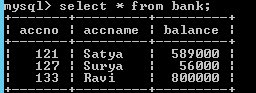

Hibernate Query Language (HQL)
=================================

**Hibernate Query Language (HQL)** is same as SQL (Structured Query Language)
but it doesn't depend on the table of the database. Instead of table name, we
use class name in HQL. So it is database independent query language

-   **HQL is database independent**, means if we write any program using HQL
    commands then our program will be able to execute in all the
    databases without doing any further changes to it.

-   HQL supports object oriented features like **Inheritance, polymorphism,
    Associations (**Relationships)

SQL vs HQL
----------
If we want to select a **Complete Object** from the database, we use POJO class
reference in place of   *** **while constructing the query
```sql
// In SQL
sql> select * from Employee
Note: Employee is the table name.

// In HQL
hql> select s from EmployeeBo s
[ or ]
from EmployeeBo s
Note: here s is the reference of EmployeeBo
```
<br>

If we want to load the **Partial Object** from the database that is only
selective properties of an objects, then we need to replace column names with
POJO class variable names
```sql
// In SQL
sql> select eid,name,address from Employee
Note: eid,name,address are the columns of Employee the table.

// In HQL
hql> select s.eid,s.name,s.address from EmployeeBo s
```
<br>

It is also possible to **select** the object from the database **by passing run
time values** into the query using **" ? "**
```sql
//In SQL
sql> select * from employee where eid=?

// In HQL
hql> select s from EmployeeBo s where s.eid=?
[ or ]
select s from EmployeeBo s where s.eid =:101
```
<br>

Query Interface
---------------
If we want to execute a HQL query on a database, we need to create a **Query**
interface object. To get query object, we need to call **session**.
**createQuery()** method in the session Interface.

Following are the most commonly used methods in Query interface

-   **public int executeUpdate()** -is used to execute **the update or delete
    query**.

-   **public List list()**  -returns the result of the relation as a list.

-   **public Query setFirstResult(int rowno)** - row number from where record
    will be retrieved.

-   **public Query setMaxResult(int rowno)** - no. of records to be retrieved
    from the relation (table).

-   **public Query setParameter(int position, Object value)** it sets the value
    to query parameter.

-   **public Query setParameter(String name, Object value)** it sets the value
    to a named query param.

**Synatx:**
```sql
Query qry = session.createQuery("--- HQL command ---");
List l = qry.list();
Iterator it = l.iterator();
while(it.hasNext())
{
  Object o = it.next();
  EmployeeBo s = (EmployeeBo)o;
  ----- ------- ---------
}
```

<br>


HQL Examples
------------

Following files are common to all the examples

**Table :bank**
```sql
CREATE TABLE `bank` (
`accno` INT(11) NOT NULL AUTO_INCREMENT,
`accname` VARCHAR(50) NULL DEFAULT NULL,
`balance` DOUBLE NULL DEFAULT NULL,
PRIMARY KEY (`accno`)
)
ENGINE=InnoDB
;
```



**BankBo.java**
```java
package hql;

public class BankBo {
	private int accno;
	private String accname;
	private double balance;

	public int getAccno() {
		return accno;
	}
	public void setAccno(int accno) {
		this.accno = accno;
	}
	public String getAccname() {
		return accname;
	}
	public void setAccname(String accname) {
		this.accname = accname;
	}
	public double getBalance() {
		return balance;
	}
	public void setBalance(double balance) {
		this.balance = balance;
	}
}
```

**BankBo.hbm.xml**
```xml
<?xml version="1.0"?>
<!DOCTYPE hibernate-mapping SYSTEM "hibernate-mapping-3.0.dtd">

<hibernate-mapping>
	<class name="hql.BankBo" table="bank">
		<id name="accno" column="accno" />
		<property name="accname" column="accname" />
		<property name="balance" column="balance" />
	</class>
</hibernate-mapping>
```

**hibernate.cfg.xml**
```xml
hibernate.cfg.xml
<hibernate-configuration>
	<session-factory>
<property name="hibernate.connection.driver_class">com.mysql.jdbc.Driver</property>
<property name="hibernate.connection.url">jdbc:mysql://localhost:3306/smlcodes</property>
		<property name="hibernate.connection.username">root</property>
		<property name="hibernate.connection.password">root</property>
<property name="hibernate.dialect">org.hibernate.dialect.MySQLDialect</property>
		
		<mapping resource="BankBo.hbm.xml" />
	</session-factory>
</hibernate-configuration>
```

<br>


#### 1. HQL Select Query Example
-----------------------------
```java
package hql;

import java.util.Iterator;
import java.util.List;
import org.hibernate.Query;
import org.hibernate.SessionFactory;
import org.hibernate.cfg.Configuration;
import org.hibernate.classic.Session;

public class HQLSelect {
	public static void main(String[] args) {
		Configuration cfg = new Configuration();
		cfg.configure("hibernate.cfg.xml");

		SessionFactory factory = cfg.buildSessionFactory();
		Session session = factory.openSession();

		System.out.println("====1.Selecting Complete Object====== ");
		Query query = session.createQuery("Select b from BankBo b");
		List list = query.list();
		Iterator it = list.iterator();
		while (it.hasNext()) {
			BankBo bo = (BankBo) it.next();
			System.out.println("------------------------");
			System.out.println("ACC No : " + bo.getAccno());
			System.out.println("Name : " + bo.getAccname());
			System.out.println("Balance : " + bo.getBalance());

		}

		System.out.println("====2.Selecting Partial Object====== ");
      query = session.createQuery("Select b.accname, b.balance from BankBo b where b.accno=?");
		query.setParameter(0, new Integer(127));
		list = query.list();
		it = list.iterator();
		while (it.hasNext()) {
			Object o[] = (Object[]) it.next();
			System.out.println("Name : " + o[0]);
			System.out.println("Balance : " + o[1]);
		}
	}
}

====1.Selecting Complete Object====== 
ACC No : 121
Name : Satya
Balance : 589000.0
------------------------
ACC No : 127
Name : Surya
Balance : 56000.0
====2.Selecting Partial Object====== 
Name : Surya
Balance : 56000.0
```


#### 2. HQL Update/Delete Query Example
------------------------------------

while working with DML operations in HQL we have to call **executeUpdate();** to
execute the query, which **will returns one integer value** after the execution
it will **tells the count of effected rows**.
```java
package hql;

import org.hibernate.Query;
import org.hibernate.SessionFactory;
import org.hibernate.Transaction;
import org.hibernate.cfg.Configuration;
import org.hibernate.classic.Session;

public class HQLUpdateDelete {
	public static void main(String[] args) {
		Configuration cfg = new Configuration();
		cfg.configure("hibernate.cfg.xml");

		SessionFactory factory = cfg.buildSessionFactory();
		Session session = factory.openSession();

		System.out.println("====== UPDATE OPERATION =========");
		Transaction tx = session.beginTransaction();
Query query = session.createQuery("update BankBo b set b.balance =? where b.accno=?");
		query.setParameter(0, new Double(0));
		query.setParameter(1, new Integer(127));
		int rs = query.executeUpdate();
		tx.commit();
		System.out.println(rs + " :Rows are Updated");

		System.out.println("====== DELETE OPERATION =========");
		tx = session.beginTransaction();
	query = session.createQuery("delete from BankBo b where b.accno=?");
		query.setParameter(0, new Integer(133));
		rs = query.executeUpdate();
		System.out.println(rs + " :Rows are Updated");
		tx.commit();
		session.close();
	}
}

mysql> select * from bank;
+-------+---------+---------+
| accno | accname | balance |
+-------+---------+---------+
|   121 | Satya   |  589000 |
|   127 | Surya   |       0 |
+-------+---------+---------+
2 rows in set (0.00 sec)
```


#### 3.HQL Insert Query Example
-----------------------------

while writing the insert query, we need to select values from other table, we
can’t insert our own values manually. Because, HQL supports only the **INSERT
INTO………** **SELECT……… ;** it won’t support **INSERT INTO………..VALUES**

```java
Query query = session.createQuery("insert into Stock(stock_code, stock_name) select stock_code, stock_name from backup_stock");

int result = query.executeUpdate();
```


#### 4 HQL with Aggregate functions
--------------------------------

We may call avg(), min(), max() etc. aggregate functions by HQL. Let's see some
common examples:

**Example to get total salary of all the employees**
```java
Query q=session.createQuery("select sum(salary) from Emp");  
List<Integer> list=q.list();  
System.out.println(list.get(0));
```
<br>

**Example to get maximum salary of employee**  
```java
Query q=session.createQuery("select max(salary) from Emp");
```
<br>

**Example to get minimum salary of employee**  
```java
Query q=session.createQuery("select min(salary) from Emp");
```
<br>

**Example to count total number of employee ID**
```java 
Query q=session.createQuery("select count(id) from Emp");  
```
<br>

**Example to get average salary of each employees**
```java
Query q=session.createQuery("select avg(salary) from Emp");  
```