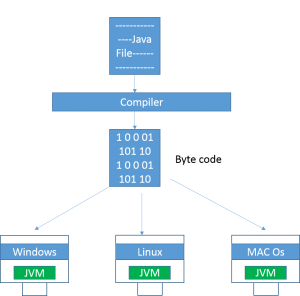
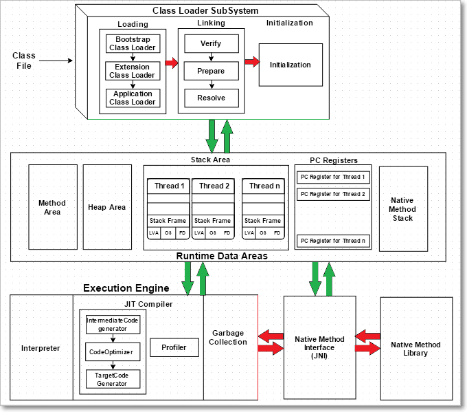
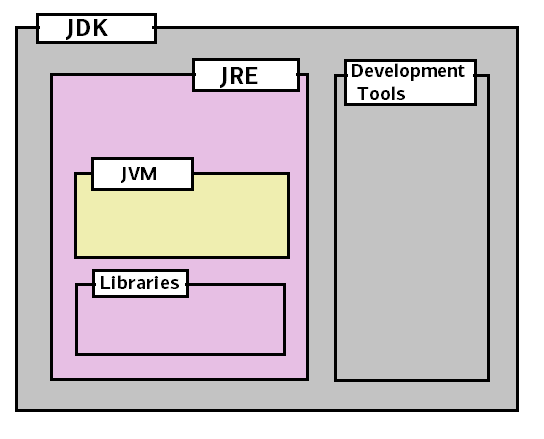

1.Language Fundamentals
=======================

Java is a platform independent programming language which is introduced
by **James Gosling** and his team mates in the year 1991.

First they want to develop programming language for the **Setup boxes and small embedded systems** in the year of 1991.they named it as -**Green talk",** because the file extension is ‘.**gt’**. After that they renamed as **-Oak",** it’s a tree name**. **But they faced some trademark issues in 1995 they renamed it as -Java"

The first beta version of java released in 1995.


Features of Java
----------------

**1.Simple – No Pointers Dude!**  
Compare with previous Object-oriented language C++ they removed many confusing
and/or rarely-used features e.g., explicit pointers, operator overloading etc.
So now no confusions, clean syntax makes java as **Simple**   


**2.Object-oriented – All about java Basics**  
Java based on OOP. below are concepts of OOPs are
- Object
- Class
- Inheritance
- Polymorphism
- Abstraction
- Encapsulation  


**3.Platform Independent – OS doesn’t matter!**  


A platform is the hardware or software environment in which a program runs.There are two types of platforms software-based and hardware-based. Java provides software-based platform.

Java code can be run on multiple platforms e.g.Windows,Linux,Sun Solaris,Mac/OS etc. Java code is compiled by the compiler and converted into bytecode. This byte-code is a platform independent code because it can be run on multiple platforms.


**4.Secured – U can Hack OS, but you can’t hack Java Byte code**  
The Java platform is designed with security features built into the language and runtime system such as static type-checking at compile time and runtime checking (security manager), which let you creating applications that can’t be invaded from outside. You never hear about viruses attacking Java applications.


**5.Robust – Strong, Error Free always**  
Robust simply means strong. Java uses strong memory management. There are lack of pointers that avoids security problem. There is automatic garbage collection in java. There is exception handling and type checking mechanism in java. All these points makes java robust.


**6.Architecture-neutral – 64-bit, 32-bit, xxx-bit doesn’t matter I will work**  
The language like JAVA can run on any of the processor irrespective of their architecture and vendor


**7.Portable**  
We may carry the java bytecode to any platform.


**8.High-performance**  
Java is faster than traditional interpretation since byte code is -close" to native code still somewhat slower than a compiled language (e.g., C++)


**9.Distributed**  
We can create distributed applications in java. RMI and EJB are used for creating distributed applications. We may access files by calling the methods from any machine on the internet.


**10.Multi-threaded**  
A thread is like a separate program, executing concurrently. We can write Java programs that deal with many tasks at once by defining multiple threads. The main advantage of multi-threading is that it shares the same memory. Threads are important for multi-media, Web applications etc.  


### Class Path:
**CLASSPATH** is a parameter that tells the JVM where to look for classes and packages.

When you have set of jar files which are always required during your application runtime, then it’s probably best to add them in machine’s environment variable 'CLASSPATH'.

During application runtime, application class loader will always scan the jar files and classes at specified paths in this variable.

Java – JDK, JRE and JVM
-----------------------

**JVM Architecture**



#### a.ClassLoader
**1.Loading the Class:**  
When a Java program is converted into **.class** file by Java compiler **ClassLoader** is responsible to load that class file from file system or any other location.

Our Java class is depends up on any other class let’s say JdbcDriver.class, it will search by following ClassLoaders

- **Bootstrap ClassLoader** - **JRE/lib/rt.jar** First bootstrap class loader tries to find the class. It scans the **rt.jar** file in JRE **lib** folder

- **Extension ClassLoader** - **JRE/lib/ext** or any directory denoted by java.ext.dirs. If class is not found then extension class loader searches the class file in inside **jre\\lib\\ext** folder

- **Application ClassLoader** - **CLASSPATH environment variable, -classpath or -cp option** Again if class is not found then application classloader searches all the Jar files and classes in CLASSPATH environment variable of system.

If class is found by any loader then class is loaded by class loader;else `ClassNotFoundException` is thrown.


**2.Linking:** -

- **Bytecode verifier** will verify whether the generated bytecode is proper
  or not.

- **Prepare(memory allocation)**: allocates memory **to static variables &
  methods**.

**3.Initialization:**  
In prepare only memory is allocated, here all **static variable will be
assigned** with the original values and the **static blocks will be executed**.  
  


#### b.Runtime area


**Fields(Data members)** and **methods** are also known as **class members** -**Method Are**a : all **Class level** Data members, Method definitions stored here

- **Heap** All **Objects** & instance variable Data stored Here.

- **Stacks** : All **Methods executions & Thread Executions** done here. store local variables, and intermediate results. Each thread has its own JVM stack, created simultaneously as the thread is created. So all such local variable are called **thread-local variables**.

- **PC register** store the physical memory address of the statements which is currently executing. In Java, each thread has its separate PC register.

- **Native Method Stack :**Java supports and uses **native code** as well. Many low level code is written in languages like C and C++. Native method stacks hold the instruction of native code.


#### c. Execution Engine  

All code assigned to JVM is executed by an **execution engine**. The execution engine reads the byte code and executes one by one. It uses two inbuilt *interpreter* and *JIT compiler* **to convert the bytecode to machine code and execute it**.

1. **Interpreter** A JVM interpreter pretty much converts each byte-code instruction to corresponding native instruction. It **directly** executes the bytecode only one instruction at a time and **does not perform any  optimization.**

2. **JIT Compiler** JIT compiler **takes a block of code** (not one statement at a time as interpreter), optimize the code and then translate it to optimized machine code. **To improve performance, it will Optimizes the bytecode**

3. **Garbage Collection : Once code Execution done, it will clears the memory.**  
 

#### d.Java Native Interface


**Java Native Interface (JNI) :** It is a interface which interacts with the Native Method Libraries and provides the native libraries(C, C++) required for the execution.

**Native Method Libraries :**   
It is a collection of the Native Libraries(C, C++) which are required by the Execution engine**.**

Differences between JDK, JRE and JVM
------------------------------------

JVM = Just a Specification. HotSpot VM is implementation of IT

JRE = JVM + libraries to run Java application.



JDK = JRE + tools to develop Java Application.

**Development Tools** - [Basic
Tools](https://www.cs.mun.ca/java-api-1.5/tooldocs/index.html#basic) (**javac,
java, javadoc, apt, appletviewer, jar, jdb**, javah, javap, extcheck)

- [Security Tools](https://www.cs.mun.ca/java-api-1.5/tooldocs/index.html#security) (keytool,
  jarsigner, policytool, kinit, klist, ktab)
- [Internationalization Tools](https://www.cs.mun.ca/java-api-1.5/tooldocs/index.html#intl) (native2ascii)
- [Remote Method Invocation (RMI) Tools](https://www.cs.mun.ca/java-api-1.5/tooldocs/index.html#rmi) (rmic,rmiregistry, rmid, serialver)
- [Java IDL and RMI-IIOP Tools](https://www.cs.mun.ca/java-api-1.5/tooldocs/index.html#idl) (tnameserv,idlj, orbd, servertool)
- [Java Deployment Tools](https://www.cs.mun.ca/java-api-1.5/tooldocs/index.html#deployment) (pack200,unpack200)
- [Java Plug-in Tools](https://www.cs.mun.ca/java-api-1.5/tooldocs/index.html#plugin) (htmlconverter)
- [Java Web Start Tools](https://www.cs.mun.ca/java-api-1.5/tooldocs/index.html#javaws) (javaws)

Identifiers
-----------

```java
public class Hello {
public static void main(String[] args) {
       System.out.println("Hello Java!");
}
}
```

In Above Hello, main, args are called **Identifiers**

**Rules for defining Identifiers**

- Only Allowed characters are
  
  - **a-z**
  
  - **A-Z**
  
  - **0-9**
  
  - **$**
  
  - **–**

- if we are using any other symbol we will get Compile time error **-*IllegalCharacter*".**

- Identifier should not be starts with digit.

- There is no length limit for java identifiers but it is not recommended to take more than 15 length.

- All Java class names, Interface names we can uses as an Identifier, but it’s not recommended

```java
public class Test {
        int Runnable = 10;
        int Integer = 20;    
  }
```

Keywords
--------

Some identifiers are reserved to associate some functionality or to represent values, such type of reserved identifiers are called **-*ReservedWords*" / -Keywords"**

| abstract     | continue     | for          | new          | switch       |
| ------------ | ------------ | ------------ | ------------ | ------------ |
| assert\*\*\* | default      | goto\*       | package      | synchronized |
| boolean      | do           | if           | private      | this         |
| break        | double       | implements   | protected    | throw        |
| byte         | else         | import       | public       | throws       |
| case         | enum\*\*\*\* | instanceof   | return       | transient    |
| catch        | extends      | int          | short        | try          |
| char         | final        | interface    | static       | void         |
| class        | finally      | long         | strictfp\*\* | volatile     |
| const\*      | float        | native       | super        | while        |
| \*           |              | not used     |              |              |
| \*\*         |              | added in 1.2 |              |              |
| \*\*\*       |              | added in 1.4 |              |              |
| \*\*\*\*     |              | added in 5.0 |              |              |

Comments
--------

```java
/* text */
```

The compiler ignores everything from /* to */.

```java
/**documentation */
```

This indicates a documentation comment (*doc comment*, for short). The compiler ignores this kind of comment, just like it ignores comments that use /* and */. The javadoc tool uses doc comments when preparing automatically generated documentation. 

```java
// text
```

The compiler ignores everything from // to the end of the line