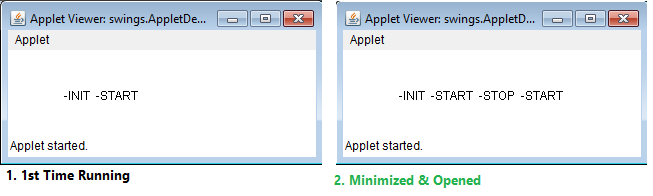

Java UI 
============

In JAVA we write two types of programs or applications. They are **standalone
applications (Local/Desktop)** and **distributed applications (web/Network)**

Initially, before Servlets come into picture above 2 types of applications are
implemented using

1.  **Swings** Developing Standalone Applications

2.  **Applets** Developing Distributed Applications

Applet Basics
-------------

“**An applet is a JAVA program which runs in the context of browser or World
Wide Web".**

-   To deal with applets we must import a package called **java.applet.\*.**
    This package

-   It only one class Applet whose fully qualified name is
    **java.applet.Applet.**

In **java.applet.Applet** we have four life cycle methods. They are public
**void init (),** public **void start (),** public void **stop ()**, public void
**destroy ()**, **void paint ()** it not a life cycle method

1.  **Public void init ():** This is the method which is called by the browser **only one time after loading
the applet**. In this method we write some block of statements which will
perform one time operations, such as, obtaining the resources like opening the
files, obtaining the database connection, initializing the parameters, etc.

1.  **Public void start ():**
    **Start** method will be called each and every time. In this method we write
    the block of statement which provides business logic.

2.  **Public void stop ():**
    **Stop** method is called by the browser when we minimize the window. In
    this method we write the block of statements which will temporarily releases
    the resources which are obtained in init method.

3.  **Public void destroy ():**
    This is the method which will be called by the browser when we close the
    window button or when we terminate the applet application. In this method we
    write same block of statements which will releases the resources permanently
    which are obtained in init method.

4.  **Public void paint ().**
    This is the method which will be called by the browser **after completion of
    start method**. This method is used for displaying the data on to the
    browser. Paint method is internally call **drawstring method**

<br>

<u>STEPS for developing APPLET Program</u>

1.  **Import java.applet.Applet** package.

2.  Choose the user defined **public class that must extends java.applet.Applet
    class**

3.  **Overwrite the life cycle methods** of the applet if require.

4.  Save the program and **compile.**

5.  **Run the applet**: To run the applet we have two ways.

    -   Using HTML program
    
    -   Using applet viewer tool.

```java
public class AppletDemo extends Applet {
	String s = "";

	public void init() {
		s = s + "  -INIT";
	}
	public void start() {
		s = s + "  -START";
	}
	public void paint(Graphics g) {
		g.drawString(s, 50, 50);
	}
	public void stop() {
		s = s + "  -STOP";
	}
	public void destroy() {
		s = s + "  -DESTROY";
	}
}
```

Compile the above Program, Run using any of below methods

**1) Using HTML program**
```java
<APPLET code="AppletDemo " height=100 width=150>
```


**2) Using applet viewer tool.**
```java
appletviewer AppletDemo.java
```



