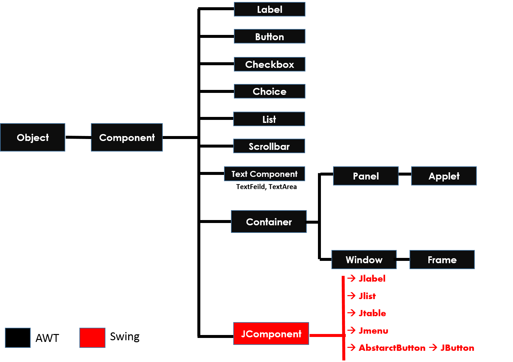
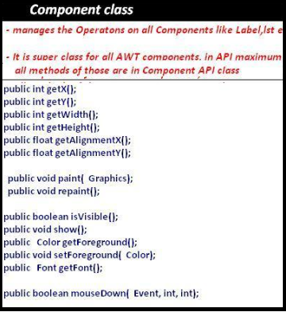
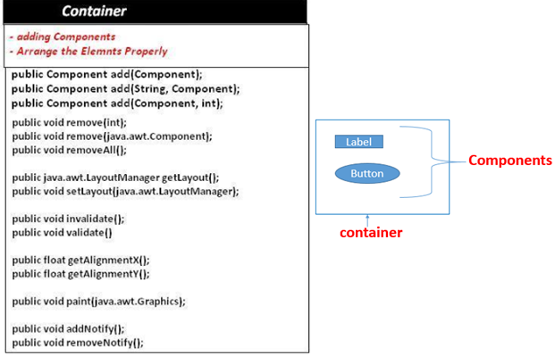
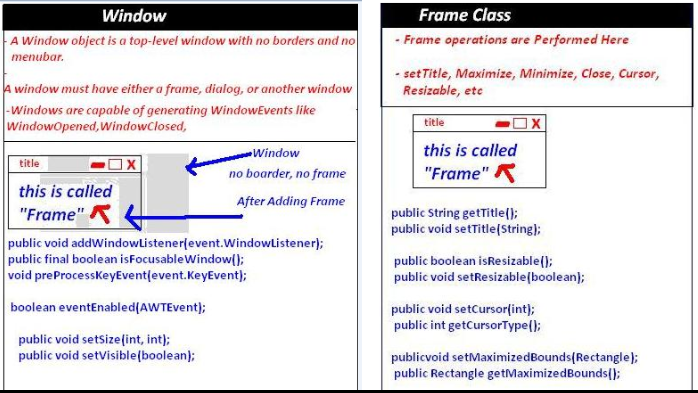
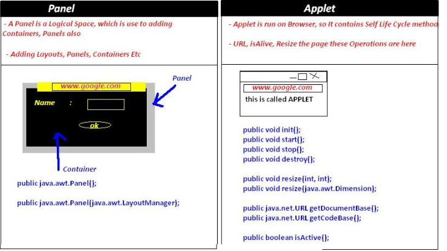

Java AWT (abstract windowing toolkit)
====================================

See, **java.awt.\* & javax.swing.\*** both packages hierarchy almost same. Only
difference is letter **‘J’**

**1. Component:**  
Component is any GUI Component like Label, Button, Etc

**2. Container**  
Container is an empty space, we have to place components

**3. Window & Frame**  

**4. Panel & Applet**

