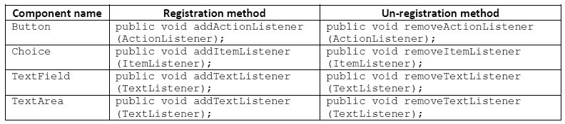

Java Swings - Events Handling
===================

As a part of GUI applications we use to create two types of components. They are
**passive components** and **active components**

-   **Passive component**, no interaction from the user. For example **Label**.

-   **Active component** there is an interaction from the user. For example
    **button, check box, etc**

<br>

<u>For developing Event handling, a class must have below steps</u>

1.  **Class which implement Listener Interface**

2.  **Component must register with Listener**

3.  **Get the object of Event class**

4.  **Implement event method**


**1.Class which implement Listener Interface**  
Every interactive component must have a predefined listener whose general
notation is xxx listener.

| Button    | **java.awt.event.ActionListener**     |
|-----------|---------------------------------------|
| Choice    | **java.awt.event.ItemListener**       |
| TextField | **java.awt.event.TextListener**       |
| TextArea  | **java.awt.event.TextListener**       |
| Scrollbar | **java.awt.event.AdjustmentListener** |


**2 .Component must register with Listener**  
Each and every interactive component must be registered and unregistered with
particular event and Listener. The general form of registration and
un-registration methods is as follows:
```java
public void addxxxListener (xxxListener);
public void removexxxListener (xxxListener);
```



**3.Get the object of Event class**  
Whenever we interact any active component, the corresponding active component
Event class object will be created. That object contains two details:
>   *1. Name of the component.*  
>   *2. Reference of the component.*

The general form of every Event class is **xxxEvent**.

| **Component name** | **Event name**                     |
|--------------------|------------------------------------|
| Button             | **java.awt.event.ActionEvent**     |
| choice             | **java.awt.event.ItemEvent**       |
| textField          | **java.awt.event.TextEvent**       |
| textArea           | **java.awt.event.TextEvent**       |
| scrollbar          | **java.awt.event.AdjustmentEvent** |


**4.Implement Event method**  
All these methods are present in **xxxLisnter** classes. We have to implement
appropriate method

