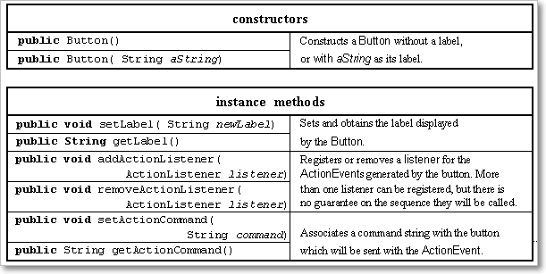

Swing Components 
===============

**1. Label**


**2. Button**


**3.TextComponet**


**4. TextField**


**5. Layout Managers**


<br>


<u>Steps for developing awt program:</u>

1. Import the appropriate packages.

2. Choose the appropriate class and it must **extend java.awt.Frame** and
**implements** appropriate **Listener** if required.

3. Identify & **declare components** as data members in the top of the class.

4. **Set the title** for the window.

5. **Set the size** of the window.

6. **Create Objects of the components in the Constructor** which are identified
in step 3.

7. **Add** the created **components to container**.

8. **Register** the events of the appropriate interactive component **with
appropriate Listener**.

9. Make the components to be visible (**setvisible(true**)).

10. **Define the undefined methods** in the current class which is coming from
appropriate **Listener**.

11. Write functionality to GUI component in that method

<br>

<u>Example</u>
```java
public class LoginDemo extends Frame implements ActionListener {
	// 1. Decalring components
	Label l1, l2, status;
	TextField t1, t2;
	Button login;

	public LoginDemo() {
 // 4,5 Setting title & Size
 setSize(200, 200);
 setTitle("Login");

 // 6.creating Component Objects
 l1 = new Label("Username : ");
 l2 = new Label("Password : ");
 status = new Label("Status");
 t1 = new TextField(50);
 t2 = new TextField(50);
 login = new Button("Login");

 // 7.adding componets to container
 add(l1);
 add(t1);
 add(l2);
 add(t2);
 add(login);
 add(status);
 setLayout(new FlowLayout());

 // 8.reister with Listener
 login.addActionListener(this);
 setVisible(true);// 9.setvisble
	}

	@Override // 10
	public void actionPerformed(ActionEvent e) {
 if (e.getSource() == login) {
 	// 11.implemeting Logic
 	status.setText(t1.getText() + " :  " + t2.getText());
 }
	}

	public static void main(String[] args) {
 new LoginDemo();
	}
}
```


Similarly we have no.of components but the process of each one is similar.

<u>Combined steps to develop FRAME and APPLET applications</u>
1. Import appropriate packages for GUI components (java.awt.\*) providing
functionality to GUI components (java.awt.event.\*) and for applet development
(java.applet.Applet).

2. Every user defined class must extend either Frame or Applet and it must
implement appropriate Listener if required.

3. Identify which components are required to develop a GUI application.

4. Use life cycle methods (init, start, destroy) in the case of applet, use
default Constructor in the case of Frame for creating the components, adding the
components, registering the components, etc.

5. Set the title of the window.

6. Set the size of the window.

7. Set the layout if required.

8. Create those components which are identified.

9. Add the created components to container.

10. Every interactive component must be registered with appropriate Listener.

11. Make the components to be visible in the case of Frame only.

12. Implement or define the abstract method which is coming from appropriate
Listener.
